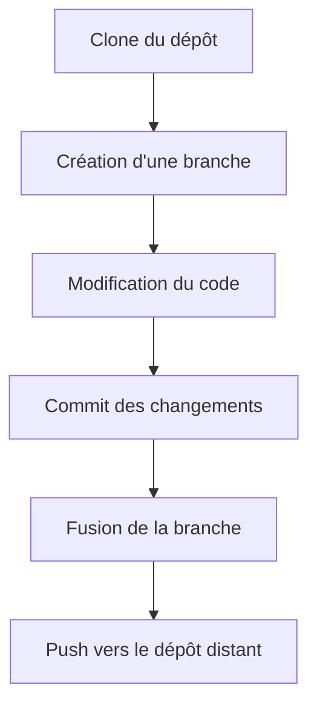
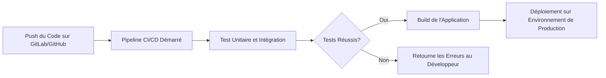

### Git, GitLab et GitHub pour le CI/CD

Dans cet article, nous allons explorer comment Git, GitLab, et GitHub sont utilisés pour implémenter des pipelines CI/CD (Intégration Continue et Déploiement Continu). Ces outils sont devenus essentiels pour automatiser et gérer les processus de développement logiciel. Nous allons décomposer chaque composant pour comprendre comment ils interagissent et comment vous pouvez les utiliser pour améliorer votre flux de travail.

#### Qu'est-ce que Git ?

Git est un système de gestion de version distribué. Cela signifie qu'il permet à plusieurs développeurs de travailler sur un projet de manière simultanée sans se marcher sur les pieds. Voici quelques concepts de base de Git :

- **Repository (Dépôt)** : C'est un espace de stockage où l'historique de votre projet est enregistré. Il contient tous les fichiers et l'historique des modifications.
- **Branch (Branche)** : Une branche est une version parallèle du code sur laquelle vous pouvez travailler indépendamment. Une branche peut être fusionnée avec la branche principale (`main` ou `master`) après approbation.
- **Commit** : Un commit est un enregistrement de changements dans le dépôt. Chaque commit a un identifiant unique qui permet de revenir en arrière ou de fusionner des modifications.
- **Merge** : C'est l'action de fusionner les changements d'une branche dans une autre.

##### Comment fonctionne Git ?

Voici une illustration simple du fonctionnement de Git avec un exemple de flux de travail :



##### Explication du Processus Git

1. **Clone du Dépôt** : Vous commencez par cloner un dépôt existant depuis GitHub ou GitLab vers votre machine locale.
2. **Création d'une Branche** : Vous créez une nouvelle branche pour travailler sur une fonctionnalité ou une correction de bug.
3. **Modification du Code** : Vous faites les changements nécessaires dans votre code.
4. **Commit des Changements** : Vous enregistrez vos modifications dans le dépôt local avec un message de commit.
5. **Fusion de la Branche** : Une fois les modifications prêtes, vous fusionnez votre branche dans la branche principale.
6. **Push vers le Dépôt Distant** : Enfin, vous poussez vos changements vers le dépôt distant pour les partager avec les autres développeurs.

#### Qu'est-ce que GitLab et GitHub ?

##### GitHub

GitHub est une plateforme de développement collaboratif qui repose sur Git. Elle est principalement utilisée pour héberger des dépôts Git et permet de collaborer sur des projets de manière transparente. GitHub offre également des fonctionnalités de CI/CD via **GitHub Actions**, qui permettent d'automatiser les tests, les builds, et les déploiements.

##### GitLab

GitLab est une plateforme similaire à GitHub, mais avec un ensemble d'outils encore plus complet pour le DevOps. GitLab CI/CD est une fonctionnalité intégrée qui permet de créer des pipelines pour automatiser les tests, les builds, et les déploiements directement depuis le dépôt GitLab.

#### Fonctionnement de la CI/CD avec GitLab et GitHub

##### GitHub Actions (CI/CD)

GitHub Actions vous permet de créer des workflows pour automatiser les processus de développement. Ces workflows sont définis dans un fichier YAML au sein du dépôt.

Exemple de workflow pour GitHub Actions :

```yaml
name: CI/CD Pipeline

on:
  push:
    branches:
      - main

jobs:
  build:
    runs-on: ubuntu-latest

    steps:
      - name: Checkout code
        uses: actions/checkout@v2
      
      - name: Install dependencies
        run: pip install -r requirements.txt

      - name: Run tests
        run: pytest
```

#### GitLab CI/CD

GitLab CI/CD utilise un fichier `.gitlab-ci.yml` pour définir les pipelines. Ce fichier décrit les étapes que GitLab doit suivre pour tester, construire, et déployer le code.

Exemple de pipeline pour GitLab CI/CD :

```yaml
stages:
  - test
  - build
  - deploy

test:
  stage: test
  script:
    - pytest

build:
  stage: build
  script:
    - python setup.py sdist

deploy:
  stage: deploy
  script:
    - scp dist/* user@server:/path/to/deploy/
```

##### Visualisation du Processus CI/CD

Pour mieux comprendre le processus CI/CD avec Git, GitHub, et GitLab, voici une visualisation avec Mermaid :



Étapes du Processus CI/CD

1. **Push du Code** : Le développeur pousse son code vers GitLab ou GitHub.
2. **Pipeline CI/CD Démarré** : Le push déclenche automatiquement un pipeline CI/CD.
3. **Tests** : Le code est testé pour détecter les erreurs ou les bugs.
4. **Build** : Si les tests réussissent, l'application est construite (compilation, packaging, etc.).
5. **Déploiement** : Enfin, l'application est déployée sur l'environnement de production. Si les tests échouent, les erreurs sont retournées au développeur pour correction.

#### Conclusion

Git, GitLab, et GitHub sont des outils puissants pour gérer et automatiser le développement logiciel. En utilisant Git pour le contrôle de version et GitLab/GitHub pour le CI/CD, vous pouvez créer un flux de travail robuste qui assure que votre code est testé, validé, et déployé automatiquement à chaque changement. Ces pratiques vous permettent de livrer du code de qualité plus rapidement et plus efficacement.