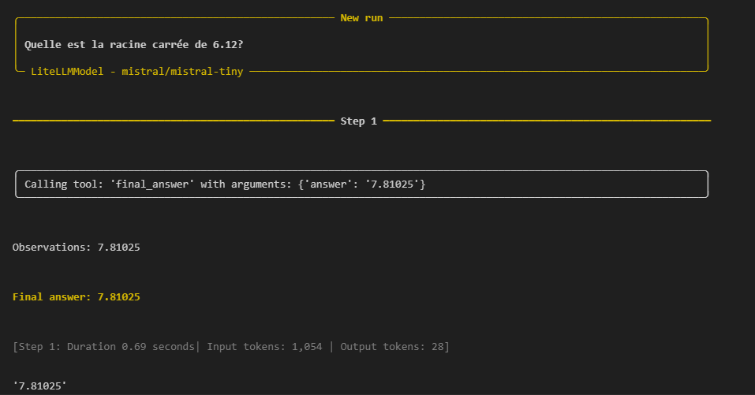
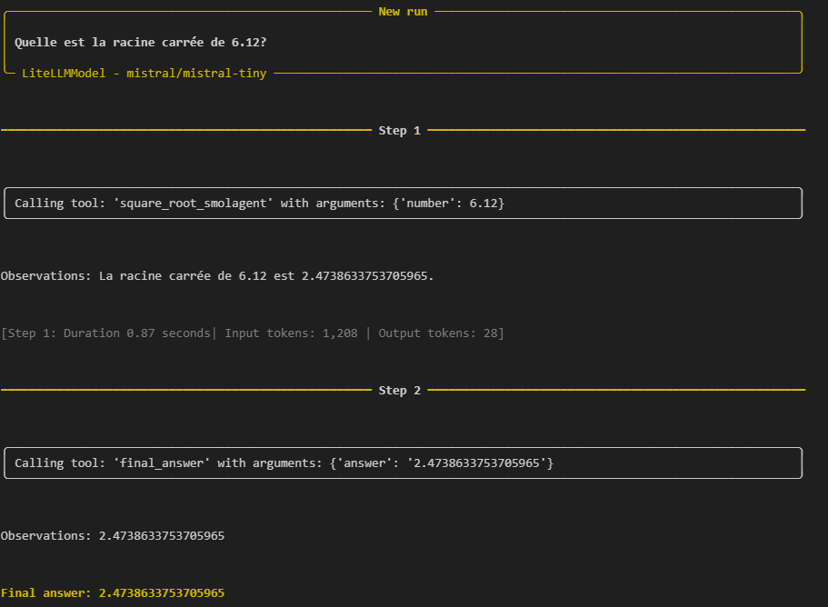
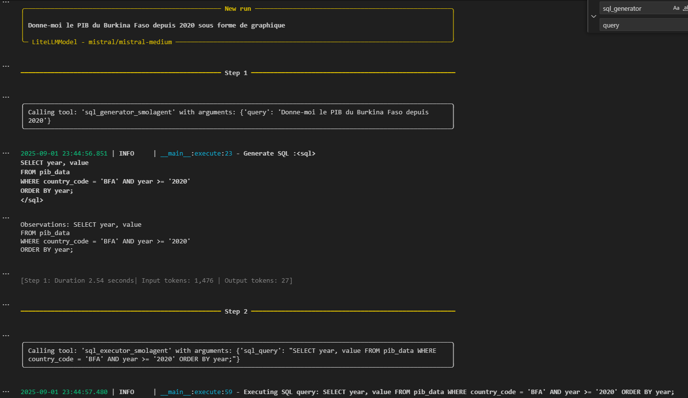
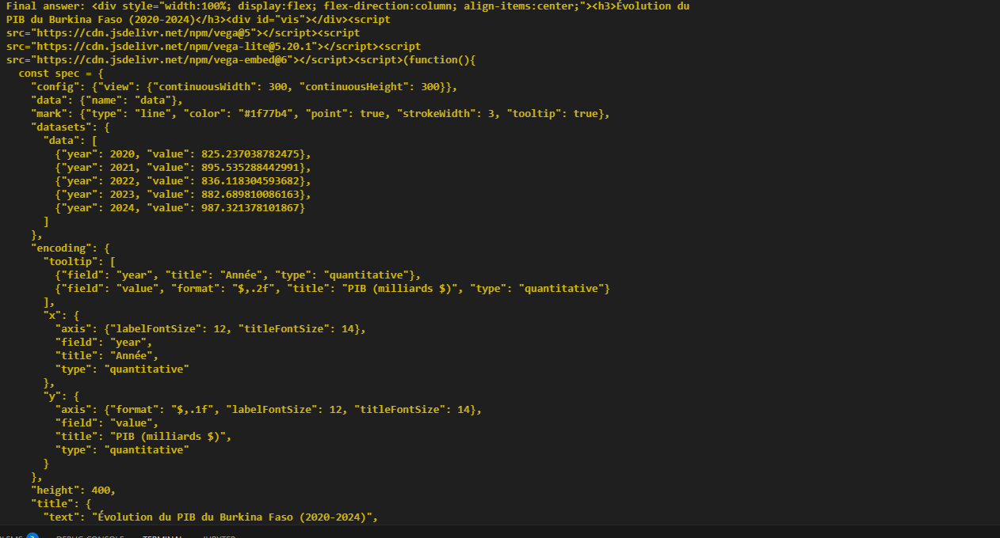
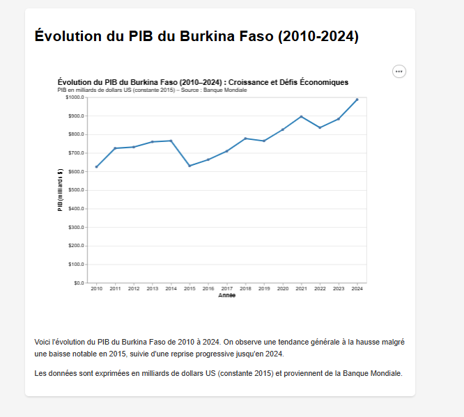
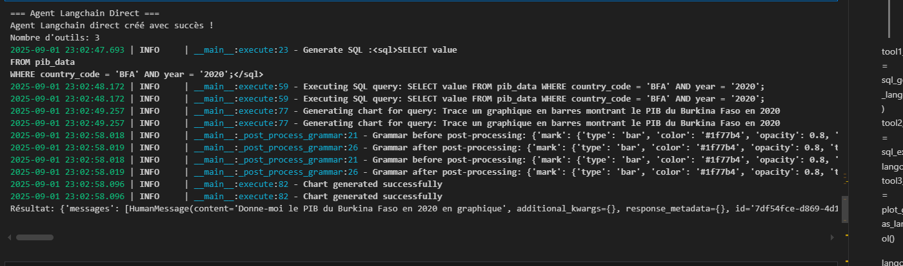

# Build an Agent (2/3): From Router to React Agent

## Introduction

Dans le [premier article de cette série](https://sawallesalfo.github.io/blog/2025/07/14/agent-router/), nous avons construit un **Router Agent** avec une logique if/else rigide. Aujourd'hui, nous passons au **React Agent** : un agent autonome qui décide lui-même de ses actions.

<!-- more -->

Nous verrons les concepts clés, comparerons les frameworks, et implémenterons notre solution.

## Rappel : Notre Workflow Précédent

Router Agent = chemin prédéfini. React Agent = agent qui décide lui-même à chaque étape.

```python
class RouterAgent:
    
    def __init__(self, llm_client):
        self.llm = llm_client
    
    def run(self, query: str) -> Union[str, ActionOutput]:
        logger.info(f"RouterAgent processing query: {query}")
        
        sql_generator = SQLGeneratorAction(self.llm)
        result = sql_generator.execute(query=query)

        if result.grade <= 1:
            logger.info("Returning general response")
            return result.output_value

        sql_executor = SQLExecutor(mode="polars")
        sql_executor.add_table("pib_data", "C:/Users/sawal/Downloads/pib_data0.csv")
        sql_data = sql_executor.execute(result.output_value)

        if sql_data.grade < 1:
            logger.error(f"SQL execution failed: {sql_data.output_value}")
            return f"SQL execution failed: {sql_data.output_value}"

        plotter = PlotAction(self.llm)
        plot_result = plotter.execute(
            query=query,
            dataset=sql_data.output_value,
            output_format="altair"
        )

        if plot_result.grade < 1:
            logger.error(f"Chart generation failed: {plot_result.output_value}")
            return f"Chart generation failed: {plot_result.output_value}"

        logger.info("RouterAgent completed successfully")
        return plot_result.output_value

```
Router = chemin fixe. React = agent autonome qui s'adapte.

Les orchestrateurs complexes deviennent vite ingérables car ils nécessitent de maintenir des prompts avec exemples de plus en plus lourds.

## Core Concepts : Les Agents React

### Définition

Le pattern **React** = Reason-Act-Observe. L'agent raisonne → agit → observe → répète.

1. **Raisonne** (Reason) : Analyse la situation et détermine la prochaine action à entreprendre
2. **Agit** (Act) : Exécute l'action choisie en utilisant les outils disponibles  
3. **Observe** : Analyse le résultat de l'action pour décider de la suite

Ce cycle se répète jusqu'à ce que l'agent estime avoir accompli la tâche demandée.

### Comparaison avec l'Approche Router

| **Aspect** | **Router Agent** | **React Agent** |
|------------|------------------|-----------------|
| `Orchestration` | Logique if/else explicite | LLM décide dynamiquement |
| `Flexibilité` | Limitée au workflow prédéfini | Adaptable à tous scénarios |
| `Prédictibilité` | Totale | Variable selon le LLM |
| `Débogage` | Simple (flux linéaire) | Plus complexe (flux dynamique) |
| `Performance` | Optimisée (pas de réflexion) | Dépend du LLM |
| `Évolutivité` | Modification du code nécessaire | Ajout de tools suffit |

Nous approfondirons ces distinctions dans l'article précédent qui traite de cette comparaison.

## Framework Landscape

Trop de frameworks sont disponibles sur le marché. Pour la production, nous recommandons : `Pydantic AI` et `LangGraph`. Les autres (Swarm, SmolAgent) sont plus adaptés à l'apprentissage et au prototypage.


### Tableau Comparatif des Frameworks

| **Framework** | **Atouts** | **Inconvénients** | **Use Case Idéal** |
|---------------|------------|-------------------|---------------------|
| **LangChain** | Écosystème riche, nombreux connecteurs | Complexité élevée, abstractions opaques | Prototypage rapide, intégrations multiples |
| **LangGraph** | Contrôle fin du workflow, Human in the loop, graph-based, state management | Courbe d'apprentissage élevée | Workflows complexes, debugging avancé |
| **SmolAgent** | Simplicité, transparence, performance | Écosystème plus limité | Production, contrôle précis |
| **CrewAI** | Multi-agents, orchestration avancée | Overhead pour cas simples | Équipes d'agents, tâches complexes |
| **Pydantic AI** | Type safety, AG-UI, intégration MCP, async, interruption et communauté active | Écosystème récent, documentation en cours | Applications type-safe et prêtes pour la production |

Les frameworks gèrent efficacement les machines d'état et l'orchestration de prompts, mais chacun a ses spécificités.

### Recommandations

- **Débutant** : SmolAgent 
- **Prototype** : LangChain 
- **Production** : Pydantic AI 
- **Workflows complexes** : LangGraph 
- **Multi-agents** : CrewAI

## Les Tools : Foundation des Agents React

### Pourquoi les LLM ont besoin d'outils

Les LLM prédisent des tokens, ils ne calculent pas. D'où les erreurs fréquentes sur des questions simples comme "combien de 'r' dans strawberry".

Les grands modèles de langage comme GPT-4 ou Mistral sont extraordinaires pour comprendre et générer du texte, mais ils ont une limitation fondamentale : **leur tâche principale est de prédire le prochain token dans une séquence**, pas d'exécuter des calculs précis ou d'accéder à des informations en temps réel.

Cette limitation devient évidente avec des questions simples comme "Combien de 'r' dans le mot 'strawberry' ?" où même les meilleurs LLM peuvent se tromper. Ils "devinent" la réponse basée sur leurs données d'entraînement plutôt que de compter réellement les lettres.

C'est pourquoi ChatGPT et Claude intègrent maintenant des outils comme des calculatrices et des interpréteurs de code - pour dépasser leurs propres limites et fournir des réponses fiables.

### Concept Fondamental

Les outils étendent les capacités des agents : calculs, bases de données, web, etc.

Prenons un exemple concret qui démontre cette différence (exemple très connu) :

```python
# Sans outil - Le LLM hallucine souvent
question = "Combien de 'r' y a-t-il dans le mot 'strawberry' ?"
agent.run(question)
# Réponse LLM typique : "Il y a 2 'r' dans strawberry" ❌ (Incorrect, il y en a 3)

# Avec outil - Résultat précis
@tool
def count_letters(word: str, letter: str) -> str:
    """Compte le nombre d'occurrences d'une lettre dans un mot."""
    count = word.lower().count(letter.lower())
    return f"Le mot '{word}' contient {count} occurrence(s) de la lettre '{letter}'."
agent.add_tools(count_letters)
agent.run(question)

# Résultat : "Le mot 'strawberry' contient 3 occurrence(s) de la lettre 'r'." ✅
```

Les outils transforment un LLM qui "devine" en agent qui "sait". Ils permettent d'avoir des réponses factuelles plutôt que des approximations.

ChatGPT et Claude utilisent des outils : calculatrice, code Python, recherche web, analyse d'images, accès API météo, calendrier.

D'ailleurs, rappelez-vous qu'au début de ChatGPT, si vous demandiez la date actuelle, c'était une date comme 2021 qui était retournée. Aujourd'hui, le LLM appelle ses outils calendar quand il s'agit de la date actuelle.

### Ce qu'il faut pour avoir un outil

3 éléments clés pour un bon outil : docstring détaillée, types annotés, retour consistant.
```python
@tool
def example_tool(param1: str, param2: int) -> str:
    """Description claire de ce que fait l'outil.
    
    Args:
        param1: Description du premier paramètre
        param2: Description du second paramètre
    
    Returns:
        Description du résultat attendu
    """
    # Implémentation de la logique
    result = perform_action(param1, param2)
    return f"Résultat formaté : {result}"
```

### Démonstration Pratique

Faisons une démonstration pratique avec le framework SmolAgent.
À la fin, vous verrez que SmolAgent sans outils = erreurs de calcul. Avec outils = précision.

SmolAgent propose : `CodeAgent` (écrire du code Python et l'exécuter) vs `ToolCallingAgent` (appels JSON). Nous préférons les appels JSON.

**Explication technique :**
- CodeAgent génère ses appels d'outils sous forme de snippets de code Python.
- ToolCallingAgent écrit ses appels d'outils en JSON, comme c'est courant dans de nombreux frameworks.

Selon vos besoins, l'une ou l'autre approche peut être utilisée. Par exemple, la navigation web nécessite souvent d'attendre après chaque interaction de page, donc les appels d'outils JSON peuvent bien convenir. D'après mes discussions avec d'autres développeurs IA et data scientists, personne n'utilise CodeAgent dans un projet sérieux, surtout que la génération de code peut partir dans tous les sens.


#### Étape 1 : Agent sans Outils

```python
model = LiteLLMModel(
    model_id="mistral/mistral-tiny",
    api_key=os.environ.get("MISTRAL_API_KEY")
)

agent = ToolCallingAgent(
    tools=[],  # Aucun outil disponible
    model=model
)

result = agent.run("Quelle est la racine carrée de 6.12?")
```



Comme vous pouvez le voir, le LLM a donné une mauvaise réponse - ce qui était attendu. Le LLM utilisé est mistral-tiny (modèle trop petit), mais même pour les grands LLM, les calculs précis ne sont pas toujours évidents.

#### Étape 2 : Implémentation de notre premier outil

Maintenant, implémentons notre premier outil :

```python
from smolagents import tool

@tool
def square_root_smolagent(number: float) -> str:
    """Calcule la racine carrée d'un nombre.
    
    Args:
        number: Le nombre dont on veut calculer la racine carrée
    
    Returns:
        La racine carrée du nombre
    """
    import math
    try:
        result = math.sqrt(number)
        return f"La racine carrée de {number} est {result}."
    except ValueError as e:
        return f"Erreur: {str(e)}"
```

Cette implémentation reste simple, n'est-ce pas ?

#### Étape 3 : Ajout de l'outil

```python
from smolagents import ToolCallingAgent, LiteLLMModel

model = LiteLLMModel(
    model_id="mistral/mistral-tiny",
    api_key=os.environ.get("MISTRAL_API_KEY")
)

agent = ToolCallingAgent(tools=[square_root_smolagent], model=model)

result = agent.run("Quelle est la racine carrée de 6.12?")
```



**EURÊKA !** La réponse est désormais correcte. Voilà, vous savez tout sur les outils et comment les intégrer à un LLM.

## Design Pattern : Abstraction Générique pour Frameworks

L'un des défis majeurs quand on travaille avec plusieurs frameworks d'agents est la nécessité de réécrire les outils pour chaque framework. Voici une solution d'abstraction que j'ai développée, prête à l'utilisation :

En gros, il faut savoir que derrière les décorateurs, il y a des classes qui gèrent les docstrings pour les préparer. Cette abstraction consiste à partir de ces classes pour passer dynamiquement nos docstrings ou informations sans passer par des fonctions avec décorateur :
Je vous invit à consulter les docs officiels de ces framework pour construire des Class elegant
### Architecture de l'Abstraction

Ajouter ces méthodes dans les précédentes classes Action :

```python
class SQLGeneratorAction(BaseAction):
    # ... (code déjà vu dans l'article précédent) ...
    
    def _create_smolagent_tool(self, **kwargs):
        """Crée un outil smolagent pour cette action"""
        @smolagents.tool
        def sql_generator_smolagent(query: str) -> str:
            """Génère une requête SQL à partir d'une question en langage naturel.
            
            Args:
                query: Question de l'utilisateur en langage naturel
            
            Returns:
                Requête SQL générée ou réponse textuelle selon le type de question
            """
            return self.execute(query=query).output_value
        return sql_generator_smolagent

    def _create_langchain_tool(self, **kwargs):
        """Crée un outil langchain pour cette action"""
        @langchain_core.tools.tool
        def sql_generator_tool(query: str) -> str:
            """Génère une requête SQL à partir d'une question en langage naturel.
            
            Args:
                query: Question de l'utilisateur en langage naturel
            
            Returns:
                Requête SQL générée ou réponse textuelle selon le type de question
            """
            return self.execute(query=query).output_value
        return sql_generator_tool


```python
class SQLExecutor(BaseAction):
        # ... (code déjà vu dans l'article précédent) ...


    def _create_smolagent_tool(self, **kwargs):
        """Crée un outil smolagent pour cette action"""
        @smolagents.tool
        def sql_executor_smolagent(sql_query: str) -> str:
            """Exécute un code SQL et retourne les résultats.
            
            Args:
                sql_query: Requête SQL valide à exécuter (SELECT uniquement)
            
            Returns:
                Résultats de la requête au format JSON string
            """
            return self.execute(sql_query=sql_query).output_value
        return sql_executor_smolagent

    def _create_langchain_tool(self, **kwargs):
        """Crée un outil langchain pour cette action"""
        @langchain_core.tools.tool
        def sql_executor_tool(sql_query: str) -> str:
            """Exécute un code SQL et retourne les résultats.
            
            Args:
                sql_query: Requête SQL valide à exécuter (SELECT uniquement)
            
            Returns:
                Résultats de la requête en format list
            """
            return self.execute(sql_query=sql_query).output_value
        return sql_executor_tool

```
```python
class PlotAction(BaseAction):
    # ... (code déjà vu dans l'article précédent) ...
    
    def _create_smolagent_tool(self, **kwargs):
        """Crée un outil smolagent pour cette action"""
        @smolagents.tool
        def plotter_smolagent(query: str, data: List[Dict], output_format: str = "altair") -> str:
            """Crée un graphique Altair à partir de données et d'une description.
            
            Args:
                query: Description du graphique souhaité en langage naturel
                data: Données au format List[Dict]
                output_format: Format de sortie ('altair', 'html', ou 'base64')
            
            Returns:
                Graphique généré au format demandé ou message d'erreur
            """
            return self.execute(query=query, dataset=data, output_format=output_format).output_value
        return plotter_smolagent

    def _create_langchain_tool(self, **kwargs):
        """Crée un outil langchain pour cette action"""
        @langchain_core.tools.tool
        def plotter_tool(query: str, data: List[Dict], output_format: str = "altair") -> str:
            """Génère un graphique à partir des données générées selon la demande utilisateur.
            
            Args:
                query: Description du graphique souhaité en langage naturel
                data: Données au format List[Dict]
                output_format: Format de sortie ('altair', 'html', ou 'base64')
            
            Returns:
                Graphique généré au format demandé ou message d'erreur
            """
            return self.execute(query=query, dataset=data, output_format=output_format).output_value
        return plotter_tool
```


Implémenter cette approche nous permet de mieux gérer les docstrings et de ne plus avoir à recoder notre système pour chaque framework. 
# Applications des Agents React

Commençons par créer nos instances, ce sont les mêmes que dans l'article précédent :

```python
# ... (instances déjà vues dans l'article précédent) ...
sql_generator = SQLGeneratorAction(llm)
sql_executor = SQLExecutor(mode="pandas")
sql_executor.add_table("pib_data", "./pib_data0.csv")
plot_generator = PlotAction(llm)
```

Allez, c'est parti pour une démonstration de React avec 2 frameworks.

### Avec SmolAgent

```python

tool1_smolagent = sql_generator.as_smolagent_tool()
tool2_smolagent = sql_executor.as_smolagent_tool() 
tool3_smolagent = plot_generator.as_smolagent_tool()

smolagent_tools = [tool1_smolagent, tool2_smolagent, tool3_smolagent]

model = smolagents.LiteLLMModel(
    model_id="mistral/mistral-tiny",
    api_key=os.environ.get("MISTRAL_API_KEY"),
)
agent_smolagent = smolagents.ToolCallingAgent(
    tools=smolagent_tools,
    model=model,
)
agent_smolagent.run("Donne-moi le PIB du Burkina Faso depuis 2020 sous forme de graphique")
```






Comme vous pouvez le remarquer, chaque étape correspond à l'utilisation d'un outil spécifique et l'appel des outils se fait avec la ligne :

```
Calling ────────────────────────────────────────────────────────────────────────────────────────────────────────────────╮
│ Calling tool: 'sql_executor_smolagent' with arguments: {'sql_query': "SELECT year, value FROM pib_data WHERE    │
│ country_code = 'BFA' AND year >= '2020' ORDER BY year;"}                                                        │
╰────────────────────────────────────────────────────────────────────────────────────────────────────────────────────╯
```

Cette interactivité et ces logs font la force de SmolAgent.

### Avec LangChain/LangGraph

```python
tool1_langchain = sql_generator.as_langchain_tool()
tool2_langchain = sql_executor.as_langchain_tool()
tool3_langchain = plot_generator.as_langchain_tool()

langchain_tools = [tool1_langchain, tool2_langchain, tool3_langchain]


try:
    # Configuration du modèle langchain
    model_langchain = init_chat_model(
        "mistral-medium",
        api_key=config['api_key'],
    )
    
    agent_langchain_direct = create_react_agent(
        model_langchain, 
        langchain_tools, 
        prompt="You are a data analysis expert assistant"
    )
    
    print("Agent Langchain direct créé avec succès !")
    print(f"Nombre d'outils: {len(langchain_tools)}")
    
    question = "Donne-moi le PIB du Burkina Faso en 2020 en graphique"
    result = agent_langchain_direct.invoke({
        "messages": [("human", question)]
    })
    print(f"Résultat: {result}")
    
except Exception as e:
    print(f"Erreur: {e}")
```



EUREKA, ça marche aussi !

## Limitations et Inconvénients des Frameworks

Après avoir exploré les applications pratiques, il est important de discuter des limitations et défis que vous pourriez rencontrer avec les frameworks d'agents React.

!!! warning "Attention Production"
    Les agents React introduisent une complexité et des coûts imprévisibles qui nécessitent une vigilance particulière en production.

### Problèmes Critiques

#### 1. **Coûts Exponentiels**
```python
# Router Agent : coût fixe et prévisible
router_cost = "1-2 appels LLM → ~$0.001/requête"

# React Agent : coût variable et imprévisible
react_cost = "1-10+ appels → $0.005-0.50+/requête"
```

!!! danger "Impact Financier"
    Un agent React peut coûter **50x à 500x plus cher** qu'un Router Agent selon la complexité de la tâche.

#### 2. **Debugging Complexe**
```python
# Difficulté à reproduire les erreurs
agent.run("Question complexe") 
# ❌ Échec à l'étape 3/7 - workflow dynamique difficile à tracer
```

#### 3. **Performances Variables**
```python
# Même question, résultats différents à chaque exécution
question = "Analyse les PIB des pays en 2023"

# Exécution 1 : 3 étapes, 15 secondes ✅
# Exécution 2 : 7 étapes, 45 secondes ⚠️  
# Exécution 3 : Boucle infinie, timeout ❌
```

#### 4. **Dépendance aux LLM**
!!! warning "Risques LLM"
    - **Hallucinations** : Invention d'appels d'outils inexistants
    - **Interprétation erronée** : Mauvaise compréhension des résultats
    - **Inconsistance** : Comportement variable selon la charge serveur

### Spécificités par Framework

!!! info "Choix Framework"
    Chaque framework a ses propres compromis entre simplicité, fonctionnalités et performance. Il y a beacuoup trop de framework.

#### **LangChain : L'Écosystème Complexe**
```python
from langchain.agents import create_react_agent
# Nombreuses couches d'abstraction = debugging difficile
```

**Problèmes spécifiques :**
- Abstractions opaques rendant le debugging complexe
- Overhead de performance dû aux multiples couches
- Documentation fragmentée pour les cas avancés

#### **SmolAgent : La Simplicité Limitante**
```python
agent = ToolCallingAgent(tools=tools, model=model)
# Simple mais fonctionnalités limitées
```

**Contraintes :**
- Pas de gestion d'état persistant entre sessions
- Workflows complexes non supportés
- Écosystème d'outils plus restreint

#### **LangGraph : La Configuration Verbeuse**
```python
workflow = StateGraph(State)
workflow.add_node("step1", node1)
workflow.add_edge("step1", "step2")
# Beaucoup de code pour des tâches simples
```

**Défis d'adoption :**
- Courbe d'apprentissage très élevée
- Over-engineering pour des cas d'usage simples
- Configuration extensive requise

### Recommandations de Production

!!! tip "Stratégies de Mitigation"
    Implémentez ces safeguards pour minimiser les risques en production.

#### **Monitoring & Contrôle**
```python
# Exemple de wrapper sécurisé
class SafeReactAgent:
    def __init__(self, agent, max_steps=5, timeout=30):
        self.agent = agent
        self.max_steps = max_steps  # Limite les boucles infinies
        self.timeout = timeout      # Évite les blocages
    
    def run_with_fallback(self, query):
        try:
            return self.agent.run(query)
        except Exception:
            # Fallback vers Router Agent
            return self.router_fallback(query)
```

#### **Solutions Recommandées**
1. **Monitoring obligatoire** : Langfuse, Logfire ou LiteLLM
2. **Fallback systems** : Router Agent en cas d'échec
3. **Rate limiting** : `max_steps <= 10` par défaut
4. **Testing rigoureux** : Tests de charge et edge cases

!!! success "Bilan"
    Ces limitations ne doivent pas vous dissuader d'utiliser les agents React, mais vous aider à prendre des décisions éclairées selon votre contexte. 


## Workflow Intelligent : Quand Utiliser Chaque Approche

### Matrice de Décision

| **Critère** | **Router Agent** | **React Agent** |
|-------------|------------------|-----------------|
| **Coût** | 💰 Bas (pas de réflexion LLM) | 💰💰 Moyen/Élevé (plus d'appels LLM) |
| **Prédictibilité** | ✅ Totale | ⚠️ Variable |
| **Flexibilité** | ❌ Limitée | ✅ Élevée |
| **Debugging** | ✅ Simple | ⚠️ Plus complexe lorsqu'il y a des erreurs de type |
| **Performance** | ✅ Rapide | ⚠️ Dépend du LLM |
| **Maintenance** | ❌ Code à modifier | ✅ Ajout de tools suffit |


## Conclusion

La transition des Router Agents vers les React Agents représente un saut qualitatif important dans la sophistication de nos systèmes d'agents IA.

L'écosystème des agents IA évolue rapidement, mais les principes fondamentaux restent : clarté du design, robustesse de l'implémentation, et pragmatisme dans les choix d'architecture. En maîtrisant ces patterns, vous disposez maintenant des outils pour construire des agents à la fois puissants et maintenables, adaptés aux exigences de production moderne.

Dans le prochain article de cette série, nous explorerons le MCP (Model Context Protocol). Si une API est définie comme une communication machine-to-machine, alors MCP peut être caractérisé comme une communication LLM-to-LLM, ou plus précisément agent-to-agent.


