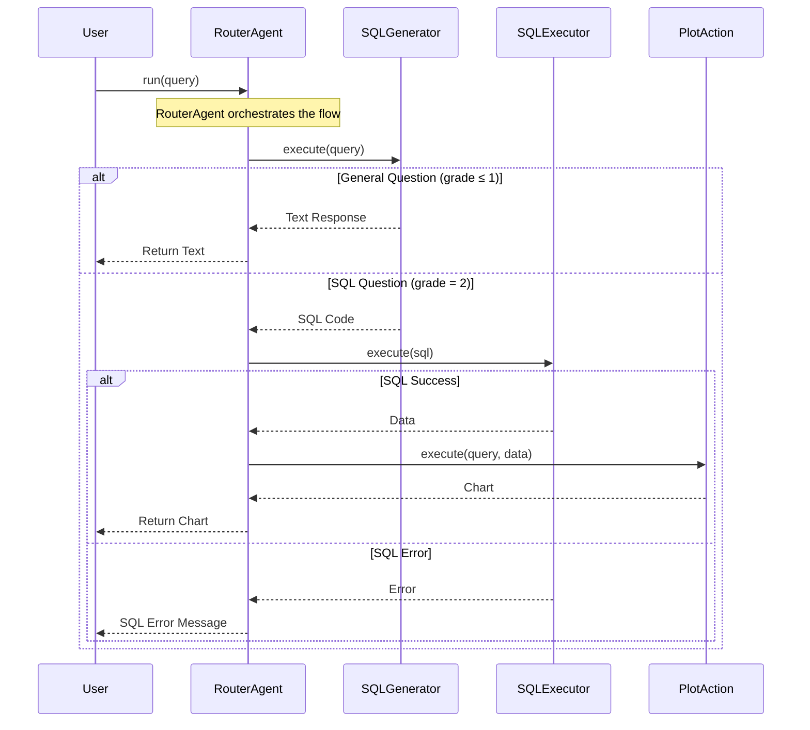
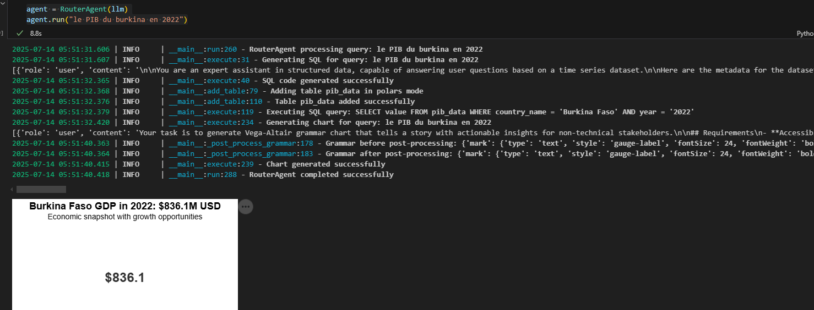
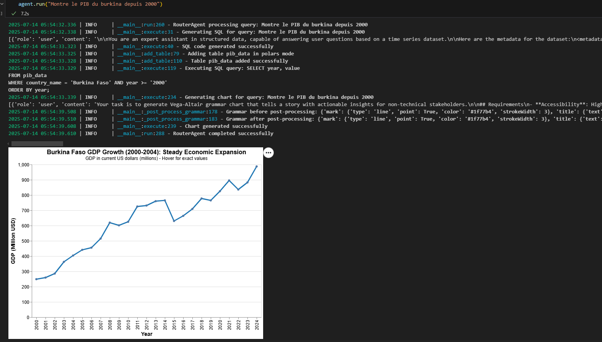

# Build an Agent (1/3): Exemple d'un Agent Router

## Introduction

Bon, 
Dans cet article, je partage avec vous comment construire des agents IA sans recourir à des frameworks complexes comme LangChain ou SmolAgent. Si vous êtes nouveau sur ce blog, je vous invite à lire d'abord cet article :

**Qu'est-ce qu'un agent ?** Pour comprendre les concepts de base, je vous invite à lire d'abord [l'article précédent sur les agents](https://sawallesalfo.github.io/blog/2025/06/30/agentic-ia-ne-veut-pas-forc%C3%A9ment-dire-agent-react/)

Cette première partie de la série "How to build an Agent" se concentre sur la création d'un **Router Agent** - un agent capable de router intelligemment les requêtes utilisateur vers différentes actions selon leur nature.

L'approche présentée ici privilégie la simplicité et le contrôle total sur les sorties des agents, en utilisant uniquement Python et des bonnes pratiques d'abstraction. Dans cet article, nous allons mettre en place un Agent Router qui fait des visualisations de A à Z.

## Les 8 Bonnes Pratiques Fondamentales

Avant d'explorer l'implémentation, voici quelques bonnes pratiques à mettre en place si vous voulez créer vos propres agents :

1. **Concevoir un workflow clair** avec une orchestration simple, privilégier les schémas pour avoir une idée claire des composants de votre système. Vous pouvez dessiner au tableau, sur PowerPoint ou avec un outil spécifique. Personnellement, je préfère utiliser Mermaid car il s'intègre facilement dans le code.

2. **Définir un type de sortie standardisé** (ici dans cet article j'utiliserai `ActionOutput`) pour toutes les actions

3. **Standardiser les méthodes principales** (utiliser `execute()` pour chaque action)

4. **Utiliser des balises XML** pour contrôler les sorties des LLMs

5. **Implémenter le One-Shot Prompting** avec des exemples dans les prompts

6. **Utiliser un adapter pattern** pour gérer les différents clients LLM (voir mon article sur LLM factory [ici](https://sawallesalfo.github.io/blog/2025/04/30/trop-de-sdk-pour-les-llms--passe-%C3%A0-une-llmfactory--ou-adapters-avec-litellm/))

7. **Maintenir un code propre** avec une logique d'abstraction bien définie (ce point c'est assez simple à dire mais plus le code est codé sans bonne structuration plus il sera difficile à maintenir)

8. **Différencier vos prompts templates** avec Jinja au lieu d'un simple formatage, car vous serez vite limité quand vous avez un mélange d'accolades dans vos prompts. D'ailleurs, vous pourriez définir des décorateurs qui permettent de générer les prompts templates juste grâce à un docstring de votre fonction.

Dans la suite de cet article, on essayera de mettre en place un Agent qui fait des visualisations.

## WORKFLOW

Notre Router Agent suit un pattern d'orchestration simple mais efficace :



Grâce à ce graphique, on voit que nous avons besoin d'une requête qui sera envoyée à un agent.

L'agent va d'abord passer par un générateur de code SQL, puis exécuter ce code et enfin générer le graphique.

Ce workflow nous permet donc de visualiser nos premiers composants.

## Les Abstractions de Base

La première étape consiste à créer une structure de données commune pour toutes les actions :

```python
@dataclass
class ActionOutput:
    action_name: str
    output_value: Any
    grade: int  # Note de qualité de la sortie
```

Cette approche garantit une interface cohérente entre toutes les actions de l'agent. Je peux facilement contrôler les résultats grâce au paramètre `grade`.

Toutes les actions héritent d'une classe de base et implémentent la méthode `execute()` :

```python
class BaseAction(ABC):
    def __init__(self, name: str):
        self.name = name
    
    @abstractmethod
    def execute(self, *args, **kwargs) -> ActionOutput:
        pass
```

### LLM Adapter

L'adapter permet de gérer différents clients LLM avec une interface unifiée :
Dans cet article, j'utilise un LLM de ma LLMFactory de type Mistral.

Faire un appel LLM revient à faire : `llm.predict(query=my_query, system_prompt=my_system_prompt)`

L'article qui discute de cette approche : [Trop de SDK pour les LLMs ? Passez à une LLMFactory](https://sawallesalfo.github.io/blog/2025/04/30/trop-de-sdk-pour-les-llms--passe-%C3%A0-une-llmfactory--ou-adapters-avec-litellm/)

Avec le code ci-après, j'ai mon client LLM :

```python
config = {
    "provider": "mistral",
    "api_key": os.getenv("MISTRAL_API_KEY"),
    "model_name": "mistral-medium-latest",
    "model_params": {}
}

llm = LLMFactory(config).get_client()
```

## Construction du Générateur SQL

### Prérequis

Pour générer des requêtes SQL de manière fiable avec un LLM, trois éléments sont essentiels :

1. **Une question claire et structurée** - Le LLM doit comprendre exactement ce qu'on lui demande
2. **La description complète de la base de données** - Structure, types, contraintes et signification des données
3. **Un LLM capable de générer du SQL** - La plupart des LLMs modernes en sont capables

### Implémentation

Notre implémentation suit ces étapes :

1. **Description de la base de données** 
   - Création d'un fichier YAML avec le schéma complet
   - Documentation des champs et de leur signification
   - Ajout d'exemples pour guider le LLM

2. **Configuration du LLM**
   - Utilisation de Mistral en mode API (gratuit pour les tests)
   - Configuration via l'adapter pattern vu précédemment

3. **Gestion des réponses**
   - Validation des requêtes générées
   - Gestion des questions non-SQL
   - Traitement des erreurs

4. **Template de prompt**
   - Instructions claires pour le LLM
   - Exemples de questions/réponses
   - Format de sortie standardisé

### Données et Métadonnées

Pour ce projet, j'utilise un dataset de la Banque Mondiale sur le PIB par habitant, transformé en format time series. Voici la description YAML qui servira de référence au LLM :

```yaml
dataset:
  name: "World Bank Country Classification"
  description: "World Bank country and regional classifications with income groups"
  language: "French"
  source: "Données sur les comptes nationaux de la Banque mondiale et fichiers de données sur les comptes nationaux de l'OCDE."
  title: "GDP per capita (current US$)"
  description: "Le PIB par habitant est le produit intérieur brut divisé par la population en milieu d'année. Le PIB est la somme de la valeur ajoutée brute de tous les producteurs résidents d'une économie plus toutes taxes sur les produits et moins les subventions non incluses dans la valeur des produits. Elle est calculée sans effectuer de déductions pour la dépréciation des biens fabriqués ou la perte de valeur ou la dégradation des ressources naturelles. Les données sont en dollars américains courants."    
  unit: "Current US Dollars"
  table_name: "pib_data"
  primary_key: "Country Code"
  
columns:
  - name: "country_name"
    type: "TEXT"
    description: "Country or region name in French"
    nullable: false
    examples: ["France", "Allemagne", "Brésil", "États-Unis", "Burkina Faso", "Côte d'Ivoire"]

  - name: "country_code"
    type: "TEXT"
    description: "ISO 3-letter country code or World Bank aggregate code"
    nullable: false
    primary_key: true
    examples: ["FRA", "DEU", "BRA", "USA", "BFA", "CIV", "WLD", "EUU"]
  
  - name: "value"
    type: "FLOAT"
    description: "GDP per capita in current US dollars"
    nullable: false
    
  - name: "year"
    type: "TEXT"
    description: "Year of the data"
    nullable: false  
```

Pour le prompt template SQL, cela ressemble à ceci :

```python
PROMPT_TEMPLATE_SQL = """
Tu es un assistant expert en données structurées et capable de répondre à des questions utilisateur à partir d'un jeu de données timeseries.

Voici les métadonnées du jeu de données :
<metadata>{{ metadata }}</metadata>

Les métadonnées permettent de mieux comprendre le jeu de données, ses colonnes, ses types de données, et les informations supplémentaires qui peuvent être utiles pour répondre aux questions.

Ta réponse doit respecter **strictement** l'un des formats suivants :
- Si la query demande une explication, définition, source ou toute information contenue dans les métadonnées du jeu de données, alors ta réponse doit être **entourée de balises `<text>`** comme ceci :
- Si la query nécessite d'interroger les données via une requête SQL (par exemple, valeurs d'un pays, comparaison entre années, etc.), alors ta réponse doit être **entourée de balises `<sql>`** comme ceci :

<exemple>
**Question** : Quelle est la définition longue de l'indicateur ?
**Réponse attendue** <text>Le PIB par habitant est le produit intérieur brut divisé par la population en milieu d'année. Le PIB est la somme de la valeur ajoutée brute de tous les producteurs résidents d'une économie plus toutes taxes sur les produits et moins les subventions non incluses dans la valeur des produits.</text>
</exemple>

Voici la query : <query>{{ query }}</query>
Ne mélange jamais les deux types. Ne justifie rien. Retourne uniquement ce qu'on t'a demandé au bon format.
"""
```

```python
import yaml

class SQLGeneratorAction(BaseAction):
    """Action qui génère des requêtes SQL ou retourne des informations à partir des métadonnées"""
    
    def __init__(self, llm_client):
        super().__init__("sql_generator")
        self.llm_client = llm_client
        
        # Chargement des métadonnées
        with open("./metadata.yaml", 'r') as file:
            self.metadata = yaml.safe_load(file)
    
    def _validate_sql(self, sql: str) -> bool:
        """Valide basiquement la syntaxe SQL"""
        sql = sql.strip().upper()
        return sql.startswith(('SELECT', 'WITH'))
    
    def execute(self, query: str) -> ActionOutput:
        """Génère une requête SQL ou retourne une information des métadonnées"""
        try:
            # Génération de la réponse via le LLM
            prompt = Template(PROMPT_TEMPLATE_SQL).render(
                query=query,
                metadata=self.metadata
            )
            output = self.llm_client.predict(prompt)
            
            # Tentative d'extraction d'une requête SQL
            if match := re.search(r"<sql>(.*?)</sql>", output, re.DOTALL):
                sql = match.group(1).strip()
                if self._validate_sql(sql):
                    return ActionOutput(
                        action_name=self.name,
                        output_value=sql,
                        grade=2  # SQL valide
                    )
                else:
                    return ActionOutput(
                        action_name=self.name,
                        output_value="Requête SQL invalide générée",
                        grade=0
                    )
            
            # Si pas de SQL, on cherche une réponse textuelle
            if match := re.search(r"<text>(.*?)</text>", output, re.DOTALL):
                return ActionOutput(
                    action_name=self.name,
                    output_value=match.group(1).strip(),
                    grade=1  # Réponse textuelle
                )
            
            return ActionOutput(
                action_name=self.name,
                output_value="Format de réponse invalide",
                grade=0
            )
                
        except Exception as e:
            logger.error(f"Erreur dans SQLGeneratorAction: {str(e)}")
            return ActionOutput(
                action_name=self.name,
                output_value=f"Erreur: {str(e)}",
                grade=0
            )
```

Et voilà, nous avons notre générateur SQL fonctionnel !

## Construction de l'Exécuteur du Code

Il y a plusieurs façons de procéder :

1. Si l'on dispose d'une vraie base de données relationnelle de type SQL comme PostgreSQL ou autre, c'est assez simple : il suffit de mettre en place un wrapper qui se connecte à la base et exécute les requêtes.

2. On peut aussi simuler une base de données SQL. Pour cela, on a plusieurs solutions :
   - Polars Context
   - DuckDB
   - SQLite
   - Pandas SQL

Je vous propose d'utiliser Polars car il est très optimisé : il peut faire de l'exécution lazy comme Spark et gère très bien les grosses tables. Par expérience, j'ai manipulé des tables de plus de 20 Go en faisant du SQL avec Polars. Cela fonctionne bien car le contexte fait du lazy loading et, lors du scan du dataset, il parcourt et récupère uniquement les partitions qui l'intéressent. Mais fermons la parenthèse et revenons à nos moutons.

Ici j'ai juste un fichier CSV à scanner, mais je vous propose ici une Action complète qui peut se faire sur pandas, polars ou sqlite très simple à prendre en main.

Voici le code :) ne me remerciez pas :

```python
class SQLExecutor:
    """Simplified SQL executor with configurable backends"""
    
    def __init__(self, mode: str = "sqlite"):
        self.mode = mode.lower()
        self.data_sources = {}
        
        if self.mode == "polars":
            self.ctx = pl.SQLContext()
        elif self.mode == "sqlite":
            self.conn = sqlite3.connect(":memory:")
        elif self.mode != "pandas":
            raise ValueError(f"Unsupported mode: {self.mode}. Use 'pandas', 'polars', or 'sqlite'")
    
    def add_table(self, table_name: str, data_source: Union[pd.DataFrame, pl.DataFrame, str]):
        """Add a table to the executor"""
        try:
            logger.info(f"Adding table {table_name} in {self.mode} mode")
            
            if self.mode == "pandas":
                if isinstance(data_source, str):
                    df = pd.read_csv(data_source)
                    self.data_sources[table_name] = df
                elif isinstance(data_source, pl.DataFrame):
                    self.data_sources[table_name] = data_source.to_pandas()
                else:
                    self.data_sources[table_name] = data_source
            
            elif self.mode == "polars":
                if isinstance(data_source, str):
                    df = pl.scan_csv(data_source)
                    df = df.with_columns(pl.col("year").cast(pl.String))
                    self.ctx.register(table_name, df)
                    self.data_sources[table_name] = data_source
                else:
                    self.ctx.register(table_name, data_source)
                    self.data_sources[table_name] = data_source
            
            elif self.mode == "sqlite":
                if isinstance(data_source, str):
                    df = pd.read_csv(data_source)
                elif isinstance(data_source, pl.DataFrame):
                    df = data_source.to_pandas()
                else:
                    df = data_source
                df.to_sql(table_name, self.conn, if_exists='replace', index=False)
                self.data_sources[table_name] = data_source
                
            logger.info(f"Table {table_name} added successfully")
            
        except Exception as e:
            logger.error(f"Error adding table {table_name}: {str(e)}")
            raise
    
    def execute(self, sql_query: str) -> ActionOutput:
        """Execute SQL query and return results"""
        try:
            logger.info(f"Executing SQL query: {sql_query}")
            
            if not sql_query.strip().upper().startswith(('SELECT', 'WITH')):
                raise ValueError("Only SELECT queries are allowed")
            
            if self.mode == "pandas":
                result = sqldf(sql_query, self.data_sources)
                result = result.to_dict(orient='records')
                return ActionOutput(output_value=result, grade=1, action_name="SQL executor")
            
            elif self.mode == "polars":
                result = self.ctx.execute(sql_query, eager=True)
                result = result.to_pandas().to_dict(orient='records')
                return ActionOutput(output_value=result, grade=1, action_name="SQL executor")
            
            elif self.mode == "sqlite":
                result = pd.read_sql_query(sql_query, self.conn)
                result = result.to_dict(orient='records')
                return ActionOutput(output_value=result, grade=1, action_name="SQL executor")
                
        except Exception as e:
            logger.error(f"SQL execution error: {str(e)}")
            raise Exception(f"SQL execution error: {str(e)}")
    
    def get_tables(self):
        """Get list of available tables"""
        if self.mode == "sqlite":
            cursor = self.conn.cursor()
            cursor.execute("SELECT name FROM sqlite_master WHERE type='table';")
            return [row[0] for row in cursor.fetchall()]
        else:
            return list(self.data_sources.keys())
    
    def __del__(self):
        """Cleanup resources"""
        if hasattr(self, 'conn') and self.conn:
            self.conn.close()
```

## Construction de l'Action Plot

La génération automatique de graphiques à partir de données et de requêtes en langage naturel représente un défi technique complexe qui combine traitement du langage naturel, compréhension des données et génération de code. Pour aller droit au but, c'est mieux d'utiliser vega-altair si on veut le faire plus facilement et efficacement.

### Pourquoi Altair plutôt que Plotly ou Matplotlib ?

Altair se distingue par sa grammaire de visualisation déclarative basée sur Vega-Lite, qui offre une structure JSON prévisible et standardisée, une séparation claire entre les données et la spécification visuelle, et nécessite beaucoup moins de code "boilerplate" que Matplotlib. Cette consistance structurelle facilite grandement la génération automatique de graphiques : le modèle de langage sait exactement à quoi s'attendre, ce qui réduit les erreurs et accélère le développement. En résumé, Altair est particulièrement adapté à l'automatisation car il combine simplicité, robustesse et clarté dans la définition des visualisations.

### Discussions

Le post-traitement est une étape absolument cruciale dans la génération automatique de graphiques. Il ne s'agit pas simplement de récupérer la grammaire Altair produite par le LLM : il faut aussi corriger les éventuelles incohérences de syntaxe (par exemple, les différences entre JavaScript et Python), injecter les vraies données dans la grammaire, et valider la structure finale avant le rendu. Sans cette étape, on s'expose à des erreurs d'exécution ou à des visualisations incomplètes.

Bonne nouvelle : la plupart des modèles de langage modernes, même les plus petits, s'en sortent très bien pour générer du Altair. J'ai pu tester avec GPT-4o-mini, Claude 3 Haiku ou Mistral Medium : tous comprennent la structure JSON attendue, suivent correctement les instructions, et produisent des grammaires Altair cohérentes dans la majorité des cas. Cela ouvre la voie à des solutions robustes, même avec des modèles accessibles et peu coûteux.

Un point d'attention : il ne suffit pas de générer la grammaire et de l'afficher telle quelle. Selon le contexte, la visualisation peut être servie sous différents formats : HTML pour une intégration web, base64 pour une API, ou directement en objet Altair pour une application Python. Cette flexibilité est essentielle pour s'adapter à tous les cas d'usage (dashboard, reporting automatisé, chatbot, etc.).

Un autre aspect clé à prendre en compte est la gestion des tokens et l'optimisation du prompt. Pour éviter d'exploser le contexte du modèle, il est judicieux de limiter la taille des exemples de données envoyés dans le prompt. Par exemple, on peut simplement échantillonner les 5 premières lignes du dataset :

```python
data_sample = dataset[:5]
```

Cette approche réduit significativement la consommation de tokens tout en conservant suffisamment d'informations pour que le modèle comprenne la structure des données.

Le template de prompt doit aussi être optimisé : instructions concises mais précises, exemples structurés, contraintes claires sur le format de sortie. Il ne faut pas hésiter à itérer plusieurs fois pour trouver le prompt idéal, celui qui maximise la qualité des réponses du modèle. À noter : certains modèles comme Mistral ont été entraînés sur d'anciennes versions de Vega, donc il arrive parfois qu'ils utilisent des clés obsolètes dans la grammaire générée.

Voici un exemple de template optimisé :

```python
PLOT_PROMPT_TEMPLATE = """Your task is to generate Vega-Altair grammar chart that tells a story with actionable insights for non-technical stakeholders.

## Requirements
- **Accessibility**: High contrast, clear labels, readable fonts
- **Professional**: Colorblind-friendly palette
- **Titled**: Clear, descriptive title

## Chart Types
Choose the most appropriate:
- **Trend**: Time series/line charts
- **Comparison**: Bar/grouped charts  
- **Distribution**: Histograms/box plots
- **KPI**: Gauge/indicator charts

## Output Format
- Grammar should be between tags <altair>... </altair>
- Never add key 'data' and 'config' or 'selection' or 'layer' in output
- Possible data type in key encoding are quantitative or nominal
- Just return the grammar

<altair>{
  "mark": {"type": "bar"},
  "title": "Sample Chart Title",
  "encoding": {
    "x": {"type": "nominal", "title": "X Axis Name"},
    "y": {"type": "quantitative", "title": "Y Axis Name"}
  },
  "$schema": "https://vega.github.io/schema/vega-lite/v5.20.1.json"
}</altair>

**Query**: <query>{{query}}</query>
**Data Sample**: {{data_sample}}
"""
```

En production, il ne s'agit évidemment pas de servir le graphique tel quel dans un notebook ou une console. L'intérêt de cette architecture, c'est qu'elle permet une intégration très flexible : la visualisation générée peut être exportée dynamiquement en HTML pour une application web, ou encodée en base64 pour être intégrée dans une API, un rapport automatisé, ou même transmise à un front-end distant. Cette polyvalence rend le système facilement déployable dans des contextes variés :
- Applications web (HTML)
- APIs (base64)
- Dashboards interactifs
- Génération de rapports automatisés

Mais alors, comment transformer toute cette belle théorie en un agent qui génère vraiment des graphiques ? Spoiler : il ne suffit pas de crier "Altair, fais-moi un joli chart !" (même si ça serait cool). Voici donc la fameuse classe PlotAction, à consommer sans modération :

```python
import altair as alt
import ast

class PlotAction(BaseAction):
    """Action to generate Vega-Altair charts from data and queries"""
    
    def __init__(self, llm_client):
        super().__init__("chart_generator")
        self.llm_client = llm_client
        self.prompt_template = PLOT_PROMPT_TEMPLATE
    
    def _extract_altair_content(self, text: str) -> str:
        """Extract Altair grammar from LLM output"""
        pattern = r"<altair>(.*?)</altair>"
        match = re.search(pattern, text, re.DOTALL)
        if match:
            return match.group(1).strip()
        return None

    def _post_process_grammar(self, grammar_str: str, dataset: List[Dict]) -> Dict:
        """Post-process the grammar to add data and make it Altair-compatible"""
        
        grammar_str = grammar_str.replace("true", "True").replace("false", "False").replace("null", "None")
        grammar_dict = ast.literal_eval(grammar_str)
        logger.info(f"Grammar before post-processing: {grammar_dict}")
        
        grammar_dict["data"] = {"name": "data"}
        grammar_dict["datasets"] = {"data": dataset}

        logger.info(f"Grammar after post-processing: {grammar_dict}")
        return grammar_dict
    
    def _generate_chart_grammar(self, query: str, dataset: List[Dict]) -> Dict:
        """Generate chart grammar using LLM"""
        try:
            data_sample = dataset[:5]
            prompt = Template(PLOT_PROMPT_TEMPLATE).render(query=query, data_sample=data_sample)

            llm_output = self.llm_client.predict(prompt)
            
            grammar_content = self._extract_altair_content(llm_output)
            if not grammar_content:
                raise ValueError("No valid Altair grammar found in LLM output")
        
            processed_grammar = self._post_process_grammar(grammar_content, dataset)
            return processed_grammar
            
        except Exception as e:
            logger.error(f"Error generating chart grammar: {str(e)}")
            raise Exception(f"Error generating chart grammar: {str(e)}")
    
    def _render_chart(self, grammar_dict: Dict, output_format: str = "altair"):
        """Render chart in the specified format"""
        try:
            chart = alt.Chart.from_dict(grammar_dict)
            
            if output_format.lower() == "altair":
                return chart
            
            elif output_format.lower() == "html":
                return chart.to_html()
            
            elif output_format.lower() == "base64":
                with tempfile.NamedTemporaryFile(suffix='.png', delete=False) as tmp_file:
                    chart.save(tmp_file.name, format='png')
                    with open(tmp_file.name, 'rb') as f:
                        img_data = f.read()
                    os.unlink(tmp_file.name)
                    return base64.b64encode(img_data).decode('utf-8')
            
            else:
                raise ValueError(f"Unsupported output format: {output_format}")
                
        except Exception as e:
            logger.error(f"Error rendering chart: {str(e)}")
            raise Exception(f"Error rendering chart: {str(e)}")
    
    def execute(self, query: str, dataset: List[Dict], output_format: str = "altair") -> ActionOutput:
        """Execute chart generation"""
        try:
            logger.info(f"Generating chart for query: {query}")
            
            grammar_dict = self._generate_chart_grammar(query, dataset)
            chart_output = self._render_chart(grammar_dict, output_format)
            
            logger.info("Chart generated successfully")
            return ActionOutput(
                action_name=self.name,
                output_value=chart_output,
                grade=2
            )
            
        except Exception as e:
            logger.error(f"Chart generation error: {str(e)}")
            return ActionOutput(
                action_name=self.name,
                output_value=f"Error: {str(e)}",
                grade=0
            )
```


## AgentRouter

En suivant le workflow présenté en début de l'article, l'implémentation devient assez simple :

```python
class RouterAgent:
    
    def __init__(self, llm_client):
        self.llm = llm_client
    
    def run(self, query: str) -> Union[str, ActionOutput]:
        logger.info(f"RouterAgent processing query: {query}")
        
        sql_generator = SQLGeneratorAction(self.llm)
        result = sql_generator.execute(query=query)

        if result.grade <= 1:
            logger.info("Returning general response")
            return result.output_value

        sql_executor = SQLExecutor(mode="polars")
        sql_executor.add_table("pib_data", "C:/Users/sawal/Downloads/pib_data0.csv")
        sql_data = sql_executor.execute(result.output_value)

        if sql_data.grade < 1:
            logger.error(f"SQL execution failed: {sql_data.output_value}")
            return f"SQL execution failed: {sql_data.output_value}"

        plotter = PlotAction(self.llm)
        plot_result = plotter.execute(
            query=query,
            dataset=sql_data.output_value,
            output_format="altair"
        )

        if plot_result.grade < 1:
            logger.error(f"Chart generation failed: {plot_result.output_value}")
            return f"Chart generation failed: {plot_result.output_value}"

        logger.info("RouterAgent completed successfully")
        return plot_result.output_value

```

Ce routeur est un exemple parfait d'orchestration contrôlée : ici, on gère le workflow avec des instructions `if/else`, ce qui permet une maîtrise totale du cheminement de la requête. Si on voulait un agent de type "react agent", il suffirait de déclarer les actions comme des outils : le LLM orchestrateur se chargerait alors d'appeler dynamiquement les actions selon la tâche à accomplir, sans logique conditionnelle explicite. On en discutera plus en détail dans un prochain article, car ce paradigme ouvre la porte à des architectures encore plus modulaires et scalables.

Voilà à quoi cela ressemble visuellement :


N'est-ce pas merveilleux, cette représentation ? Elle illustre parfaitement la clarté du workflow et la séparation des responsabilités entre chaque composant. Qu'en pensez-vous ? Voici une autre vue pour compléter la réflexion :


## Perspectives

Ceci n'est qu'un exemple de projet : dans la réalité, tout peut rapidement devenir complexe en fonction de la volumétrie des données, des règles métiers, ou des besoins d'intégration. Mais l'avantage de cette approche, c'est que le code reste facilement industrialisable et monitorable. Une simple application Gradio ou Dash suffit pour démontrer la valeur de ce type d'agent, que ce soit en POC ou en production.

Quelques pistes pour aller plus loin :
- Ajouter une gestion fine des erreurs et des logs pour chaque action.
- Intégrer un système de monitoring (ex : Prometheus, Grafana) pour suivre les performances et détecter les anomalies.
- Déployer l'agent sous forme d'API REST ou de microservice pour l'intégrer dans un SI existant.
- Étendre le routeur pour gérer plusieurs jeux de données ou plusieurs types de visualisations.
- Ajouter une interface utilisateur interactive pour tester dynamiquement les requêtes.

## Conclusion

La construction d'un Router Agent, comme présenté ici, montre qu'il est possible de bâtir des systèmes intelligents, robustes et évolutifs sans dépendre de frameworks complexes. L'essentiel réside dans la clarté du workflow, la standardisation des interfaces, et l'utilisation judicieuse des abstractions. En combinant bonnes pratiques d'ingénierie logicielle et puissance des LLMs, on obtient des agents à la fois simples à maintenir et capables de répondre à des besoins métiers variés.

La prochaine fois, nous explorerons ensemble comment passer d'un agent "if/else" à un agent réactif, où le LLM orchestre lui-même la séquence d'actions à exécuter, pour encore plus de flexibilité et d'automatisation. Restez connectés !