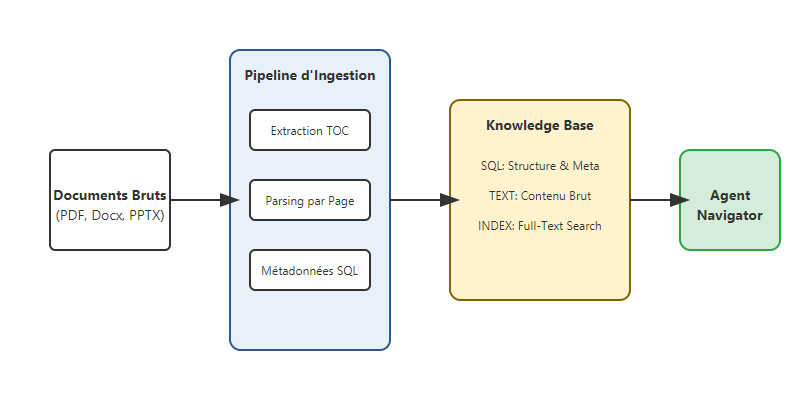
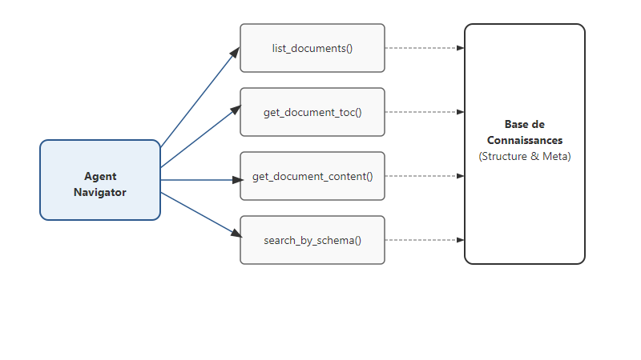

# Au-delà de la Recherche : Le RAG Agentique et le Pattern "Navigator"

Dans mon article précédent, j'ai expliqué pourquoi la **Recherche Hybride** est une première étape importante. Mais pour des domaines de précision comme la banque ou le droit, la recherche statistique par similitude ne suffit pas. L'agent doit savoir exactement où il se trouve.

C'est là qu'intervient le **RAG Agentique**, et plus précisément le pattern **Navigator**. Ici, oubliez les **Vector DB** et les **Embeddings** : nous passons sur une navigation déterministe basée sur la structure et les outils. 

<!-- more -->

## La Fondation : Une Base de Connaissances Structurée, pas Vectorielle

Beaucoup pensent que le RAG impose l'utilisation de vecteurs. En tant que **ML Engineer**, j'ai découvert que pour des bases de connaissances métier complexes (comme celles que j'ai pu bâtir récemment), la structure relationnelle est bien plus puissante pour un agent.

Pour qu'un agent Navigator soit efficace, il lui faut une "carte" précise. Voici mon pipeline type :

1.  **Extraction de la Structure (TOC)** : Je traite le document comme un arbre logique. Je consacre un effort majeur à extraire la hiérarchie pour que l'agent puisse savoir que la "Section 4.2" traite des risques financiers.
2.  **Indexing par Page et par Section** : Le texte est indexé de manière à ce que l'agent puisse "feuilleter" le document numériquement. On ne parle plus de "chunks" flous, mais de pages et de paragraphes identifiables.
3.  **Métadonnées SQL** : Chaque fragment est tagué (Date, Type de document, ID Unique). L'agent peut ainsi filtrer sa recherche avec la précision chirurgicale du SQL.



## Pourquoi se passer de Vector DB ?

Dans le pattern Navigator, l'intelligence réside dans la **capacité de l'agent à explorer** plutôt que dans le calcul de distance entre vecteurs. 
- En SQL, on sait exactement quel document on consulte.
- On peut auditer chaque étape du parcours de l'IA (elle a listé, puis a ouvert tel chapitre).
- On évite les "hallucinations sémantiques" où deux concepts proches statistiquement mais opposés juridiquement sont mélangés.

## Le Duo Gagnant : SQL + Full-Text Index

Mon architecture repose désormais sur deux piliers :
- **SQL (SQLite ou PostgreSQL)** : Pour stocker l'arborescence, les métadonnées et la TOC. C'est le cerveau "logique".
- **Full-Text Index (FTS5 ou BM25)** : Pour permettre à l'agent de chercher des mots-clés précis à l'intérieur de la structure.

## Le Pattern Navigator : L'Agent comme Explorateur

Une fois cette carte construite, je donne à l'agent une boîte à outils pour naviguer. Le premier réflexe de l'agent n'est pas de chercher, mais de **lister** ses ressources.



L'agent dispose d'outils (Tools) définis de manière structurée :

```python
@agent.tool
async def list_documents(ctx: RunContext, country: str = None) -> list[DocumentSummary]:
    """Liste les documents disponibles avec filtres SQL précis."""
    # Requête SQL directe sur la base de connaissances
    return await db.fetch_all("SELECT id, title FROM documents WHERE country = $1", country)

@agent.tool
async def get_document_toc(ctx: RunContext, doc_id: str) -> list[TocEntry]:
    """Récupère le plan structuré d'un document spécifié."""
    return await db.fetch_toc(doc_id)

@agent.tool
async def get_document_content(ctx: RunContext, doc_id: str, section_name: str) -> str:
    """Extrait le texte exact d'une section identifiée dans la TOC."""
    return await kb.extract_section(doc_id, section_name)
```

## Conclusion

Le RAG Agentique Navigator transforme l'IA d'un simple moteur de recherche statistique en un véritable **analyste documentaire**. En revenant à une structure relationnelle solide et en lui donnant les bons outils, on obtient une fiabilité qu'une approche vectorielle classique ne peut pas égaler.

Dans le prochain article, nous verrons comment garantir que ces analyses respectent vos standards métier grâce à un système de revue automatisé.
