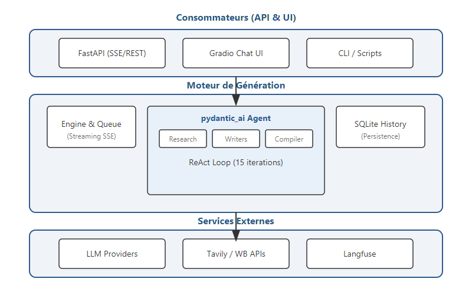

# Concevoir un Système Agentique : Quand le ML Engineering rencontre la Réalité Terrain

En tant que **ML Engineer**, on a souvent tendance à se concentrer sur la création d’APIs, de modèles ou encore de packages Python bien structurés. Dans des équipes très spécialisées — avec des backend engineers, des data engineers et des équipes plateforme — l’intégration de bout en bout est généralement fluide.

Mais mon expérience dans des organisations moins technologiques, ou au sein de petites équipes, m'a appris une réalité différente : le défi ne réside pas seulement dans le modèle lui-même, mais dans la manière dont ces composants s’intègrent réellement avec les systèmes existants. Voici comment j'ai conçu mon architecture pour qu'elle soit non seulement performante, mais surtout intégrable.

<!-- more -->

## Au-delà du modèle : Le Package comme moteur

Plutôt que de construire un service isolé, j'ai choisi de packager mon intelligence agentique. Pourquoi ? Pour qu'elle puisse être consommée aussi bien par une API FastAPI que par un simple script ou une interface de test. C'est ma façon de garantir que le travail de ML reste portable, peu importe l'évolution de l'infrastructure environnante.

## Une Structure en Couches pour la Portabilité

J'ai structuré mon système en trois couches pour isoler la complexité :
1. **La couche Consommateurs** : FastAPI, Gradio, ou CLI. C'est ici que l'on s'adapte à l'utilisateur.
2. **Le Moteur (Core Package)** : Là où je concentre la logique de l'agent et la gestion de la persistance.
3. **Les Services Externes** : LLMs et APIs.



## Gérer la latence : Le Streaming comme pont UX

Dans une petite équipe, on n'a pas toujours un expert frontend pour gérer des états complexes. En utilisant le **Server-Sent Events (SSE)** directement depuis mon moteur, je fournis une flux de données prêt à l'emploi. Chaque "pensée" de l'agent est envoyée en temps réel. C'est une décision technique qui simplifie énormément l'intégration pour ceux qui consomment mon travail :

```python
async def stream_agent_responses(request: ChatRequest):
    # Une queue pour capturer les événements de l'agent en temps réel
    event_queue = asyncio.Queue()
    
    # On lance l'agent en arrière-plan
    task = asyncio.create_task(agent_engine.run(request, event_queue))

    while True:
        event = await event_queue.get()
        if event["type"] == "done":
            break
        if event["type"] == "error":
            yield f"data: {json.dumps({'error': event['content']})}\n\n"
            break
        
        # Envoi de chaque fragment (chunk) au client
        yield f"data: {json.dumps({'chunk': event['content']})}\n\n"

@app.get("/api/chat/stream")
async def chat_stream(request: ChatRequest):
    return StreamingResponse(
        stream_agent_responses(request), 
        media_type="text/event-stream"
    )
```

## Conclusion

L'architecture d'un système agentique est un équilibre permanent. En tant que ML Engineer, ma mission s'arrête rarement au `predict()`. Elle continue jusqu'à ce que le système soit capable de discuter de manière fiable avec le reste de l'infrastructure, même si celle-ci n'est pas "AI-ready".

Dans le [prochain article](ai_webhook_integration.md), j'aborderai un point crucial de cette intégration : comment j'utilise les **webhooks** pour connecter mon IA à des systèmes qui ne peuvent pas se permettre d'attendre.
