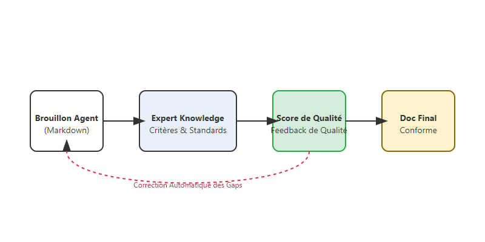

# Conformité et qualité : guider un agent vers des standards métier exigeants

Générer du texte avec une IA est devenu facile. Mais générer un document qui respecte scrupuleusement les standards de qualité, de ton et de fond d'une organisation est un défi bien plus complexe. Comment passer d'un simple "brouillon" à un document prêt à être approuvé ?

La réponse réside, selon mon expérience, dans la mise en place d'une boucle de rétroaction entre l'agent et une base de connaissances experte. C'est ce que j'aime appeler la **Conformité Agentique**.

<!-- more -->

## Le Risque de l'IA "en roue libre"

Sans guide, un agent aura tendance à être trop générique ou à ignorer certaines contraintes métier spécifiques (ex: mentions obligatoires, format précis des indicateurs). J'ai souvent constaté que cela pouvait aboutir à des documents demandant tellement de révisions humaines que le gain de temps initial était annulé.

## Ma Solution : Le Reviewer Agent et les Critères de Qualité

Pour garantir la qualité, j'ai souvent introduit un second rôle dans mes workflows : le **Reviewer Agent**. Son travail n'est pas de rédiger, mais de critiquer. Il s'appuie sur deux piliers :

1. **La Base de Connaissances Experte** : Elle contient les guides de rédaction officiels, les exemples de "bons" documents et les checklists.
2. **Les Grilles d'Évaluation** : Des critères précis auxquels l'agent doit répondre avec une preuve concrète.

Voici comment je structure le retour de cet agent via un modèle **Pydantic**, pour qu'il soit directement exploitable par le système :

```python
class AssessmentItem(BaseModel):
    id: str  # ex: "1.1a"
    question: str
    assessment: Literal["YES", "NO", "N/A"]
    comment: str
    evidence: str  # Citation exacte du texte qui prouve le résultat

class AuditReport(BaseModel):
    project_name: str
    overall_ready: bool
    assessments: list[AssessmentItem]
    critical_gaps: list[str]
    score: float  # Pourcentage de conformité
```



## Le Processus : Rédiger, Évaluer, Corriger

Le cycle de production que je privilégie suit trois étapes clés :

### 1. La Rédaction Guidée
L'agent rédacteur utilise les outils de recherche et de rédaction pour créer une première version.

### 2. L'Audit Automatique
Le Reviewer Agent analyse le brouillon par rapport aux critères métier. Pour chaque section, il identifie les "Gaps" (les manques). Grâce au modèle structuré ci-dessus, le système sait exactement quelles parties corriger.

### 3. La Correction Itérative
Au lieu de simplement donner ce rapport à l'humain, le système renvoie ces observations à l'agent rédacteur. Ce dernier, informé de ses manques, relance une recherche spécifique et met à jour les sections concernées.

## L'Humain au centre de la validation

Je ne vois pas la technologie comme un remplaçant de l'expert, mais comme un moyen de le libérer des tâches de vérification de forme. L'expert reçoit un document déjà "prêt pour relecture", accompagné d'un score de qualité. Cela transforme son rôle : il ne corrige plus les oublis basiques, il apporte sa valeur ajoutée stratégique.

## Conclusion

L'avenir de l'IA générative en entreprise ne réside pas dans la production de masse, mais dans la production de **qualité**. En intégrant des boucles de conformité directement dans des architectures d'agents, j'essaie de bâtir des systèmes qui ne se contentent pas d'écrire, mais qui comprennent et respectent des standards d'excellence.

C'est ainsi que je conclus cette série d'articles sur l'analyse et la revue agentique. Dans le [dernier article](https://sawallesalfo.github.io/blog/2026/02/28/sous-le-capot-du-docx--comment-jautomatise-le-remplissage-de-fiches-m%C3%A9tier-avec-une-ia/), je partagerai avec vous comment je boucle la boucle en automatisant la production de documents finaux parfaitement formatés.
