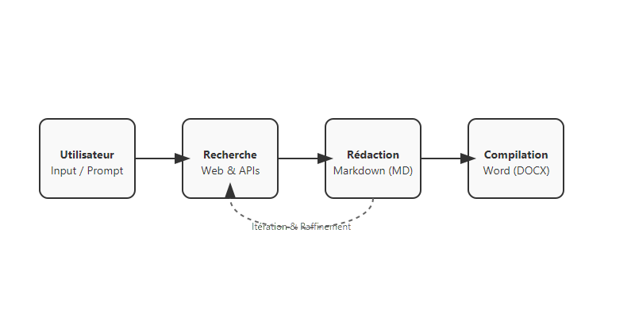

# Automatiser la génération de documents complexes : mon approche agentique

La génération de documents professionnels, tels que les rapports techniques ou les notes de cadrage, est une tâche qui demande souvent des heures de recherche, de synthèse et de mise en forme. Si les LLMs classiques excellent dans la rédaction de courts textes, j'ai souvent remarqué qu'ils peinent à produire des documents longs et structurés tout en respectant un template strict.

Pour relever ce défi, j'ai exploré une approche agentique basée sur le pattern **ReAct** (Reasoning + Acting). Dans cet article, je partage avec vous ma façon de transformer un processus de rédaction manuel en un système capable de rechercher des données, de rédiger des sections et de compiler un document final. C'est une méthode parmi d'autres, mais elle s'est révélée particulièrement efficace.

<!-- more -->

## Le Problème : Pourquoi un simple prompt ne suffit pas ?

Lorsqu'on demande à une IA de "générer un rapport de 30 pages", on se heurte rapidement à plusieurs limites :
1. **La fenêtre de contexte** : Même avec des fenêtres larges, la cohérence globale diminue avec la longueur du texte.
2. **Le manque de données fraîches** : L'IA ne connaît pas les derniers indicateurs ou les spécificités locales sans recherche externe.
3. **Le formatage** : Faire respecter une structure de chapitres précise et insérer des tableaux formatés reste un défi pour un modèle purement textuel.

## Une Solution possible : Découper pour mieux régner

L'approche que je privilégie consiste à donner à l'IA les outils nécessaires pour construire le document pièce par pièce. Au lieu de rédiger le document d'un bloc, j'ai mis en place un cycle itératif où l'agent gère :

1. **La Recherche** : Utilisation d'outils de recherche web ou d'APIs métier spécialisées.
2. **La Rédaction par section** : Chaque chapitre est rédigé individuellement, souvent au format Markdown pour plus de souplesse.
3. **La Validation** : L'agent peut inspecter son propre travail et corriger une section si nécessaire.
4. **La Compilation** : Une fois toutes les sections prêtes, un outil dédié assemble le tout dans un format professionnel (DOCX ou PDF).



## Mise en œuvre technique

Pour l'implémentation, j'utilise souvent des frameworks comme **pydantic_ai** qui permettent de définir des agents de manière structurée. Chaque capacité de l'agent est enregistrée comme un "tool". Par exemple, voici comment je définis généralement un outil de rédaction de section :

```python
@agent.tool
async def write_section(ctx: RunContext, section_id: str, content: str):
    """Rédige une section spécifique du document."""
    # Logique pour sauvegarder le contenu dans un espace de travail temporaire
    return f"Section {section_id} mise à jour."
```

## Le défi du "Human-in-the-loop" : Ne pas écraser l'humain

Un aspect crucial de mon approche est la collaboration entre l'IA et l'utilisateur. Il arrive souvent qu'après une première génération, un expert souhaite modifier manuellement un paragraphe directement dans le Markdown. 

Si l'agent relance une génération sans précaution, il risque d'écraser ces modifications précieuses. Pour éviter cela, j'ai mis en place une stratégie de "lecture avant écriture" : l'agent utilise un outil `inspect_workspace()` pour lister les fichiers, puis un outil `read_section()` pour intégrer les changements de l'utilisateur dans son contexte avant de proposer des améliorations.

## Conclusion

L'utilisation d'agents pour la génération de documents change radicalement ma productivité. En passant d'une rédaction monolithique à une approche par outils et sections, j'obtiens des résultats plus précis et réellement collaboratifs.

C'est mon retour d'expérience actuel sur le sujet. Dans le [prochain article](https://sawallesalfo.github.io/blog/2025/10/30/concevoir-un-syst%C3%A8me-agentique--quand-le-ml-engineering-rencontre-la-r%C3%A9alit%C3%A9-terrain/), je vous propose de regarder sous le capot pour analyser l'architecture technique que j'ai mise en place.
