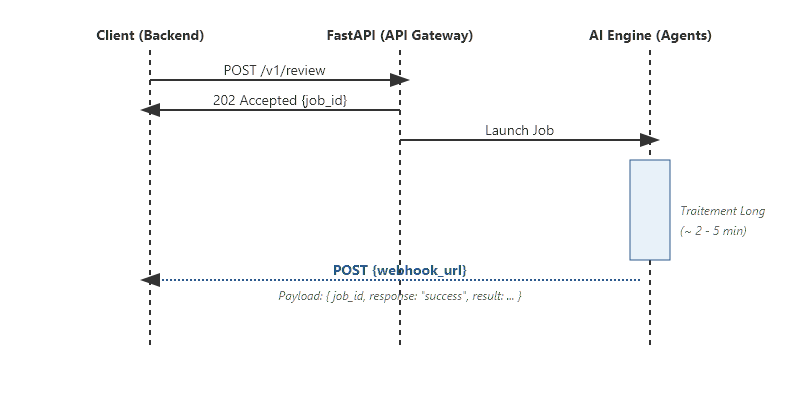

# Finis les timeouts : comment j'intègre mes moteurs IA via webhooks

On se concentre souvent sur la performance des modèles. Mais dans la réalité, le défi est de faire en sorte que l'IA discute efficacement avec le reste du système. C'est là que j'ai découvert la puissance des **webhooks**.

<!-- more -->

## Le Mur du Synchrone

Le traitement par IA peut prendre plusieurs minutes. Maintenir une connexion HTTP ouverte est risqué. L'approche asynchrone transforme le dialogue : l'API répond immédiatement "202 Accepted" et rappelle le client via un **Webhook** une fois le travail fini.



## L'Élément Clé : Le Contrat d'Interface

Pour que la notification soit automatique et fluide, il faut établir un **contrat strict** entre mon moteur IA et le développeur Backend. Sans ce contrat, le backend ne saurait pas interpréter ma réponse et serait obligé de venir "interroger" mon API manuellement (polling).

Voici le schéma de données (Payload) que j'utilise généralement pour notifier le backend :

```json
{
  "job_id": "uuid-1234-5678",
  "status": "success",
  "result": {
    "document_url": "https://storage.cloud/document_final.docx",
    "summary": "Le document a été généré avec succès..."
  },
  "metadata": {
    "user_id": "user_01",
    "processing_time": "145s"
  }
}
```

En cas d'erreur, le contrat prévoit une structure identique pour que le backend puisse gérer l'échec proprement :

```json
{
  "job_id": "uuid-1234-5678",
  "status": "error",
  "error_message": "LLM timeout after 120s"
}
```

## Mise en œuvre avec FastAPI

Du côté de mon moteur IA, l'envoi de la notification se fait via une simple requête POST vers l'URL fournie par le backend :

```python
import httpx

async def notify_backend(webhook_url: str, payload: dict):
    async with httpx.AsyncClient() as client:
        # On tente d'envoyer le résultat au backend
        response = await client.post(webhook_url, json=payload)
        
        # Logique de retry si le backend est temporairement indisponible
        if response.status_code != 200:
            logger.warning(f"Notification failed: {response.status_code}")
```

## Pourquoi ce contrat change tout ?

1. **Automatisation Totale** : Le développeur backend crée un endpoint dédié. Dès que mon agent a fini, le backend reçoit les données et peut, par exemple, envoyer un mail à l'utilisateur ou mettre à jour une base de données sans aucune intervention manuelle.
2. **Découplage** : Je peux faire évoluer mon moteur IA sans casser le backend, tant que je respecte le format JSON convenu.
3. **Fiabilité** : En cas de coupure réseau, mon système de notification peut retenter l'envoi (Retry Policy), garantissant que le résultat arrive à destination.

## Conclusion

L'intégration de l'IA demande de sortir du cadre du code pour regarder comment l'information circule. En définissant un contrat de webhook clair, je m'assure que mon travail est réellement exploitable par les autres équipes.

Dans le [prochain article](https://sawallesalfo.github.io/blog/2025/12/30/le-rag-ne-se-limite-pas-aux-embeddings--limportance-de-la-recherche-hybride/), je vous expliquerai pourquoi j'ajuste mon approche du RAG pour redonner du poids aux mots-clés.
