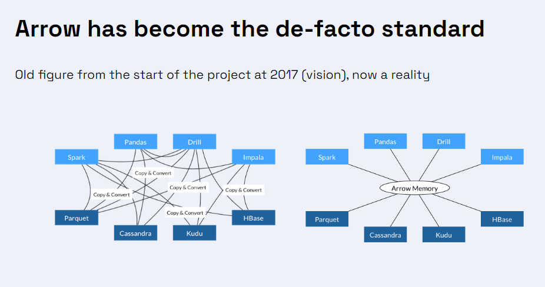

# Apache Arrow pour l'optimisation du traitement des données

La gestion des données en mémoire ressemble parfois à un tatonnement. Les  data engineers, scientists et analysts se retrouvent souvent à jongler entre différents formats de données, calculs intensifs et besoins de performance. Jusqu’à récemment, nous étions limités par des outils et formats conçus pour des volumes et des vitesses bien inférieurs à ceux d’aujourd'hui. C’est là qu’**Apache Arrow** entre en scène, tel un champion prêt à transformer ce marathon en un sprint maîtrisé.
Dans ce billet de blog, on ne va parler que de données. Comment python gère les dataframes en backend?
<!-- more -->

## Représentation tabulaire des données

### Théoriquement
On commence par un petit voyage dans la manière dont les données sont stockées. Imaginez que vous avez une énorme table remplie de données :


Il existe deux façons principales de l’organiser en mémoire dans un logiciel :

- **Row-wise** : ici, les données sont stockées ligne par ligne. Chaque ligne représente un enregistrement complet. C’est comme si vous lisiez un livre page par page, pratique pour écrire rapidement des données.

  

- **Columnar** : dans ce format, les données sont stockées par colonne. Chaque colonne contient les valeurs d’un même attribut, ce qui est très efficace pour les opérations de lecture et d'analyse, notamment lors du filtrage ou de l'agrégation.

  


### En pratique : stockage sur disque
La manière dont ces formats sont implémentés peut avoir un impact majeur sur les performances d'analyse. Prenons l'exemple d'un data scientist travaillant sur de grands ensembles de données.

#### Formats Row-wise
Les formats **row-wise** sont souvent utilisés dans des bases de données transactionnelles comme PostgreSQL ou MySQL. Ils permettent un accès rapide aux enregistrements complets, idéaux pour des opérations telles que les insertions et mises à jour. Toutefois, pour les analyses complexes, ce format peut ralentir les choses, car il est moins efficace pour les opérations d'agrégation ou de filtrage sur des colonnes spécifiques. Par exemple, interroger une base de données pour des statistiques sur une colonne exige la lecture de toutes les lignes, ce qui entraîne une surcharge.

Les formats row-wise incluent également des formats comme **CSV**, **Excel**, et **JSON** :

- **CSV (Comma-Separated Values)** : Ce format, très répandu, stocke les données sous forme de texte brut. Bien qu'il soit pratique pour l'échange de données, il se révèle souvent inefficace pour les analyses complexes de grands ensembles de données, en raison de sa structure plate et non optimisée.
  
- **JSON (JavaScript Object Notation)** : Structuré de manière row-wise, JSON est idéal pour l'échange de données, mais reste inefficace pour les analyses complexes.

#### Formats Columnar
Les formats **columnar** sont optimisés pour les performances lors des analyses de données. Ils permettent des opérations rapides sur les colonnes, notamment pour le filtrage et l'agrégation. Les formats optimisés incluent **Apache Parquet**, **ORC**, et **Feather**.

- **Parquet** : Un format de fichier compressé et optimisé pour le stockage de grands volumes de données. Il est particulièrement efficace pour les analyses car il stocke les données par colonne et compresse les valeurs similaires, réduisant ainsi l'espace de stockage et améliorant les performances d'E/S.

- **ORC (Optimized Row Columnar)** : Similaire à Parquet, ORC offre des performances de lecture rapides et une compression efficace, souvent utilisé dans les environnements Hadoop.

- **Feather** : Format simplifié pour les échanges rapides de données entre langages, comme Python et R. Il permet un accès extrêmement rapide et réduit le temps d'E/S grâce à des buffers efficaces.


## Backends Arrow vs NumPy Array

Lorsque nous travaillons sur des données en Python, que ce soit pour des calculs ou du stockage, nous utilisons des bibliothèques comme Pandas, NumPy, Polars ou PyArrow. Mais comment ces données sont-elles gérées en backend ? 

### Gestion des formats de données



L'image ci-dessus illustre comment Apache Arrow s'est imposé comme un standard pour le traitement de données en mémoire. Autrefois, chaque outil devait réaliser des conversions pour lire différents formats de données (CSV, Parquet, etc.), ce qui entraînait des pertes de temps et une inefficacité des ressources. Aujourd'hui, Arrow centralise le stockage en mémoire, permettant aux outils d'accéder directement aux données sans conversion intermédiaire.

### Intégration progressive du backend PyArrow

Par défaut, Pandas utilise NumPy comme backend :

```python
pd.read_csv('data.csv')
```

Depuis Pandas 2.0, il est désormais possible d'utiliser **Apache Arrow** comme backend pour améliorer les performances, notamment pour les types de données complexes comme les chaînes de caractères et les dates.

Voici comment lire un fichier CSV avec le backend PyArrow :

```python
pd.read_csv("data.csv", engine="pyarrow", dtype_backend="pyarrow")
```

Sur un fichier de test, cette méthode a été **32 fois plus rapide** que l'exécution standard avec NumPy.

### Pourquoi ?

Pour comprendre la raison, résumons rapidement comment Pandas fonctionne. L'idée générale est qu'avant de pouvoir faire quoi que ce soit dans Pandas, il est nécessaire de charger en mémoire les données d'intérêt (en utilisant des méthodes comme read_csv, read_sql, read_parquet, etc.). Lors du chargement des données en mémoire, il est nécessaire de décider comment ces données seront stockées. Pour les simples données comme les entiers ou les flottants, cela n'est généralement pas si compliqué, car la représentation d'un seul élément est principalement standard, et nous avons juste besoin de tableaux du nombre d'éléments dans nos données. Mais pour d'autres types (comme les chaînes, les dates et heures, les catégories, etc.),

Python est capable de représenter presque tout, mais les structures de données de Python (listes, dictionnaires, tuples, etc.) sont très lentes et ne peuvent pas être utilisées. Ainsi, la représentation des données n'est ni en Python ni standard, et une implémentation doit être réalisée via des extensions Python, généralement implémentées en C (ou en C++, Rust, et autres). Pendant de nombreuses années, l'extension principale pour représenter des tableaux et effectuer des opérations sur eux de manière rapide a été NumPy. Et c'est sur cette base que Pandas a initialement été construit.

Apache Arrow, quant à lui, a émergé comme un standard pour le traitement en mémoire. Il permet de centraliser les données, éliminant la nécessité de conversions coûteuses entre différents formats de stockage. Cela améliore considérablement les performances des analyses.


## Fonctionnement des backends Arrow et NumPy

Pour illustrer les différences entre NumPy et Apache Arrow, générons des données similaires à celles que nous avons utilisées précédemment. 

Imaginons que nous avons une colonne avec les chaînes suivantes :

- `"numpy"`

- `"data"`

- `"analysis"`

- `null`

- `"performance"`

### NumPy Backend

Avec NumPy, on stockerait ces chaînes en utilisant un tableau de taille fixe, souvent moins optimal pour les chaînes de caractères.

- **Structure** :
  - Tableau de chaînes de longueur maximale, par exemple 15 caractères.
  - Chaque chaîne occupe 15 espaces, même si elle est plus courte.

**Représentation hypothétique du tableau NumPy**

| Chaîne         | Stockage                           |
|----------------|------------------------------------|
| `"numpy"`      | `"numpy         "`                 |
| `"data"`       | `"data         "`                  |
| `"analysis"`   | `"analysis    "`                   |
| `null`         | `""            ` (ou espace vide)  |
| `"performance"`| `"performance "`                   |

### Apache Arrow Backend

Avec Arrow, ces chaînes sont stockées en utilisant plusieurs buffers (un buffer est une zone mémoire temporaire utilisée pour stocker des données en attente de traitement ou de transfert).

- **Validity Bitmap Buffer** : `00011101`
- **Offsets Buffer** : `0 5 9 17 17 28`
- **Values Buffer** : `numpydataanalysisperformance`

**Représentation Arrow**

| Composant             | Valeurs                         |
|-----------------------|---------------------------------|
| Validity Bitmap Buffer| `00011101`                      |
| Offsets Buffer        | `0 5 9 17 17 28`                |
| Values Buffer         | `numpydataanalysisperformance`  |

- **Validity Bitmap Buffer** : Indique l'absence du 4ème élément (`null`).
- **Offsets Buffer** : Montre les débuts et fins de chaque chaîne dans le Values Buffer.
- **Values Buffer** : Contient les données réelles, stockées de manière compacte.

Cela permet une gestion plus efficace de la mémoire et améliore les temps de traitement, notamment pour des opérations complexes sur de gros ensembles de données.


## Conclusion

Grâce à Apache Arrow, les opérations de lecture et de calcul sont optimisées, quel que soit le format de stockage. Le passage aux formats columnar est un atout majeur, surtout pour le traitement de grandes quantités de données.