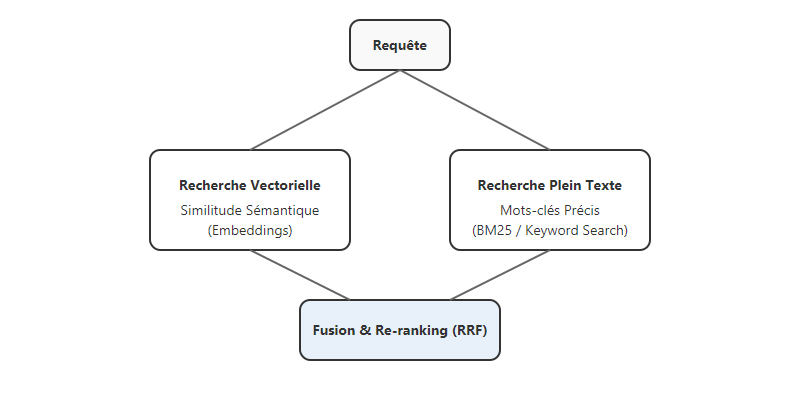

# Le RAG ne se limite pas aux embeddings : l'importance de la recherche hybride

Le RAG (*Retrieval Augmented Generation*) est devenu le standard pour connecter des LLMs à des bases de connaissances privées. Dans la plupart des tutoriels, on vous explique qu'il suffit de découper vos documents en morceaux (*chunks*), de les transformer en vecteurs (*embeddings*) et de faire une recherche de similitude.

Cependant, dans des secteurs exigeants comme la banque ou le droit, j'ai constaté que cette approche "tout-vecteur" est souvent insuffisante. Aujourd'hui, je partage avec vous pourquoi la combinaison de la recherche vectorielle et de la recherche plein texte (Full-Text Search) est le véritable pilier d'un RAG de production fiable.

<!-- more -->

## Pourquoi le "Tout-Vecteur" n'est pas suffisant ?

La recherche vectorielle est excellente pour capturer des concepts sémantiques. Mais dans le domaine juridique ou financier, la précision est vitale. J'ai souvent observé que les embeddings échouent sur :
1. **Les termes techniques et acronymes** : Un numéro d'article de loi ou un code d'opération bancaire précis peut être "lissé" dans l'espace vectoriel, perdant sa spécificité.
2. **La rareté des mots** : Des termes extrêmement rares dans le jeu de données d'entraînement du modèle d'embedding peuvent être mal interprétés.
3. **Le besoin de "Match Exact"** : Parfois, on ne veut pas ce qui est "proche", on veut exactement ce qui est "écrit".

## La Recherche Hybride : Le meilleur des deux mondes

Pour pallier ces défauts, j'utilise systématiquement une recherche hybride combinant :
- **Recherche Vectorielle** (Embeddings) : Pour la compréhension sémantique (le "sens" de la question).
- **Recherche Plein Texte** (BM25 ou Keyword Search) : Pour la précision chirurgicale sur les mots-clés, noms propres et codes.



## Pondération et Fusion (RRF)

Il est intéressant de noter que de nombreux papiers de recherche récents (State of the Art) réaffectent un poids de plus en plus important à la recherche plein texte traditionnelle. 

En utilisant des algorithmes comme le **Reciprocal Rank Fusion (RRF)**, mon système fusionne les résultats des deux méthodes. Voici une illustration simplifiée de la logique de fusion que j'utilise :

```python
def hybrid_rerank(vector_results, text_results, k=60):
    """Fusionne les résultats via Reciprocal Rank Fusion."""
    scores = collections.defaultdict(float)
    
    # On itère sur les deux listes de résultats
    for rank, doc_id in enumerate(vector_results):
        scores[doc_id] += 1 / (k + rank)
        
    for rank, doc_id in enumerate(text_results):
        scores[doc_id] += 1 / (k + rank)
        
    # On retourne les documents triés par score décroissant
    sorted_docs = sorted(scores.items(), key=lambda x: x[1], reverse=True)
    return [doc_id for doc_id, score in sorted_docs]
```

J'ajuste les scores pour donner une priorité au *Full-Text* lorsque la requête contient des termes très spécifiques. Mon expérience m'a montré que retrouver le document exact via un mot-clé unique est souvent plus utile qu'une liste de documents thématiquement proches mais hors-sujet.

## Conclusion

Le RAG de demain ne sera pas une simple boîte noire vectorielle. Ce sera un système hybride capable de respecter la précision des mots-clés tout en comprenant le contexte. C'est une étape nécessaire vers une IA vraiment exploitable par les métiers de la connaissance.

Mais chercher n'est qu'une partie du problème. Dans le [prochain article](https://sawallesalfo.github.io/blog/2026/01/15/au-del%C3%A0-de-la-recherche--le-rag-agentique-et-le-pattern-navigator/), je vous montrerai comment je passe de la "recherche" à la "navigation" intelligente grâce au **RAG Agentique (Navigator based)**.
