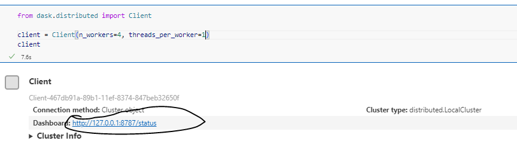
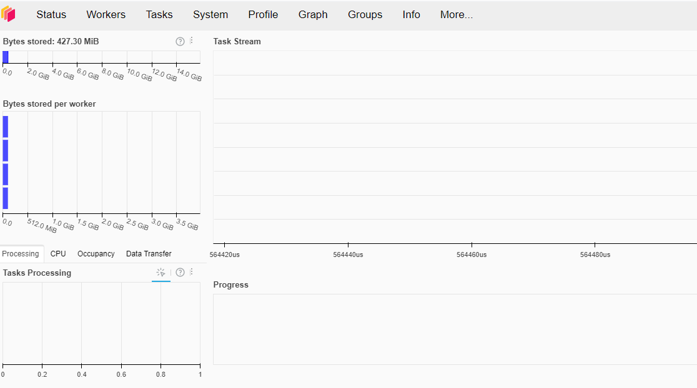
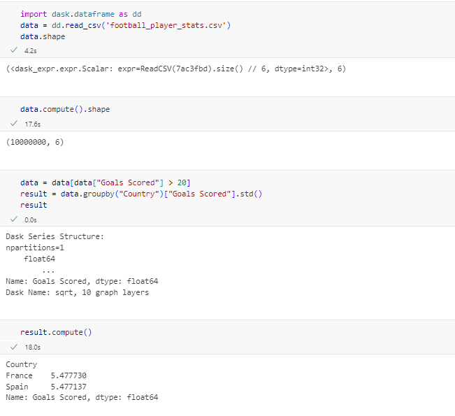

# Faites du Dask plutôt que du Spark si vous avez juste de grosses tables de données


Dans le monde actuel des données, traiter de grands volumes nécessite des solutions performantes et évolutives. Le calcul distribué permet de gérer efficacement ces données en les répartissant sur plusieurs machines/cores/workers (selon votre cas). Cependant, toutes les entreprises n'ont pas besoin d'une infrastructure lourde et coûteuse telle qu'un cluster Spark. **Dask**, un framework Python, est une alternative légère et flexible, particulièrement adaptée aux environnements déjà basés sur Python.

<!-- more -->

Ce billet de blog explore pourquoi Dask est une excellente option pour les data scientists qui manipulent de gros volumes de données, sans pour autant entrer dans la catégorie du Big Data.

### Prérequis
Si vous ne les avez pas déjà installés, vous aurez besoin des paquets suivants :
```bash
pip install dask[distributed]
pip install "bokeh>=3.1.0"  # Pour visualiser le tableau de bord du cluster
```

### 1. Données volumineuses et le besoin de calcul distribué

Lorsque le volume de données devient trop important pour être traité en mémoire sur une seule machine, les performances diminuent rapidement. Des tâches courantes comme l'entraînement de modèles de machine learning, l'analyse de données, ou encore la création de visualisations interactives peuvent être ralenties. À ce stade, le besoin de **calcul distribué** devient critique. Le principe est simple : répartir la charge de travail sur plusieurs machines pour paralléliser les calculs, et ainsi réduire considérablement le temps de traitement. Lorsqu'on ne possède pas de serveur, il s'agit de paralléliser sur le nombre de cœurs du PC.

### 2. Deux frameworks de calcul distribué : Spark et Dask

Pour répondre à ces défis, deux frameworks majeurs sont souvent utilisés : **Spark** et **Dask**. Alors que Spark a gagné en popularité dans les infrastructures Big Data, Dask est particulièrement apprécié dans les environnements Python. Voici un tableau comparatif pour mieux comprendre leurs différences :

```markdown
| **Caractéristiques**         | **Spark**                           | **Dask**                              |
|------------------------------|-------------------------------------|---------------------------------------|
| **Langage de programmation**  | Majoritairement **Scala** et **Java** | **Python**                            |
| **API de haut niveau**        | DataFrame API                       | Dask DataFrame                        |
| **Scalabilité**               | Hautement scalable, conçu pour le **Big Data** | Scalabilité adaptée aux workflows Python |
| **Type de cluster**           | Clusters distribués (Hadoop, Kubernetes) | Clusters distribués ou local sur une machine |
| **Écosystème**                | Intégré avec des outils Big Data (HDFS, Hive) | Intégré avec **NumPy**, **Pandas**, **Scikit-learn** |
| **Simplicité d'installation** | Plus complexe, nécessite souvent un cluster Hadoop | Plus simple, peut être exécuté localement |
| **Machine Learning**          | Bibliothèque intégrée (**MLlib**)   | Intégré avec **Scikit-learn**, **XGBoost**, etc. |
| **Taille des données**        | Conçu pour des pétaoctets           | Convient pour des volumes moyens à grands |
| **Maturité**                  | Plus mature, utilisé à grande échelle | Moins mature, mais en pleine expansion |
| **Coût**                  | Très cher à mettre en place un cluster spark | Pas besoin de cluster dédié pour le faire tourner efficacement |

```

### 3. Attention, tout n'est pas du Big Data

Il ne faut pas confondre données volumineuses et **Big Data**. Beaucoup d'entreprises ont de gros ensembles de données, mais cela ne suffit pas pour dire qu'elles font du Big Data. Pour mériter ce titre, il faut répondre aux critères des **5V** :

- **Volume** : Une quantité massive de données.
- **Vélocité** : La vitesse à laquelle ces données sont générées.
- **Variété** : Différents types de données (structurées, non structurées, semi-structurées).
- **Véracité** : La qualité et la fiabilité des données.
- **Valeur** : Les insights et bénéfices que l'on peut tirer de ces données.

Les géants comme **Google**, **Amazon**, et **Netflix** opèrent véritablement dans le domaine du Big Data. Ils gèrent des volumes immenses, des flux continus de données, et disposent d'une infrastructure optimisée pour tout ce traitement de masse. Cependant, si une entreprise a quelques dizaines de millions de lignes avec une vingtaine de colonnes, elle n’a pas nécessairement besoin d’un cluster Spark. Souvent, une solution comme Dask, plus légère et flexible, est beaucoup mieux adaptée à ses besoins.
Vous avez compris déjà. Dans ce billet de blog, je ne veux pas vous convaincre d'utiliser Spark. Je vous presenterai plutôt Dask.

Dask est composé de plusieurs API :

- **Arrays** (s’appuie sur NumPy)
- **DataFrames** (repose sur Pandas)
- **Bag** (suit map/filter/groupby/reduce)
- **Dask-ML** (fonctionne avec Scikit-Learn)
- **Delayed** (couvre de manière générale Python)

Puisque nous sommes en data science, on parlera de dataframe et de Dask-ML. Pour plus de références, consultez les liens dans les références.

### 4. Le Cluster Dask

Dask est un outil hyper flexible qui s'adapte aussi bien sur ta machine locale que sur un cluster distribué. Cela signifie que tu peux commencer avec une configuration légère et évoluer au fur et à mesure que tes besoins augmentent. Le noyau de sa magie réside dans le **Dask Scheduler**, qui gère l’exécution des calculs de manière dynamique, même sur plusieurs machines.

Les clusters Dask sont faciles à déployer sur des services comme Kubernetes, AWS, ou même avec un simple SSH sur des machines distantes. Comparé à des solutions plus lourdes comme Spark, cette flexibilité aide à réduire les coûts d’infrastructure. Dans mon projet, je l'exécute en local, mais ce n’est pas une obligation. Cela permet de suivre de manière efficace les ressources utilisées.

Lorsque tu crées ton client Dask, un lien vers le tableau de bord s'affiche. Je te conseille de le garder ouvert d’un côté de ton écran pendant que tu travailles sur ton notebook, même si c’est parfois un peu compliqué de jongler avec les fenêtres. C’est extrêmement utile lorsque tu commences à apprendre à utiliser Dask.

Voici comment cela fonctionne en local :


On peut voir comment le client est configuré et où le dashboard tourne. Je recommande d’y jeter un œil pour voir comment les workers exécutent ton code en coulisses.


Encore une fois, ce n’est pas obligatoire, mais c’est surtout pratique pour suivre les tâches, particulièrement lorsqu'on veut monitorer des processus ETL.

### 5. Composant DataFrames Dask

Le **Dask DataFrame** est la version parallèle du célèbre **Pandas DataFrame**. Donc, si tu maîtrises déjà Pandas, tu n'auras besoin que de petits ajustements pour te mettre à Dask. Ce qui est cool, c’est qu’il est conçu pour gérer des datasets plus gros que ce que Pandas peut traiter en mémoire, tout en gardant une interface familière.

Pandas charge tout en mémoire, ce qui n’est pas toujours idéal. Dask, en revanche, divise tes données en partitions, traitées en parallèle. Résultat, tu peux travailler avec des datasets plus volumineux que ta RAM sans trop de stress, tout en continuant d'utiliser des opérations classiques comme **groupby**, **merge**, ou **apply**. Un DataFrame Dask est essentiellement un ensemble de DataFrames Pandas.


*Une Petite Histoire...*

Pour l'anecdote, une amie statisticienne se battait avec un fichier CSV de 7 gigas sur son PC avec 64 gigas de RAM. Elle souhaitait préparer ses données pour de la modélisation statistique, mais le traitement prenait 4 heures. Avec Dask, nous avons pu réduire ce temps à... 19 minutes ! Elle était abasourdie. La clé était d'utiliser Dask pour son ETL, puis de sauvegarder sa table intermédiaire en format Parquet. Avec suffisamment de RAM et de cœurs, nous avons pu exécuter tout cela directement sur son PC.

Regarde mon code ci-dessous :


Comme tu vois, c’est du Pandas classique, non ? La seule différence, c’est que les résultats ne s'affichent qu'après avoir appelé la méthode `.compute()`. Pourquoi ? Parce que Dask fonctionne en mode "lazy execution". Il prépare toutes les opérations, et c’est seulement quand tu appelles `.compute()` qu’il exécute tout d'un coup, optimisant ainsi le processus.

Ce calcul était dix fois plus rapide qu’avec du Pandas classique. Impressionnant, non ? Si tu veux en savoir plus, jette un œil ici : [Dask DataFrame Examples](https://examples.dask.org/dataframe.html).

### 6. Dask et l'Apprentissage Automatique : Flexibilité et Intégration

Dask ne propose pas de bibliothèque intégrée comme **MLlib** dans Spark, mais il s’intègre parfaitement avec les bibliothèques populaires de machine learning de l’écosystème Python, telles que **Scikit-learn**, **XGBoost**, et **TensorFlow**. Grâce au module **Dask-ML**, tu peux étendre l’entraînement de modèles sur plusieurs machines, ce qui facilite le traitement de datasets volumineux sans forcément recourir à des solutions lourdes.

Dans un environnement classique, **Scikit-learn** utilise `joblib` pour le parallélisme sur une seule machine. Cela permet d'entraîner la plupart des estimateurs (ceux qui acceptent un paramètre `n_jobs`) en utilisant tous les cœurs de ton ordinateur portable ou de ta station de travail. Mais avec Dask, tu peux aller plus loin.

Dask te permet de paralléliser ton code Scikit-learn sur un cluster sans avoir à modifier significativement ton code existant. Par exemple, des fonctions comme **GridSearchCV** ou **RandomizedSearchCV**, très utilisées pour la recherche d’hyperparamètres, peuvent être parallélisées avec Dask. Résultat : tu gagnes en efficacité tout en gardant le même code que celui que tu exécuterais localement.

Voici un exemple avec **XGBoost** et Dask :
```python
import dask_xgboost as dxgb
import dask.dataframe as dd
from dask_ml.model_selection import train_test_split

# Définir les paramètres
params = {'objective': 'binary:logistic', 'max_depth': 4, 
          'eta': 0.01, 'subsample': 0.5, 'min_child_weight': 0.5}

# Charger les données
df = dd.read_csv('data*.csv')

X = df.drop('target', axis=1)
y = df['target']

X_train, X_test, y_train, y_test = train_test_split(X, y, test_size=0.15)

bst = dxgb.train(client, params, X_train, y_train, num_boost_round=10)

y_hat = dxgb.predict(client, bst, X_test).persist()
```

Ce qui est intéressant, c’est que tout ce code peut tourner sur un cluster distribué, ce qui booste la vitesse et la performance lorsque tu traites de gros datasets. Plus besoin de se battre contre les limites d'une seule machine.

Dask-ML offre aussi des extensions pour distribuer les modèles sur plusieurs machines. Que tu utilises **Scikit-learn**, **TensorFlow**, ou **XGBoost**, tu peux profiter de cette intégration fluide pour accélérer ton travail de data science. La flexibilité est vraiment l’atout majeur de Dask, surtout si tu évolues déjà dans un environnement Python.

Pour plus de détails et d'exemples sur l'utilisation de Dask avec le machine learning, consulte le guide officiel : [Dask XGBoost Example](https://examples.dask.org/machine-learning/xgboost.html).


### Conclusion

En conclusion, **Dask** est un excellent choix pour les entreprises souhaitant intégrer le calcul distribué dans leur workflow de data science, tout en restant dans un écosystème Python. Pour celles qui ne font pas du véritable Big Data et qui n'ont pas besoin de l'infrastructure massive d'un cluster Spark, Dask représente une solution plus légère, facile à déployer, et suffisamment puissante pour traiter de grandes quantités de données dans un environnement distribué.

### Références
- [Dask Overview](https://tutorial.dask.org/00_overview.html)
- [Parallel Computing with Dask](https://natsunami.github.io/website/2020-11-19-Parallel-computing-with-Dask/)
- [Dask XGBoost Example](https://examples.dask.org/machine-learning/xgboost.html)
- [From Pandas to Dask](https://examples.dask.org/dataframes/03-from-pandas-to-dask.html#Dask-Dataframe-vs-Pandas-Dataframe)