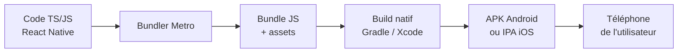
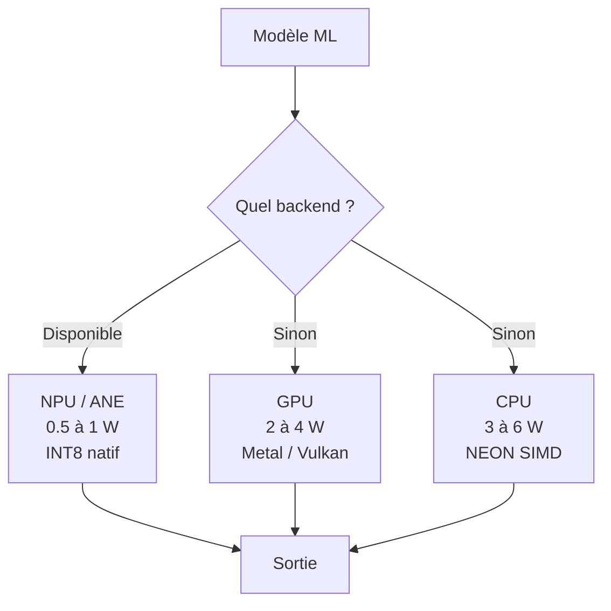
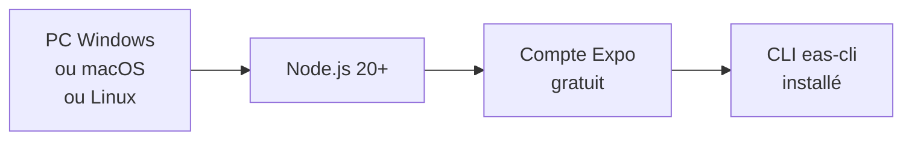
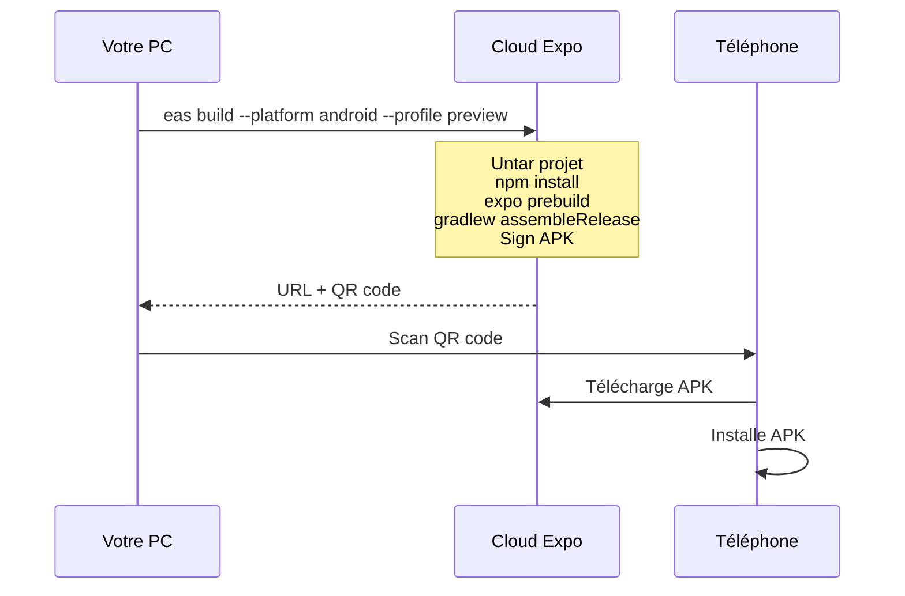
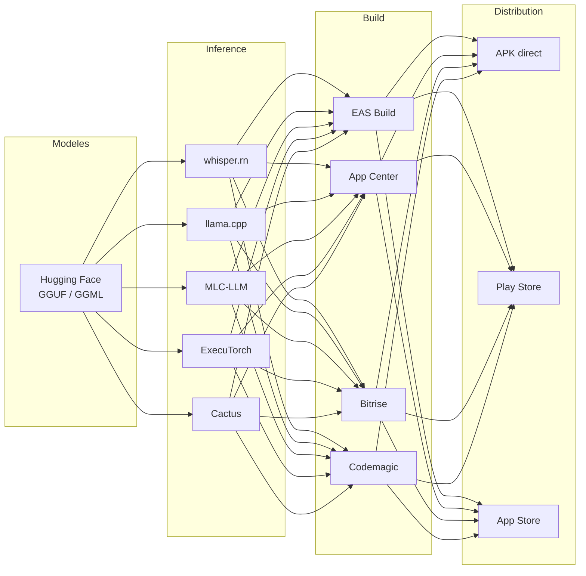
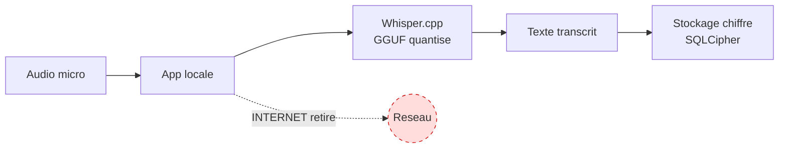

### Déployer un LLM sur mobile : un guide pas à pas pour ML engineers

La plupart d'entre nous, ML engineers, on déploie nos modèles sur des serveurs : une API derrière FastAPI, un endpoint SageMaker, un container ECS. Mais quand on me parle "déploiement on-device", je remarque que c'est souvent un sujet flou pour mes collègues data scientists. Pourtant, depuis quelques mois, c'est devenu une vraie option, même pour des modèles d'un milliard de paramètres.

J'ai monté la semaine dernière un POC de transcription audio qui tourne 100 % sur le téléphone, dans le cadre d'un projet en santé numérique. Aucune donnée ne sort du device. Et j'ai passé pas mal d'heures à expliquer ce que j'ai appris à des collègues qui n'avaient jamais touché au mobile. J'ai donc décidé de rédiger cet article pour aider un plus grand nombre de personnes à faire le saut, sans avoir à devenir développeur Android ou iOS.

<!-- more -->

L'article suppose que vous n'avez jamais fait de dev mobile. On part de zéro, et on avance étape par étape jusqu'à un POC qui tourne réellement sur un téléphone Android.

#### Pourquoi s'y intéresser maintenant ?

Trois choses ont changé en 2025-2026 :

1. **Les NPU sont partout.** Apple Neural Engine depuis 2017, Qualcomm Hexagon sur tous les Snapdragon récents, MediaTek APU sur les Dimensity. Même un Tecno milieu de gamme à 200 € peut faire tourner Whisper Small en temps réel.
2. **La compression de modèles est devenue accessible.** GPTQ, AWQ, GGUF, quantisation INT4/INT5 : on divise la taille d'un modèle par 4 à 8 sans vraiment perdre en qualité.
3. **Les contraintes business poussent au local.** RGPD, secret médical, zones sans réseau, coût d'inférence cloud : tout tire vers l'inférence locale.

Pour comparer concrètement :

| Critère | Cloud API | On-device |
|---|---|---|
| Latence réseau | 50 à 500 ms | 0 ms |
| Coût marginal par requête | par token | 0 après installation |
| Confidentialité | données chez le provider | données restent sur le device |
| Mode hors ligne | impossible | natif |
| Update du modèle | instantané | OTA ou store |
| Variabilité de perf | nulle | énorme selon device |

Aucun n'est meilleur dans l'absolu. Mais pour la santé, la finance, la défense, ou les zones rurales, l'on-device gagne presque toujours.

#### Le vocabulaire mobile en 5 minutes

Avant de plonger dans le code, posons les mots qui vont revenir tout le temps. Si vous venez du backend ou du data, certains vous parleront déjà.



Voici les termes essentiels :

- **APK** : le fichier installable sur Android. Pensez à un `.exe` Windows.
- **IPA** : la même chose pour iOS.
- **React Native (RN)** : un framework qui permet d'écrire une app mobile en TypeScript. Comme React, mais ça produit une vraie app native.
- **Expo** : un toolkit qui simplifie React Native. Il gère pour vous les permissions, l'audio, le filesystem, et surtout le build.
- **EAS Build** : le service cloud d'Expo qui compile votre app à votre place. C'est un peu le GitHub Actions du mobile : vous poussez votre code, leurs serveurs Linux/macOS produisent l'APK ou l'IPA.
- **Gradle** : le système de build Android. Si vous passez par EAS, vous n'aurez jamais à y toucher.
- **Xcode** : l'IDE Apple, obligatoire pour iOS si vous compilez localement. Avec EAS, vous n'en avez pas besoin.

> **Astuce :** Avec Expo et EAS, vous n'installez rien de natif sur votre PC. Vous écrivez du TypeScript, et tout le build se passe dans le cloud. Pour un data scientist sous Windows qui veut publier une app iOS, c'est une vraie libération.

#### La pile hardware à connaître

##### Pourquoi est-ce important ?

Parce qu'un même modèle peut être 10 fois plus rapide et 10 fois moins énergivore selon où il tourne sur le téléphone. Connaître les trois unités de calcul permet de comprendre pourquoi votre POC vole sur un iPhone 15 Pro et rame sur un Tecno Spark.



Le rôle d'un framework d'inférence mobile, c'est de router automatiquement vers le NPU si c'est dispo, sinon le GPU, sinon le CPU.

> **Note :** Conséquence pratique, votre POC se comporte différemment sur un iPhone 15 Pro et sur un Tecno Spark à 150 €. Toujours tester sur le hardware réel des utilisateurs, jamais sur votre tel perso si c'est haut de gamme.

#### La quantisation : le concept à retenir

Si vous ne deviez retenir qu'une seule notion de cet article, ce serait celle-ci.

```
Whisper Small FP32 : 466 Mo, lent, précision haute
Whisper Small Q8_0 : 244 Mo, rapide, perte 0%
Whisper Small Q5_1 : 190 Mo, très rapide, perte négligeable
Whisper Small Q4_0 : 150 Mo, ultra rapide, perte mineure
```

`Q5_1` veut dire 5 bits par poids avec une variante d'algorithme. La logique :

- Passer de FP32 à INT8 divise la mémoire par 4 et l'énergie par environ 16 sur NPU.
- 80 % de l'énergie d'inférence vient des accès mémoire, pas du calcul lui-même. Réduire la taille des poids réduit la conso, mécaniquement.
- **GGUF** est le format dominant côté mobile. Tous les modèles populaires (Llama, Mistral, Whisper, Qwen) ont des versions GGUF prêtes à l'emploi sur Hugging Face.

À retenir : un modèle ML déployé n'est pas un seul artefact. C'est un point sur la courbe taille / qualité / latence, que vous choisissez selon vos contraintes hardware. Comme un data scientist qui choisit entre XGBoost et un MLP, vous choisissez ici entre tiny, small, base, medium.

#### Le tutoriel pas à pas

L'objectif : faire tourner Whisper sur un téléphone Android, avec deux variantes de modèle pour bencher.

##### Étape 1: Préparer votre environnement



Voici comment procéder :

1. **Installer Node.js 20 ou plus récent** depuis [nodejs.org](https://nodejs.org).
2. **Créer un compte gratuit** sur [expo.dev/signup](https://expo.dev/signup). Email et password, pas de carte bancaire demandée.
3. **Installer le CLI EAS** :
   ```bash
   npm install -g eas-cli
   eas login
   ```

> **Astuce :** Aucun outil mobile (Android Studio, Xcode) à installer. C'est exactement ce qui rend Expo intéressant pour un data scientist qui veut juste tester un modèle, sans devenir dev mobile.

##### Étape 2: Scaffolder le repo

Créez un dossier projet et initialisez :

```bash
mkdir mon-stt-mobile && cd mon-stt-mobile
npm init -y
```

Installez les dépendances :

```bash
npm install expo expo-asset expo-av expo-file-system expo-status-bar
npm install react react-native whisper.rn
npm install --save-dev typescript @types/react
```

Créez un `app.json` minimal :

```json
{
  "expo": {
    "name": "Mon STT Mobile",
    "slug": "mon-stt-mobile",
    "version": "0.1.0",
    "orientation": "portrait",
    "android": {
      "package": "com.exemple.sttmobile",
      "permissions": [
        "android.permission.RECORD_AUDIO",
        "android.permission.INTERNET"
      ]
    },
    "ios": {
      "bundleIdentifier": "com.exemple.sttmobile",
      "infoPlist": {
        "NSMicrophoneUsageDescription": "Autoriser le micro pour la transcription locale."
      }
    },
    "plugins": ["expo-av"]
  }
}
```

Et un `eas.json` pour configurer le build :

```json
{
  "cli": { "version": ">= 12.0.0" },
  "build": {
    "preview": {
      "distribution": "internal",
      "android": { "buildType": "apk" }
    }
  }
}
```

##### Étape 3: Écrire la couche d'inférence

Le cœur métier tient en une trentaine de lignes. Créez `src/stt.ts` :

```ts
import * as FileSystem from 'expo-file-system';
import { initWhisper } from 'whisper.rn';

const MODEL_URL =
  'https://huggingface.co/ggerganov/whisper.cpp/resolve/main/ggml-tiny-q5_1.bin';
const MODEL_PATH = `${FileSystem.documentDirectory}ggml-tiny-q5_1.bin`;

let context: Awaited<ReturnType<typeof initWhisper>> | null = null;

export async function ensureModel() {
  const info = await FileSystem.getInfoAsync(MODEL_PATH);
  if (!info.exists) {
    await FileSystem.downloadAsync(MODEL_URL, MODEL_PATH);
  }
}

export async function loadModel() {
  if (context) return;
  context = await initWhisper({ filePath: MODEL_PATH });
}

export async function transcribe(audioPath: string) {
  if (!context) throw new Error('Model not loaded');
  const start = Date.now();
  const { promise } = context.transcribe(audioPath, { language: 'fr' });
  const { result } = await promise;
  return { text: result, durationMs: Date.now() - start };
}
```

Tout est isolé dans ce fichier. La logique métier (téléchargement, chargement, transcription) ne dépend ni de l'UI ni du build. Si demain vous voulez swapper `whisper.rn` pour Cactus ou MLC-LLM, vous ne touchez que ce fichier.

##### Étape 4: Une UI minimale

Le but n'est pas de gagner un prix de design, juste de tester sur un vrai téléphone. Créez `App.tsx` :

```tsx
import { useState } from 'react';
import { Button, Text, View } from 'react-native';
import { Audio } from 'expo-av';
import { ensureModel, loadModel, transcribe } from './src/stt';

export default function App() {
  const [text, setText] = useState('');
  const [recording, setRecording] = useState<Audio.Recording | null>(null);

  async function start() {
    const perm = await Audio.requestPermissionsAsync();
    if (!perm.granted) return;
    const r = new Audio.Recording();
    await r.prepareToRecordAsync(Audio.RecordingOptionsPresets.HIGH_QUALITY);
    await r.startAsync();
    setRecording(r);
  }

  async function stop() {
    if (!recording) return;
    await recording.stopAndUnloadAsync();
    const uri = recording.getURI()!;
    setRecording(null);
    await ensureModel();
    await loadModel();
    const r = await transcribe(uri);
    setText(`${r.text} (${r.durationMs} ms)`);
  }

  return (
    <View style={{ flex: 1, padding: 40, justifyContent: 'center' }}>
      {recording ? (
        <Button title="Arreter" onPress={stop} />
      ) : (
        <Button title="Enregistrer" onPress={start} />
      )}
      <Text style={{ marginTop: 20 }}>{text}</Text>
    </View>
  );
}
```

##### Étape 5: Builder l'APK avec EAS



La commande à lancer :

```bash
eas build --platform android --profile preview
```

Le build prend 5 à 10 minutes. À la fin, vous récupérez une URL et un QR code.

> **Note :** Au premier build, EAS va vous demander de générer un keystore Android. Répondez "yes", il s'en occupe pour vous. Vous n'avez aucune ligne de doc à lire pour ça.

##### Étape 6: Installer sur le téléphone

1. **Sur Android,** allez dans `Paramètres > Sécurité > Sources inconnues` et autorisez votre navigateur.
2. **Scannez le QR code** avec l'appareil photo de votre tel.
3. **Le téléphone télécharge l'APK.**
4. **Ouvrez le fichier téléchargé** pour installer.
5. **Lancez l'app.**

Au premier lancement, l'app télécharge le modèle Whisper (environ 30 Mo). Ensuite, tout tourne hors ligne.

##### Étape 7: Mesurer la performance

Une transcription sur mobile, ça se mesure avec une métrique reine : le **Real-Time Factor (RTF)**.

```
RTF = duree_audio_traite / duree_du_calcul

RTF = 1   : traitement aussi long que l'audio
RTF = 5   : 5 fois plus rapide, utilisable en streaming
RTF = 0.5 : 2 fois plus lent, inutilisable en live
```

Si vous deviez publier un seul nombre dans votre rapport de bench mobile, ce serait celui-là.

Côté outils, Android sans root vous donne tout ce qu'il faut via `adb` depuis votre PC :

```bash
# Conso batterie
adb shell dumpsys batterystats com.exemple.sttmobile

# RAM en direct
adb shell dumpsys meminfo com.exemple.sttmobile

# Température CPU
adb shell cat /sys/class/thermal/thermal_zone*/temp
```

##### Étape 8: Bencher deux modèles

Une fois que le POC tourne avec Whisper Tiny, ajoutez Whisper Small pour comparer :

| | Whisper Tiny Q5_1 | Whisper Small Q5_1 |
|---|---|---|
| Taille fichier | 31 Mo | 190 Mo |
| RAM runtime | 80 Mo | 250 Mo |
| Vitesse Tecno milieu de gamme | 4 à 5x temps réel | 1.2x temps réel |
| Qualité français | Acceptable dictée | Bonne |

L'écart de taille (6x) ne se traduit pas par 6x plus de qualité. C'est une décision produit. Si "assez bon" suffit, tiny est largement viable. Si la qualité est critique (médical, légal), il faut passer à small.

#### Récap des outils du métier



Mes recommandations rapides :

- **POC Whisper :** `whisper.rn` ou `cactus-react-native`.
- **POC LLM (Llama, Qwen) :** `llama.cpp` direct ou MLC-LLM.
- **Stack PyTorch officielle :** ExecuTorch (Meta) à surveiller pour 2026-2027.
- **Build cloud :** EAS si vous êtes en RN/Expo, App Center sinon.

#### Le piège classique : tester sur son iPhone Pro

C'est l'erreur que je vois à chaque fois quand un data scientist découvre le mobile. On teste sur son iPhone 15 Pro, on dit "ça vole, c'est bon", et on déploie. Et en prod, sur les vrais téléphones des utilisateurs, c'est inutilisable.

Si votre cible est en Afrique de l'Ouest, dans une mine, en zone rurale, le téléphone réel ressemble à ça :

- 4 à 6 Go de RAM, pas 8.
- Pas de NPU (Helio G99, Exynos 850).
- Une batterie qui doit durer toute la journée sans charge.
- Un OS plus ancien, parfois Android 11.

Sur le projet santé sur lequel je travaille, je benche en parallèle sur :

- **Tecno Spark 20 Pro** (Helio G99, sans NPU) : pire cas représentatif.
- **Tecno Camon 30** (Dimensity 7050, avec NPU) : cible nominale.
- **Samsung A35** : référence Samsung.
- **iPhone 13** : référence iOS.

> **Astuce :** Si ça tourne sur le pire cas, ça tournera partout. C'est le seul vrai test qui compte.

#### L'angle confidentialité

Pour les domaines régulés (santé, banque, défense), l'on-device offre un argument réglementaire que le cloud ne peut pas matcher.

Sur Android, vous pouvez littéralement retirer la permission `INTERNET` de votre manifest. L'app devient alors techniquement incapable d'exfiltrer des données. Aucun audit, aucun pen-test, aucune politique de sécurité ne peut produire cette garantie côté serveur.



C'est l'approche qu'on a retenue pour la transcription médicale sur le projet en cours. Le téléchargement initial du modèle se fait via une variante de l'app avec `INTERNET`. Une fois que c'est fait, l'utilisateur installe la version "production", qui ne peut plus du tout sortir vers le réseau.

#### Ressources utiles

Pour aller plus loin, voici quelques liens et lectures, dans l'ordre où je les recommande :

- [AWQ (Lin et al., 2023)](https://arxiv.org/abs/2306.00978) : la base de la quantisation moderne.
- [MLC-LLM (Chen et al., 2023)](https://arxiv.org/abs/2402.13449) : le papier le plus complet sur le déploiement multi-backend.
- [PowerInfer-2 (SJTU, 2024)](https://arxiv.org/abs/2406.06282) : étude énergétique fine sur smartphones.
- [MobileLLM (Meta, 2024)](https://arxiv.org/abs/2402.14905) : design d'architecture pour modèles de moins d'un milliard de paramètres optimisés mobile.
- Le repo [`ggerganov/llama.cpp`](https://github.com/ggerganov/llama.cpp) : 5 000 lignes de C++ commentées qui font tourner Llama partout, du Raspberry Pi à un iPhone. Étonnamment pédagogique.

#### Conclusion

Déployer un LLM sur mobile en 2026, ce n'est plus un travail réservé aux ingénieurs systèmes. Avec quelques heures, un compte Expo et un modèle GGUF, n'importe quel ML engineer peut faire tourner un modèle d'un milliard de paramètres dans la poche d'un utilisateur. Sans serveur, sans API, sans réseau.

Le coût technique a vraiment baissé. Ce qui reste, c'est la décision produit : où votre modèle doit-il vivre, et pourquoi ?

Essayez sur votre prochain side-project, vous verrez vite que ce n'est plus de la science-fiction !
