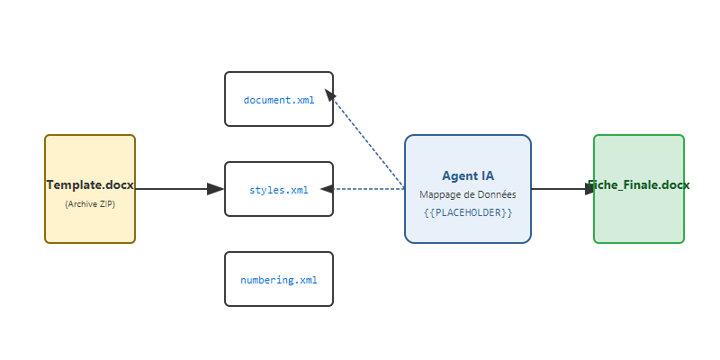
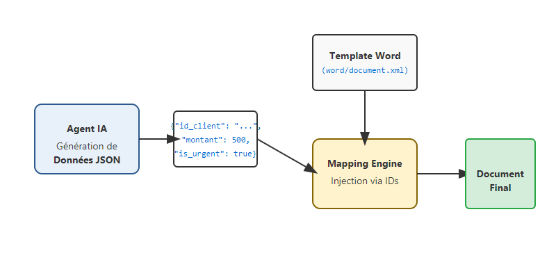

# Sous le capot du .docx : Comment j'automatise le remplissage de fiches métier avec une IA

On me demande souvent de générer des documents qui doivent s'insérer dans des processus administratifs existants. Oubliez la rédaction de longs textes libres : ici, l'enjeu est de remplir une **fiche de synthèse**, avec des cases précises, des tableaux et même des cases à cocher.

Pour relever ce défi, j'ai dû arrêter de voir Word comme un éditeur de texte et commencer à le voir pour ce qu'il est réellement : une archive **ZIP remplie de fichiers XML**. Cette perspective change tout pour l'automatisation.

<!-- more -->

## Un fichier Word est un ZIP (si, si !)

Si vous changez l'extension d'un fichier `.docx` en `.zip` et que vous l'ouvrez, vous découvrirez une arborescence de fichiers. Le plus important est `word/document.xml`. C'est là que réside tout le contenu de votre document, balisé par des tags OOXML (`<w:t>`, `<w:p>`, etc.).



## Le Workflow : Séparer l'IA de la Manipulation de Fichiers

La méthode la plus robuste que j'ai trouvée ne consiste pas à demander à l'IA d'écrire le XML (ce serait trop risqué). À la place, je sépare le travail en deux étapes distinctes :

1.  **L'Agent IA comme Générateur de Données** : Je demande à l'agent d'extraire les informations nécessaires et de les structurer dans un objet **JSON** strict (via Pydantic). 
2.  **Le Mapping Engine** : Un script Python classique récupère ce JSON et utilise des **identifiants (IDs)** ou des placeholders trouvés dans le XML du template pour injecter les données.



## L'avantage du JSON structuré

En utilisant le JSON comme pivot, je force l'agent à produire des données prévisibles :
- `nom_projet`: "Projet Solaire Alpha"
- `score_conformite`: 85
- `is_urgent`: True

Mon code de mapping n'a plus qu'à parcourir le XML et remplacer, par exemple, le placeholder `{{SCORE}}` par la valeur `85`.

## Le défi des cases à cocher

Dans le XML de Word, une case à cocher est un état spécifique. Grâce au JSON, c'est devenu trivial : si l'agent me renvoie `"is_urgent": true`, mon script de mapping va chercher l'identifiant de la case à cocher dans le XML et changer son état de "non coché" à "coché" (souvent en remplaçant les caractères `☐` par `☒`).

```python
# Exemple de logique de mapping
for key, value in data_json.items():
    if isinstance(value, bool):
        # On gère les cases à cocher via des placeholders dédiés
        symbol = "☒" if value else "☐"
        xml_content = xml_content.replace(f"{{{{CHECK_{key.upper()}}}}}", symbol)
    else:
        # On remplace le texte simple
        xml_content = xml_content.replace(f"{{{{{key.upper()}}}}}", str(value))
```

## Conclusion

L'automatisation de documents métier ne doit pas être laissée au hasard du texte libre. Ma mission est de créer des systèmes fiables. En utilisant l'IA pour générer un **JSON structuré** et un moteur simple pour l'injecter dans le **XML de Word**, je garantis un résultat professionnel, conforme et auditable à chaque exécution.

C'est ainsi que je boucle cette série : de l'extraction de connaissances à la production finale d'un document prêt à l'emploi.
