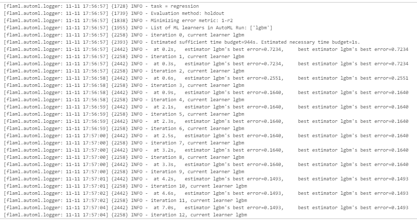
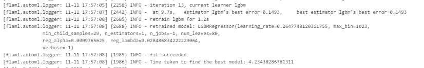
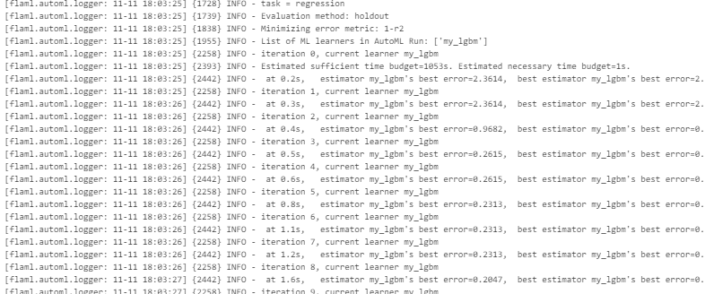
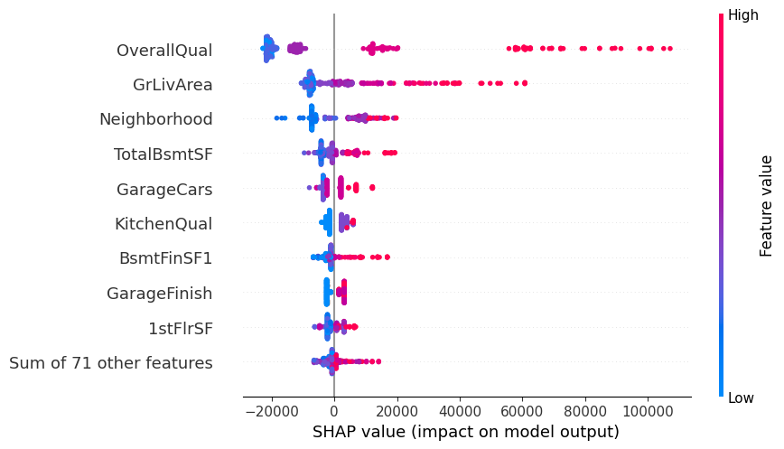
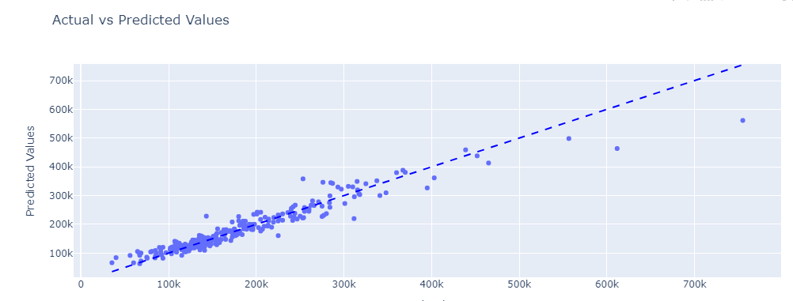

---

date: 2024-10-27  
authors:  
- ssawadogo  
categories:  
- MLOps  

---


# Auto ML et Interprétabilité avec FLAML et SHAP

En machine learning, construire des modèles performants ne suffit plus : l'interprétabilité est devenue indispensable, surtout dans des domaines réglementés. Comprendre les décisions de nos modèles est essentiel pour une IA de confiance, un des axes majeurs de l'IA Act de l'Union Européenne.

Cependant, allier performance et transparence prend du temps, surtout lorsque l’on doit optimiser les hyperparamètres et choisir les bons algorithmes. C’est là que FLAML (Fast Lightweight AutoML) entre en scène pour rendre ce processus fluide en automatisant la recherche de modèles et de paramètres optimaux.
<!-- more -->

Dans cet article, explorons comment FLAML permet de concilier efficacité et interprétabilité, en intégrant les valeurs SHAP (SHapley Additive exPlanations). Cette combinaison rend nos modèles plus compréhensibles, sans compromis sur la performance.

## Exigences

Avant d'explorer FLAML, assurez-vous d'avoir toutes les bibliothèques nécessaires. Pas de panique, voici la commande pour tout installer d'un coup :

```bash
pip install flaml[automl]==2.3.3 plotly==5.24.1 loguru==0.7.2 category_encoders==2.6.4 shap matplotlib
```

Avec tout ça, nous sommes prêts à démarrer notre aventure avec FLAML et SHAP !

## 1. Présentation de FLAML

FLAML est une bibliothèque AutoML développée par Microsoft, conçue pour vous faire gagner un temps fou dans la configuration de vos modèles de machine learning. Son interface est tellement intuitive qu'elle permet d’optimiser rapidement les hyperparamètres tout en restant flexible pour différents types de problèmes.

Les Caractéristiques Principales de FLAML:

- **Optimisation Automatique des Hyperparamètres** : Fini les essais exhaustifs ! FLAML déploie des algorithmes de recherche avancés pour trouver les meilleurs hyperparamètres sans vous faire perdre de temps.
- **Adaptabilité** : Que ce soit XGBoost ou LightGBM, FLAML supporte de nombreux modèles connus et permet même d’intégrer vos propres modèles.
- **Support Multi-Tâches** : Que vous soyez dans la classification ou la régression, FLAML s'adapte à vos besoins.
- **Efficacité en Temps et Coût** : Optimisé pour minimiser le temps d'exécution et les ressources, c’est l’outil idéal pour des expérimentations rapides et efficaces.

Avec tout cela, FLAML se présente comme un allié de choix pour vos projets de machine learning !

## 2. Interprétabilité avec SHAP

Comprendre pourquoi un modèle fait certaines prédictions est essentiel, surtout dans les secteurs avec des attentes réglementaires. Les valeurs SHAP, basées sur la théorie des jeux, offrent une méthode robuste pour rendre le processus décisionnel algorithmique bien plus transparent. Elles permettent de décortiquer l'impact de chaque variable, tout en tenant compte des interactions complexes. Dans la jungle des frameworks d'explication, les valeurs SHAP se distinguent par leur reconnaissance et leur logique.

Voici quelques atouts des valeurs SHAP :

- **Fondement Théorique** : Leur solidité repose sur la théorie des jeux, leur procurant une robustesse indéniable.
- **Quantification de l'Impact** : Chaque valeur SHAP révèle comment une variable influence la prédiction, facilitant la compréhension de ce qui affecte le plus votre modèle.
- **Visualisations Intuitives** : Les graphiques tels que les diagrammes en barres ou en dispersion rendent l’interprétation des résultats accessible, même pour les non-experts.

En intégrant SHAP, vos modèles deviennent presque transparents, offrant une vision claire sur vos données et vos modèles.

## 3. AutoML en Un Coup d'Œil

Pour illustrer ce que FLAML peut faire, voyons un exemple simple utilisant FLAML pour prédire les prix des maisons en Californie :

```python
from flaml.ml import sklearn_metric_loss_score
import pandas as pd
from flaml import AutoML
from sklearn.datasets import fetch_california_housing
from sklearn.model_selection import train_test_split
import logging

logger = logging.getLogger()

automl = AutoML()
settings = {
    "time_budget": 20,  # Temps total d'exécution en secondes
    "metric": 'r2',  # Métrique principale pour la régression
    "estimator_list": ['lgbm'],  # Sélection de modèles ML
    "task": 'regression',  # Type de tâche    
    "log_file_name": 'houses_experiment.log',  # Log de FLAML
    "seed": 2024,    
}

data = fetch_california_housing()
X_train, X_test, y_train, y_test = train_test_split(pd.DataFrame(data.data), data.target, test_size=0.2, random_state=42)

automl.fit(X_train=X_train, y_train=y_train, **settings)
y_pred = automl.predict(X_test)

def calculate_metrics(y_pred, y_test):
    metrics = {
        'r2': round(1 - sklearn_metric_loss_score('r2', y_pred, y_test), 4),
        'mse': round(sklearn_metric_loss_score('mse', y_pred, y_test), 4),
        'mae': round(sklearn_metric_loss_score('mae', y_pred, y_test), 4)
    }
    return metrics

logger.info(calculate_metrics(y_pred, y_test))
```

Dans ce code, le paramètre `time_budget` définit le temps alloué pour explorer différentes configurations de modèles. Ajustez-le en fonction de vos besoins – en général, 180 secondes fonctionnent bien pour les premiers essais.


Comme vous pouvez le voir, la sortie est très verbeuse, et tant mieux, car cela permet de voir comment le framework a fonctionné pour sélectionner les bons hyperparamètres. Après l'ajustement, nous utilisons des métriques telles que R², MSE et MAE pour évaluer les performances du modèle.

Dans ce code, le paramètre `time_budget` définit le temps alloué pour explorer différentes configurations de modèles. Ajustez-le en fonction de vos besoins – en général, 180 secondes fonctionne bien pour les première itérations (dans le cas de données tabulaires avec un nombre de lignes  inferieur à 10 millions mlemeavec une centaine de dvariables on est dans la categorie small)

En général, un budget de 180 secondes fonctionne bien pour les premières itérations, surtout dans le cas de données tabulaires contenant moins de 10 millions de lignes. Même avec une centaine de variables, on reste dans la catégorie "small".

Le choix de `time_budget` repose sur l'expérience. J'ai trouvé une discussion intéressante sur ce sujet : [choix de time_budget](https://github.com/microsoft/FLAML/issues/155). Selon les résultats de l'article de FLAML, le temps nécessaire pour atteindre ou surpasser les meilleures performances rapportées dans le benchmark AutoML peut être considérablement réduit avec FLAML. Voici les temps recommandés pour les différentes catégories de datasets :

- **‘small’** : 1m - 10m
- **‘medium’** : 10m - 1h
- **‘large’** : 1h - 4h

## 4. Ajouter un Learner Personnalisé

Un des atouts de FLAML est la possibilité d'intégrer des learners personnalisés, ce qui permet d’ajouter des fonctions de perte spécifiques ou de nouveaux modèles. Voici comment procéder :


```python
import numpy as np 

def my_loss_obj(y_true, y_pred):
    c = 0.5
    residual = y_pred - y_true
    grad = c * residual / (np.abs(residual) + c)
    hess = c ** 2 / (np.abs(residual) + c) ** 2
    
    # grad et hess pour RMSE
    grad_rmse = residual
    hess_rmse = 1.0

    # grad et hess pour MAE
    grad_mae = np.array(residual)
    grad_mae[grad_mae > 0] = 1.
    grad_mae[grad_mae <= 0] = -1.
    hess_mae = 1.0

    coef = [0.4, 0.3, 0.3]
    return coef[0] * grad + coef[1] * grad_rmse + coef[2] * grad_mae, \
        coef[0] * hess + coef[1] * hess_rmse + coef[2] * hess_mae

from flaml.automl.model import LGBMEstimator

class MyLGBM(LGBMEstimator):
    def __init__(self, **config):
        super().__init__(objective=my_loss_obj, **config)

automl.add_learner(learner_name='my_lgbm', learner_class=MyLGBM)
automl.fit(X_train=X_train, y_train=y_train, **settings)

logger.info(calculate_metrics(y_pred, y_test))
```


Ici, la fonction `my_loss_obj` combine différentes approches pour minimiser la perte en jouant sur RMSE et MAE. La classe `MyLGBM` hérite d'un estimateur LGBM, tout en intégrant notre fonction de perte personnalisée.

## 5. Une Classe AutoML Prête à l'Emploi

Pour gagner encore plus de temps, construisons une classe qui va rationaliser tout le flux de travail, du prétraitement à la sélection de caractéristiques, en passant par le réglage des hyperparamètres.

### GenericAutoML

Cette classe va adopter les concepts suivants :

- **Encodage Catégoriel** : Offrir différentes stratégies d’encodage pour transformer facilement les variables catégorielles.

- **Sélection de Variables** : Utiliser des techniques pour filtrer automatiquement les caractéristiques les plus pertinentes.

- **Stratification Personnalisée** : Gérer la validation croisée pour maintenir un équilibre de classe si une colonne spécifique est choisie.

- **Interprétabilité avec les valeurs SHAP**.

```python

    
from flaml import AutoML
from sklearn.base import BaseEstimator, RegressorMixin
import plotly.express as px
import shap
from sklearn.datasets import fetch_openml
from sklearn.model_selection import train_test_split
import pandas as pd
import numpy as np
from sklearn.feature_selection import VarianceThreshold, SelectFromModel
from category_encoders import JamesSteinEncoder, CatBoostEncoder, LeaveOneOutEncoder
from xgboost import XGBRegressor
from sklearn.ensemble import ExtraTreesRegressor

from loguru import logger

from sklearn.model_selection import RepeatedStratifiedKFold
from sklearn.preprocessing import LabelEncoder

class CustomStratifiedKFold(RepeatedStratifiedKFold):
    def __init__(self, X, stratify_column=None, n_splits=5, n_repeats=10, random_state=None):
        """
        Initialize the custom stratified splitter.

        Parameters:
        - X: DataFrame containing the features and the stratify column.
        - stratify_column: Column name to use for stratification (str).
        - n_splits: Number of splits (folds).
        - n_repeats: Number of repetitions of the splits.
        - random_state: Random state for reproducibility.
        """
        super().__init__(n_splits=n_splits, n_repeats=n_repeats, random_state=random_state)
        
        self.stratify_column = stratify_column
        if stratify_column:
            # Initialize LabelEncoder if stratify_column is provided
            self.le = LabelEncoder()
            self.le.fit(X[stratify_column])

    def split(self, X, y):
        """
        Perform stratified splits based on the specified stratify column.

        Parameters:
        - X: The input features (DataFrame).
        - y: Target labels (not used for stratification here, but required for the split method).

        Returns:
        - Generator of train-test indices for each fold.
        """
        # Encode the stratify column if it exists
        stratify_data = self.le.transform(X[self.stratify_column])
        # Perform the stratified split using the stratify data
        kfs = super().split(X, stratify_data)
        return kfs


class AutoMLRegressor(BaseEstimator, RegressorMixin):
    def __init__(self, settings=None, stratify_column=None, encoder_type="james_stein", feature_selector="variance"):
        """
        Initialize the AutoMLRegressor with user settings, encoding options, and feature selection method.
        """
        self.default_settings = {
            "time_budget": 30,
            "task": "regression",
            "estimator_list": ["xgboost", "rf", "lgbm", "extra_tree"],
        }
        self.settings = self._merge_settings(self.default_settings, settings or {})
        self.stratify_column = stratify_column
        self.encoder_type = encoder_type
        self.feature_selector = feature_selector
        self.automl = AutoML()
        self.best_estimator_ = None
        self.shap_values_ = None
        self.categorical_columns = None
        self.features_selected = None
        self.cat_encoder = None
    def _merge_settings(self, default_settings, user_settings):
        return {**default_settings, **user_settings}

    def _get_categorical_subset(self, df):
        """
        Select categorical columns based on dtype or a provided list.
        """
        if self.categorical_columns is not None:
            missing_cols = set(self.categorical_columns) - set(df.columns)
            if missing_cols:
                logger.warning(f"Missing columns in the DataFrame: {', '.join(missing_cols)}")
            return df[self.categorical_columns]
        categorical_columns = df.select_dtypes(include=['object', 'category']).columns
        if len(categorical_columns) == 0:
            logger.info("No categorical columns detected.")
        return df[categorical_columns] if len(categorical_columns) > 0 else pd.DataFrame()

    def _encode_categorical_features(self, X, y):
        """
        Encode categorical features using the selected encoding method.
        """
        X_cat = self._get_categorical_subset(X)
        if not X_cat.empty:
            if self.encoder_type == "dummy":
                X_cat = pd.get_dummies(X_cat, drop_first=True)
            elif self.encoder_type == "james_stein":
                self.cat_encoder = JamesSteinEncoder(handle_unknown='return_nan', handle_missing='return_nan')
                X_cat = self.cat_encoder.fit_transform(X_cat, y)
            elif self.encoder_type == "catboost":
                self.cat_encoder  = CatBoostEncoder(handle_unknown='return_nan', handle_missing='return_nan')
                X_cat = self.cat_encoder.fit_transform(X_cat, y)

            elif self.encoder_type == "leave_one_out":
                self.cat_encoder = LeaveOneOutEncoder(handle_unknown='return_nan', handle_missing='return_nan')
                X_cat = self.cat_encoder.fit_transform(X_cat, y)
            else:
                raise ValueError(f"Unknown encoder_type: {self.encoder_type}")
            X = X.drop(columns=X_cat.columns, errors='ignore')
            X = pd.concat([X, X_cat], axis=1)
        else:
            logger.info("No categorical columns detected in the DataFrame.")
        return X

    def _feature_selection(self, X, y):
        """
        Perform feature selection using the chosen method.
        """
        total_features = len(X.columns)
        if self.feature_selector == "variance":
            logger.info("Applying VarianceThreshold for feature selection.")
            selector = VarianceThreshold(threshold=0.0)
            selector.fit_transform(X)
        elif self.feature_selector == "tree_model":
            logger.info("Applying SelectFromModel Tree based feature selection.")
            reg = ExtraTreesRegressor(random_state=0)
            reg.fit(X, y)
            selector = SelectFromModel(reg, prefit=True)
        removed_features = total_features - selector.get_support().sum()
        logger.info(f"Removing {removed_features} features out of {total_features}: {X.columns[~selector.get_support()]}")
        self.features_selected = X.columns[selector.get_support()].tolist()
        return self.features_selected

    def fit(self, X, y, n_splits=3, n_repeats=3, random_state=42):
        """
        Fit the AutoML model on the training data.
        """
        self.settings["metric"] = self.settings.get("metric", self.huber_loss)
        X = self._encode_categorical_features(X, y)
        selected_features = self._feature_selection(X, y)
        X = X[selected_features]

        # Reset indices
        X.reset_index(drop=True, inplace=True)
        y.reset_index(drop=True, inplace=True)
              
        # Define splitter based on stratify_column
        if self.stratify_column is not None:
            splitter = CustomStratifiedKFold(X, self.stratify_column, n_splits=n_splits, n_repeats=n_repeats, random_state=random_state)
        else:
            splitter = "auto"  # Default behavior if no stratify_column is provided
        self.automl.fit(X_train=X, y_train=y, **self.settings, seed=random_state, split_type=splitter)
        self.best_estimator_ = self.automl.model.estimator
        return self

    def predict(self, X):
        features = self._transform_input_to_features(X)
        return self.automl.predict(features)

    def score(self, X, y):
        """
        Calculate the huber loss function for scoring.
        """
        y_pred = self.predict(X)
        return -self.huber_loss(X, y, estimator=self.best_estimator_)[0]

    def plot(self, y_true, y_pred):
        """
        Plot Actual vs Predicted values as a scatter plot.
        """
        fig = px.scatter(x=y_true, y=y_pred,
                         labels={'x': 'Actual Values', 'y': 'Predicted Values'},
                         title='Actual vs Predicted Values')
        fig.add_shape(type='line',
                      x0=min(y_true), y0=min(y_true),
                      x1=max(y_true), y1=max(y_true),
                      line=dict(color='blue', dash='dash'))
        fig.show()

    def compute_shap_values(self, X):
        """
        Compute SHAP values for the provided data.
        """
        features = self._transform_input_to_features(X)
        explainer = shap.TreeExplainer(self.best_estimator_, features, feature_perturbation="tree_path_dependent")
        self.shap_values_ = explainer(features)

    def plot_shap(self, plot_type="feature_importance", max_display=10):
        """
        Generate SHAP plots for feature importance or impact.
        """
        if self.shap_values_ is None:
            raise ValueError("SHAP values not computed yet. Call compute_shap_values first.")
        if plot_type == "feature_importance":
            shap.plots.bar(self.shap_values_, max_display=max_display)
        elif plot_type == "feature_impact":
            shap.plots.beeswarm(self.shap_values_)
        else:
            raise ValueError("Invalid plot_type. Choose 'feature_importance' or 'feature_impact'.")
        
    def _transform_input_to_features(self, X):
        """
        Applies the same transformations to input data as were applied during training.
        """
        # Categorical Encoding
        X_cat = self._get_categorical_subset(X)
        if not X_cat.empty:
            if self.encoder_type == "dummy":
                X_cat = pd.get_dummies(X, drop_first=True)
            else :
                X_cat = self.cat_encoder.transform(X_cat)
            
            X = X.drop(columns=X_cat.columns, errors='ignore')
            X = pd.concat([X, X_cat], axis=1)

        
        # Select previously chosen features
        if self.features_selected:
            X = X[self.features_selected]
        
        return X
    
    def huber_loss(self, X_val, y_val, estimator, labels=None,
                    X_train=None, y_train=None, weight_val=None, weight_train=None,
                    config=None, groups_val=None, groups_train=None):
            
        delta = self.settings.get("delta", 1.0)
        y_pred = estimator.predict(X_val)
        error = y_val - y_pred
        is_small_error = np.abs(error) <= delta
        squared_loss = 0.5 * error ** 2
        linear_loss = delta * (np.abs(error) - 0.5 * delta)
        huber_loss_value = np.mean(np.where(is_small_error, squared_loss, linear_loss))
        return huber_loss_value, {"huber_loss": huber_loss_value}

```


### Illustration

Pour voir cette classe à l’œuvre, exécutons-la avec table `house_prices` de sklearn :

```python
if __name__ == "__main__":
    data = fetch_openml(name="house_prices", as_frame=True)
    X = data.data
    y = data.target

    X_train, X_test, y_train, y_test = train_test_split(X, y, test_size=0.2, random_state=42)

    custom_settings = {
        "time_budget": 10,
        "estimator_list": ["xgboost", "rf", "lgbm", "extra_tree"],
        "log_file_name": "automl.log",
        "n_jobs": -1
    }

    automl_regressor = AutoMLRegressor(settings=custom_settings, encoder_type="catboost", feature_selector="variance", stratify_column="MSZoning")
    automl_regressor.fit(X_train, y_train)

    print("Meilleur Modèle :", automl_regressor.best_estimator_)

    automl_regressor.compute_shap_values(X_test)
    automl_regressor.plot_shap(plot_type="feature_importance", max_display=10)
    automl_regressor.plot_shap(plot_type="feature_impact", max_display=10)
    y_pred = automl_regressor.predict(X_test)
    automl_regressor.plot(y_test, y_pred)
```




Voici quelques corrections et suggestions d'amélioration pour rendre le texte plus fluide et clair :


Dès le début de l'output, on peut voir que la métrique utilisée est bien personnalisée, et on a recours à une stratification dans la cross-validation. La métrique par défaut que j’ai définie dans la classe est `huber_loss`, car elle est robuste face aux valeurs aberrantes. L’idée est que, si aucune métrique n’est fournie, on utilise `huber_loss` par défaut.

Les graphiques que vous voyez illustrent l'explicabilité avec SHAP (SHapley Additive exPlanations). Les barres représentent l'importance des caractéristiques, tandis que le graphique qui suit met en évidence l'impact des variables. Grâce à ce visuel, on peut déduire si les valeurs de X influencent Y de manière positive ou négative, par exemple.

Je pense d'ailleurs que je viens d'avoir une idée d'article : expliquer les bases de SHAP et comment interpréter ces visualisations :)

Le dernier graphique montre simplement l'ajustement de notre modèle, et apparemment, tout semble en ordre !




On peut varier la liste des estimateurs pour inclure d’autres modèles, mais ce qui est montré ici est largement suffisant pour démarrer. Et si vous voulez aller plus loin et intégrer des learners spécifiques, l'exemple donné plus tôt s'adapte parfaitement !

## Conclusion

Cet article vous a fait découvrir comment FLAML et SHAP peuvent travailler main dans la main pour construire des modèles de machine learning à la fois performants et interprétables. FLAML facilite et accélère l’optimisation, tandis que SHAP fournit des outils pour expliquer vos prédictions.

N’hésitez pas à expérimenter ces approches dans vos projets et partagez vos retours ! Ces techniques sont des atouts précieux pour renforcer la confiance dans vos modèles prédictifs. Les exemples de code que j’ai présentés sont prêts à être utilisés, alors, lancez-vous et explorez sans limites !

## Références

- [Documentation FLAML](https://microsoft.github.io/FLAML/docs/Use-Cases/Zero-Shot-AutoML/)
- [Notebook sur FLAML](https://github.com/microsoft/FLAML/blob/main/notebook/automl_lightgbm.ipynb)
- [Documentation sur les valeurs SHAP](https://shap.readthedocs.io/en/latest/example_notebooks/api_examples/explainers/Exact.html)
- [Mon article sur l'encodage efficace des variables catégorielles pour du ML](https://sawadogosalif.github.io/blog/2024/10/05/encodage-efficace-des-variables-catégorielles-pour-du-ml/)
