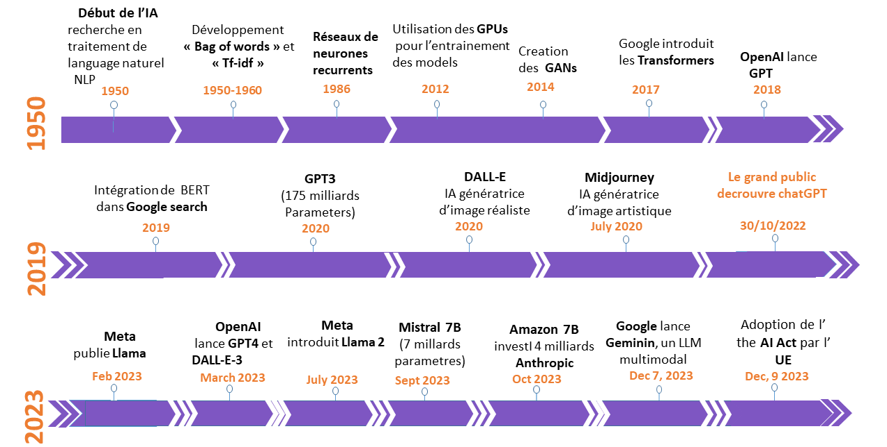
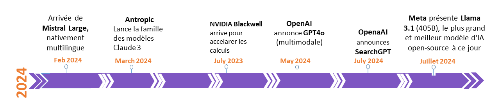

# IA générative : une Évolution plutôt que Révolution

Aujourd’hui, on plonge dans l’univers fascinant de l’IA générative. On va retracer les grandes étapes qui ont marqué son évolution. Pas de panique, on ne va pas s’embourber dans une liste exhaustive – on va plutôt se concentrer sur les moments clés qui ont façonné l’IA telle qu’on la connaît aujourd'hui. J’avais depuis un moment envie de faire le point sur les avancées dans ce domaine, mais avec le rythme effréné des innovations, je ne savais pas comment illustrer cela jusqu'à ce que je tombe sur les travaux de l'Innovation Makers Alliance.

Comme vous l'avez bien remarqué, j'adore schématiser avant de décrire. Donc voici un schéma chronologique qui résume tout.  
  
  

#### **1950-1960 : Les Premiers Pas avec le "Bag of Words"**

L'histoire de l'IA commence dans les années 1950 avec le modèle "Bag of Words". Cette approche traite le texte comme une collection de mots indépendants, sans tenir compte de leur ordre ou de leur contexte.

**Représentation Matricielle :**

Le modèle Bag of Words convertit le texte en une matrice où chaque ligne représente un document et chaque colonne un mot unique. Les valeurs indiquent la fréquence des mots dans chaque document.

Exemple :

|       | IA | est | l' | avenir | façonnera |
|-------|----|-----|----|--------|-----------|
| Doc 1 |  1 |  1  | 1  |   1    |    0      |
| Doc 2 |  1 |  0  | 1  |   1    |    1      |

**TF-IDF :**

La méthode TF-IDF (Term Frequency-Inverse Document Frequency) évalue l'importance d'un mot dans un document en comparant sa fréquence à celle dans l'ensemble des documents :

$$
\text{TF-IDF}(t, d) = \text{TF}(t, d) \times \text{IDF}(t)
$$

Où :
- **TF (Term Frequency)** mesure combien de fois un terme apparaît dans un document :

$$
\text{TF}(t, d) = \frac{\text{Nombre de fois que le terme } t \text{ apparaît dans le document } d}{\text{Nombre total de termes dans le document } d}
$$

- **IDF (Inverse Document Frequency)** évalue l'importance d'un terme dans tous les documents :

$$
\text{IDF}(t) = \log \frac{\text{Nombre total de documents}}{\text{Nombre de documents contenant le terme } t}
$$

TF-IDF et le Bag of Words ont longtemps dominé l'analyse de texte (d'ailleurs toujours utilisés pour des analyses textuelles), mais ils présentent des limites majeures : ils ignorent le contexte et l'ordre des mots, produisent des vecteurs très grands et sparses, et ne capturent pas les relations sémantiques entre les termes. Ces approches ne permettent pas de saisir les nuances du langage, comme les relations de longue portée ou les variations de sens. Ces insuffisances ont conduit au développement des réseaux de neurones.

#### **1986 : Réseaux de Neurones Récurrents (RNNs)**

En 1986, les RNNs offrent une solution pour traiter les données séquentielles comme le texte et la parole. Ils se souviennent des informations des étapes précédentes, mais ont des difficultés avec les dépendances à long terme en raison du problème du "gradient qui s’évanouit".

#### **1997 : Les Réseaux à Long Terme (LSTM)**

Pour remédier aux limitations des RNNs, les réseaux LSTM, introduits en 1997, améliorent la capture des dépendances à long terme. Malgré cette avancée, ils restent complexes à entraîner et difficiles à paralléliser.

#### **2012 : La Révolution des GPUs avec AlexNet**

En 2012, l'utilisation des GPUs pour entraîner les modèles devient une révolution avec AlexNet, développé par Ilya Sutskever, Alex Krizhevsky et Geoffrey Hinton. AlexNet réduit drastiquement le temps d'entraînement et améliore les performances dans la vision par ordinateur.

#### **2013 : Word2Vec et la Représentation Vectorielle des Mots**

En 2013, Word2Vec introduit une avancée majeure en améliorant la représentation vectorielle des mots avec les techniques CBOW et Skip-gram. Il montre que les mots apparaissant dans des contextes similaires ont des vecteurs proches, améliorant l'apprentissage sémantique.

#### **2017 : L’Essor des Transformers**

L'année 2017 marque l'introduction des Transformers par Google avec "Attention is All You Need". Les Transformers intègrent un mécanisme d'attention qui permet de capturer les relations complexes entre les mots, indépendamment de leur position. Cette architecture facilite le traitement parallèle des données et pave la voie aux grands modèles comme GPT. J'ai d'ailleurs commencé à réfléchir comment illustrer les différents types de Transformers qui existent de nos jours.

#### **2018-2022 : Les Grands Modèles de Langage**

Après l’arrivée des Transformers, les grands modèles de langage se développent rapidement :

- **GPT-3 (2020) :** Développé par OpenAI, GPT-3, avec ses 175 milliards de paramètres, est capable de générer du texte avec une cohérence impressionnante et de réaliser diverses tâches sans formation spécifique. Il représente une avancée majeure en augmentant la taille des modèles.

- **DALL-E (2021) :** DALL-E, également d'OpenAI, génère des images à partir de descriptions textuelles, fusionnant créativité et technique.

- **Midjourney (2022) :** Ce modèle se concentre sur la création artistique d’images, permettant aux utilisateurs de concevoir des œuvres uniques à partir de prompts.

- **ChatGPT (fin 2022) :** Basé sur l’architecture GPT et InstructGPT, ChatGPT offre des capacités de dialogue interactives, un tournant majeur des potentialités de l'IA générative. C’est à ce moment précis que le grand public commence à se rendre compte des dernières avancées en IA et deep learning.

#### **2023 : Les Nouveaux Acteurs en Plus de OpenAI**

- **LLaMA (2023) :** Meta introduit la série LLaMA pour fournir des alternatives efficaces avec différentes tailles de paramètres, favorisant une recherche plus accessible et performante. Ainsi, la porte à l'open source est ouverte.

- Juste après LLaMA, OpenAI entre encore en jeu avec **DALL-E 3** et **GPT-4**, qui est, jusqu'à nos jours, l'un des modèles les plus performants, bien que très coûteux.

- **Mistral 7B (2023) :** Un modèle LLM français avec 7 milliards de paramètres, conçu pour répondre aux besoins spécifiques tout en offrant une performance de haut niveau.

- **Claude 3 (2023) :** La famille Claude 3 d'Anthropic, comprenant Claude 3 Haiku, Claude 3 Sonnet, et Claude 3 Opu, établit de nouveaux standards pour les tâches cognitives complexes.

- **Bard puis Gemini (2023) :** Google rattrape son retard en annonçant Gemini, un LLM multimodal intégrant des capacités avancées pour le texte, les images, et le son, après un premier Bard qui n'a pas convaincu.

#### **2024 : Les Dernières Innovations**

- **Mistral Large (février 2024) :** Ce modèle, nativement multilingue, améliore les capacités de traitement et d'interaction dans plusieurs langues. La France ne veut pas rester en reste de cette course.

- **GPT-4O (mai 2024) :** Ce modèle "omnimodal" de OpenAI intègre des capacités avancées pour le texte, les images, et le son. Il représente un progrès significatif en matière d'IA générative.

- **SearchGPT (2024) :** Un prototype de moteur de recherche d'OpenAI, lancé le 26 juillet, combinant fonctionnalités traditionnelles et capacités d'IA générative pour une expérience de recherche enrichie.

- **NVIDIA Blackwell (2024) :** Annoncé en juillet, ce processeur accélère les calculs nécessaires pour l'entraînement des modèles d'IA, facilitant les avancées technologiques. NVIDIA se montre prêt à épauler cette course vers l'IAG (Intelligence Artificielle Généralisée).

#### Conclusion 

Désormais, les data scientists, ou si vous préférez, AI engineers ou LLM engineers (on est toujours très doués pour inventer de nouveaux titres, rires), dans les différentes entreprises s'approprient ces technologies pour accélérer la création de nouvelles sources de croissance, tout comme ils le faisaient déjà avec la data. Mais cette fois-ci, le traitement des données non structurées devient à la fois plus simple et plus stimulant grâce aux nouvelles opportunités. L'IA générative continuera ainsi de transformer les industries avec des cas d'usage comme les chatbots, ou centre d'aide ou encore d'un centre de base de connaissance, les moteurs de recherche vectoriels, et bien d'autres.

If you're a data scientist unfamiliar with AI, all of a sudden you're going to have to step up your game in to iagen.

