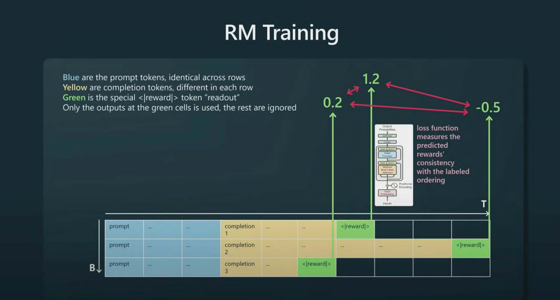
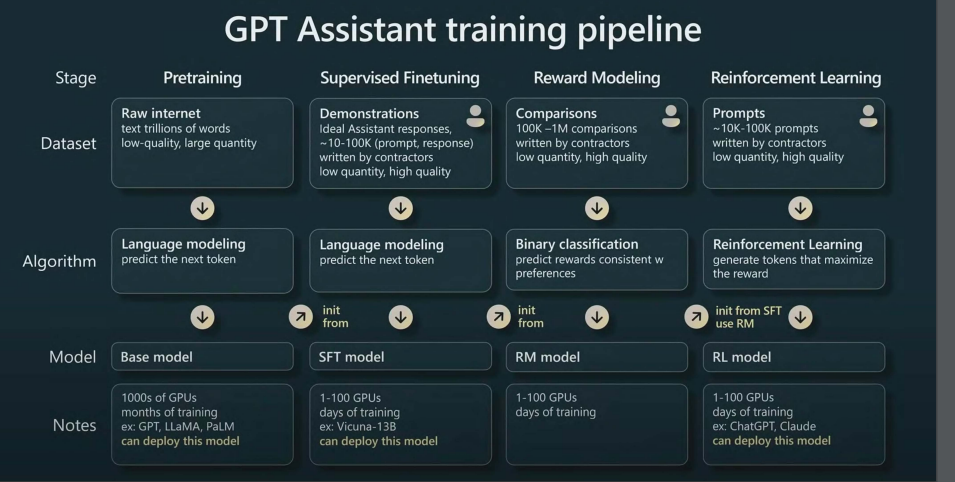

# Comment sont construits les assistants conversationnels ? ChatGPT, Claude, Mistral

Aujourd'hui, on plonge dans les coulisses des grands modèles de langage (LLM). Vous êtes-vous déjà demandé comment ces modèles arrivent à répondre avec autant de fluidité ? Quand on parle de ChatGPT, techniquement c'est le résultat d'un modèle OpenAI après avoir fait une série d'entraînements. La réponse tient en trois étapes-clés :  
1. Le **pré-entraînement** sur des montagnes de données,  
2. Le **fine-tuning** pour spécialiser le modèle, et  
3. L’**apprentissage par renforcement avec feedback humain** (RLHF).  

Dans cet article, je retrace les principales étapes avec vous. Un petit billet de blog pour clore l'année 2024. On ne fera pas de MLOPS aujourd'hui, promis :)

<!-- more -->

### 1. Pré-entraînement : modèle de fondation

Imaginez qu'on veuille apprendre à un enfant à parler. Quelle est la première étape ? Exactement, on lui expose **énormément de mots et phrases** : conversations, livres, histoires. C’est exactement ce qu’on fait avec un LLM, mais à une échelle gigantesque.

**Comment ça marche ?**  
On nourrit le modèle avec un énorme corpus de données : sites web, livres, forums, articles scientifiques… Le modèle doit prédire **le mot suivant** dans une phrase. Par exemple : si je dis _"Les oiseaux volent dans le ciel…"_, à votre avis, quel sera le mot suivant ? Voilà, c’est ce que le modèle apprend à faire.

Voici une version corrigée de votre section avec les erreurs grammaticales, orthographiques et typographiques corrigées :  

---

**Exemple concret : Le dataset utilisé pour LLaMA**  
> Voici un aperçu des données qui ont servi pour LLaMA (un modèle open-source) :

| **Source**        | **Proportion utilisée** | **Époques (Passages)** | **Taille** |
|-------------------|-------------------------|------------------------|------------|
| CommonCrawl       | 67 %                   | 1.10                   | 3,3 To     |
| C4                | 15 %                   | 1.06                   | 783 Go     |
| GitHub            | 4,5 %                  | 0.64                   | 328 Go     |
| Wikipedia         | 4,5 %                  | 2.45                   | 83 Go      |
| Livres            | 4,5 %                  | 2.23                   | 85 Go      |
| ArXiv             | 2,5 %                  | 1.06                   | 92 Go      |
| StackExchange     | 2 %                    | 1.03                   | 78 Go      |

Ces données brutes (non étiquetées) permettent au modèle d'apprendre **la grammaire, les relations entre les mots et le contexte**. Mais attention, cette étape n’est qu’une fondation. Construire des modèles de fondation n'est pas du ressort de petites entreprises ou startups. Néanmoins, à partir de modèles de fondation open source, on peut créer d'autres modèles de fondation, comme ce qu'on voit actuellement autour de LLaMA (le modèle open source par excellence).  

Les LLM comme GPT-3 nécessitent d’énormes ressources de calcul. Par exemple, l’entraînement de GPT-3 a été estimé par des chercheurs comme **Tim Dettmers** et d’autres experts en IA :  

- **Nombre de paramètres** : 175 milliards (*Source : OpenAI, *Language Models are Few-Shot Learners*).  
- **Corpus de données** : Environ 570 Go de texte filtré (*Source : OpenAI, même article*).  
- **Infrastructure** : Utilisation de clusters de GPU, notamment des **NVIDIA V100** (*Source : blog de Tim Dettmers*).  
- **Durée estimée** : Entre **10 000 et 50 000 heures GPU**, d’après des calculs indépendants de la communauté, bien que les données exactes ne soient pas publiées.  

---  

Il faut garder en tête que les modèles de fondation ne sont pas des assistants : ils savent juste compléter des phrases. D'autres couches sont ajoutées pour arriver aux agents conversationnels. J'ai trouvé un arbre sur GitHub qui illustre bien cela :  

  

Source : [GitHub](https://github.com/Mooler0410/LLMsPracticalGuide/).  

Vous verrez que la plupart des assistants conversationnels comme Bard, ChatGPT ou Claude sont aux extrémités de l'arbre, car ce sont des LLM mais pas des modèles de fondation.  

La preuve que ce ne sont pas des assistants est bien dans les exemples suivants :  

Le modèle de fondation ne répond pas aux questions :  
- Il veut seulement compléter les documents Internet.  
- Répond souvent aux questions par d'autres questions.  

  

### 2. Fine-Tuning : Spécialiser le Modèle

Ici, on fait un peu comme avec un apprenti : après lui avoir montré plein de concepts généraux, on l’entraîne pour des tâches spécifiques. Pour un modèle conversationnel, on lui montre des dialogues bien construits, où la question est claire et la réponse pertinente.

**Pourquoi c’est important ?**  
Un modèle brut sait parler, mais pas toujours de manière cohérente. Le fine-tuning lui apprend à répondre de façon précise dans un contexte spécifique. **Vous imaginez un modèle qui parle mooré (une langue locale au Burkina Faso) sans confondre les tons ni les contextes ?** C’est ici que la magie opère.

> **Note pratique** : Vous pouvez utiliser des modèles open-source déjà pré-entraînés, comme LLaMA, pour gagner du temps. Ajoutez vos propres données annotées pour un fine-tuning personnalisé.

---

Voici une version corrigée de votre section, avec des ajustements pour améliorer la clarté et corriger les erreurs :  

---

### 3. RLHF : Le Dernier Coup de Pinceau  

Voici l’étape la plus fascinante, mais aussi la plus complexe : le **Reinforcement Learning from Human Feedback** (RLHF). Pourquoi cette étape ? Pour que le modèle ne soit pas seulement performant, mais qu’il soit aussi **aligné sur vos attentes**.  

RLHF (**Reinforcement Learning with Human Feedback**) combine **Reward Modeling (RM)** et **Reinforcement Learning (RL)** pour aligner des modèles comme GPT sur les préférences humaines. Décortiquons ces deux aspects essentiels :  

---

#### 1. **Reward Modeling (RM) : Construire un modèle de récompense**  

Le **Reward Modeling** est la première étape du pipeline RLHF. Il s'agit de construire un modèle capable d'évaluer les réponses du modèle génératif (GPT) en fonction des préférences humaines.  

##### Processus  
1. **Collecte de données** :  
   - Des annotateurs humains examinent plusieurs réponses générées par le modèle pour un même **prompt**.  
   - Ils les classent selon leur qualité (par exemple, du meilleur au pire).  

2. **Entraînement du modèle de récompense** :  
   - Les données de classement humain sont utilisées pour entraîner un **Reward Model (RM)**.  
   - Le RM apprend à attribuer un score à chaque réponse (comme dans l'image ci-dessous) pour refléter la préférence humaine.  

##### Exemple  
  

Dans cet exemple, les sorties du modèle pour le token `<|reward|>` génèrent des scores comme **0.2**, **1.2**, et **-0.5** pour trois complétions différentes. La **fonction de perte** ajuste les prédictions du modèle en fonction des préférences humaines : le modèle apprend à attribuer une **récompense plus élevée** à la complétion préférée (par exemple, celle qui a obtenu **1.2**). Les autres sorties (tokens non verts) sont ignorées durant l’entraînement. Ainsi, seul le score final des tokens `<|reward|>` influence l'apprentissage.  

---

### 2. **Reinforcement Learning (RL) : Optimiser le modèle génératif**  

Une fois le modèle de récompense entraîné, il est intégré dans un pipeline de **Reinforcement Learning** pour ajuster le modèle génératif principal (GPT).  

##### Processus  
1. **Politique initiale** :  
   - On part d'un modèle génératif pré-entraîné, comme GPT-3, qui sert de **politique initiale**.  

2. **Interaction avec le modèle de récompense** :  
   - Le modèle génératif propose des réponses pour divers prompts.  
   - Le modèle de récompense (RM) attribue des scores à ces réponses.  

3. **Optimisation par renforcement** :  
   - Une méthode d'apprentissage par renforcement, comme **PPO (Proximal Policy Optimization)**, est utilisée pour améliorer la politique du modèle génératif.  
   - L'objectif est de maximiser la récompense attribuée par le RM, ce qui correspond indirectement à **aligner les sorties du modèle sur les préférences humaines**.  

##### Exemple  
Dans cette phase d’apprentissage par renforcement, les cellules jaunes jouent un rôle fondamental. Ce sont elles qui sont utilisées directement pour l’entraînement du modèle génératif. Contrairement aux cellules vertes `<|reward|>` (qui servent à attribuer des scores via le Reward Model), les tokens jaunes correspondent aux complétions générées par le modèle, et elles deviennent les labels utilisés pour ajuster les probabilités des sorties.  
  

---

### 3. **RLHF : Combinaison des deux**  

L'approche RLHF combine ces deux étapes de manière itérative :  
- **Reward Modeling** : Créer une fonction de récompense alignée sur les jugements humains.  
- **Reinforcement Learning** : Optimiser le modèle génératif en utilisant cette fonction de récompense.  

##### Avantages  
- Permet d'obtenir un modèle qui **génère des réponses alignées sur les valeurs humaines**.  
- Réduit les biais potentiels des modèles de langage pré-entraînés sur des données brutes.  

---

##### Comparaison entre RM et RL  
| **Aspect**            | **Reward Modeling (RM)**                              | **Reinforcement Learning (RL)**                    |  
|------------------------|------------------------------------------------------|---------------------------------------------------|  
| **But principal**      | Estimer une récompense pour évaluer la qualité des réponses. | Optimiser les réponses du modèle pour maximiser la récompense. |  
| **Données utilisées**  | Classements ou annotations humaines.                  | Modèle de récompense et outputs du modèle génératif. |  
| **Sortie**             | Fonction de récompense (modèle RM).                   | Politique optimisée (meilleur modèle génératif).  |  

---

- **Sans RLHF** : Le modèle pourrait fournir des réponses factuelles mais **non adaptées au contexte** ou **non alignées sur des normes sociales**.  
- **Avec RLHF** : Le modèle est capable de fournir des réponses non seulement factuelles, mais aussi **nuancées**, **polies**, et **utiles** selon les besoins humains.  
### 4. Petit Récap avec un Visuel

Voici un schéma tiré de la présentation d’Andrej Karpathy. Il résume bien les étapes :

### Conclusion et références

Créer un assistant comme chatgopt conversationnel peut sembler complexe, mais en suivant ces trois étapes, on peut transformer un modèle de fondation en un assistant puissant. Et vous, qu'en pensez-vous des modèles de fondations open source et comment faites vous du RHLF,

Pour aller plus loin :  
- **Conférence d’Andrej Karpathy sur GPT** : [Regarder ici](https://www.youtube.com/watch?v=bZQun8Y4L2A).  
- **Blog de Hugging Face sur RLHF** : [Lire ici](https://huggingface.co/blog/rlhf).  
- **Ressources sur les LLM** : [Explorer ici](https://dsp-routine.ppd-datascience.analytics.safran/concepts/modeling/llms_101/#a-brief-history).

