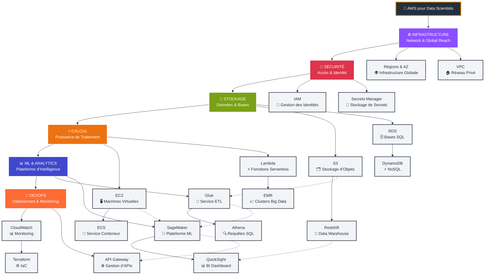

# AWS pour Data Scientists et pas que !

Bon on en fin du mois, parlons de Cloud computing avec un focus sur AWS, le géant du secteur. Tu es data scientist, tu veux te lancer dans le machine learning, mais tu ne sais pas par où commencer ? Tu as entendu parler d’AWS, mais tu trouves ça trop complexe ? Pas de panique, cet article est fait pour toi !
Si tu débarques dans l’univers AWS, tu as sûrement ressenti cette sensation : tu ouvres la console AWS pour la première fois, et c’est comme si tu étais dans le cockpit d’un vaisseau spatial… avec 200 boutons et aucun manuel d’utilisation ! Pas de panique, je vais t’emmener pas à pas dans cet écosystème, spécialement pour nous, les manieurs de données. On va y aller du bas vers le haut : d’abord les fondations, puis la magie ML. Prêt·e ? C’est parti !

---

## 🐳 Docker First : Tout Commence Là

### L’Épiphanie Docker pour Data Scientists

Avant de plonger dans AWS, parlons Docker. Si tu ne maîtrises pas encore les conteneurs, c’est vraiment LA compétence à acquérir en premier. Pourquoi ? Parce que tout l’écosystème moderne gravit autour de ça.

**L’équation magique :**

* Docker Compose en local → ECS sur AWS
* Docker Swarm → EKS (Kubernetes) sur AWS
* Dockerfile → même environnement partout !

En gros, le conteneur que tu développes sur ton laptop doit tourner exactement de la même façon dans le cloud. Fini les « ça marchait sur ma machine ! »

### Ton Workflow Data Science Containerisé

En local, tu peux avoir un `Dockerfile` comme celui-ci :

```dockerfile
FROM python:3.9-slim
WORKDIR /app

# les dépendances ML
COPY requirements.txt .
RUN pip install -r requirements.txt

# le code et tes modèles
COPY src/ ./src/
COPY models/ ./models/
COPY notebooks/ ./notebooks/

# Jupyter pour l’exploration
EXPOSE 8888
CMD ["jupyter", "lab", "--ip=0.0.0.0", "--allow-root"]
```

Le secret : ce même conteneur tourne **exactement** pareil sur AWS. Plus d’énigmes de versions de librairies, plus d’écart d’environnements.

> **Les avantages clés de Docker :**
>
> 1. Reproductibilité : Ton environnement Python/R/Julia est identique partout.
> 2. Isolation : Tes projets ne se marchent plus dessus.
> 3. Portabilité : Du laptop au cloud sans modification.
> 4. Collaboration : Toute l’équipe a le même setup.
> 5. Déploiement : Un simple `docker run` et c’est parti !

---

## 🌐 Infrastructure : Tes Fondations Solides

### Régions et Zones de Disponibilité

AWS, c’est une immense toile d’araignée planétaire. Amazon a planté des **data centers partout dans le monde**, appelés des **Régions**. Chaque région est composée de plusieurs **Zones de Disponibilité** (AZ) : ce sont des data centers physiquement isolés, mais reliés entre eux à très faible latence.

**Pourquoi ça te concerne ?**

* Pour respecter la RGPD, héberge tes données en Europe.
* Pour minimiser la latence, choisis la région la plus proche de tes utilisateurs.

### Vision d’ensemble (Mermaid)
Ce que tu devrais maitriser principalement si tu es data scientist se resume ici. 



### VPC : Ton Petit Cocon Privé 🏠

Le **VPC (Virtual Private Cloud)**, c’est ton appartement privé dans l’immeuble AWS. Tu peux :

* Gérer qui entre et qui sort (sous-réseaux, ACL, Security Groups).
* Organiser tes “pièces” (subnets publics/privés, tables de routage).
* Définir tes propres règles de firewall.

> **Astuce de débutant :** Pour commencer, utilise le VPC par défaut généré par AWS. Lorsque tu seras plus à l’aise, tu pourras passer à un VPC sur-mesure.

---

## 🔐 Sécurité : Qui Fait Quoi ?

### IAM : Le Videur de Ta Boîte de Nuit

**IAM (Identity & Access Management)**, c’est LE service crucial. C’est lui qui décide :

* Qui (utilisateurs, rôles, groupes) peut accéder à quoi.
* Quelles actions sont autorisées (lecture, écriture, suppression).

**Exemple concret :** Crée un utilisateur `DataScientistJunior` qui peut lire des objets S3, mais pas les supprimer. Adieu les “oops” à 2h du mat !

### Secrets Manager : Ton Coffre-Fort Digital 🔑

Fini de mettre tes mots de passe en dur dans le code ! **Secrets Manager** stocke tes credentials (BD, API keys, etc.) de manière chiffrée. Ensuite, tes conteneurs ou fonctions Lambda peuvent récupérer ces credentials à la volée, sans jamais exposer de secrets dans le code.

---

## 💾 Stockage : Où Tu Ranges Tes Précieuses Données

### S3 : Ton Disque Dur Magique ✨

**S3 (Simple Storage Service)** est le service incontournable pour stocker tout type de fichiers :

* **Standard** : données fréquemment utilisées
* **Infrequent Access** : données moins souvent sollicitées (coût plus bas)
* **Glacier** : archivage à long terme (recouvrement en quelques heures)
* **Deep Archive** : archivage ultra-longue durée (recouvrement en \~12 heures)

> **Use case typique :**
>
> 1. Stocker tes datasets bruts
> 2. Sauvegarder tes modèles entraînés
> 3. Conserver tes rapports finaux

### RDS : Tes Bases Relationnelles Sans Souci 🗄️

**RDS (Relational Database Service)** gère des bases MySQL, PostgreSQL, SQL Server, Aurora… Tu n’as plus à te soucier :

* Des mises à jour (patches de sécurité)
* Des sauvegardes automatiques
* De la réplication (optionnel)

> **Idéal pour :** Bases produites, métriques temps réel, journaux structurés.

### Redshift : Ton Entrepôt de Données Surpuissant 🏢

Quand tes datasets font plusieurs téraoctets (voire pétaoctets), tu passes à **Redshift**. C’est un data warehouse massivement parallel processing (MPP) conçu pour exécuter des requêtes analytiques très lourdes à la vitesse de l’éclair. Parfait pour alimenter des rapports BI ou entraînements ML à grande échelle.

### DynamoDB : La Base NoSQL qui Déchire ⚡

**DynamoDB** est la base NoSQL managée d’AWS. Ultra-rapide, scalable automatiquement :

* Tx de lecture/écriture en millisecondes
* Idéal pour stocker les résultats de tes modèles en temps réel ou les sessions utilisateur
* Offre des fonctionnalités comme les Time-to-Live (TTL), les indexes secondaires, la **DAX** (cache in-memory)

---

## ⚡ Compute : La Puissance de Calcul

### EC2 : Tes Machines Virtuelles à la Demande 🖥️

**EC2 (Elastic Compute Cloud)**, ce sont des serveurs virtuels que tu peux allumer/détruire à volonté. Besoin d’une machine GPU pour entraîner un gros réseau de neurones ? Sélectionne un **p3.2xlarge** (ou supérieur). Tu peux choisir la région, le type de stockage, le nombre de cœurs, la mémoire…

> **Types populaires pour la data science :**
>
> * **t3.medium** : pour tester rapidement, développer, faire du prototypage.
> * **m5.xlarge** : pour le travail sérieux, entraînements “petits à moyens”.
> * **p3.2xlarge** : pour le deep learning (GPU NVIDIA V100).

### Lambda : Tes Fonctions Serverless ⚡

**AWS Lambda** permet d’exécuter du code en réponse à un événement, sans gérer le serveur. Tu écris une fonction Python (ou Node.js, Java, etc.), tu la déploies, et AWS gère tout : scalabilité, disponibilité, patchs OS…

> **Cas d’usage ML pour Lambda :**
>
> * Nettoyage de données dès qu’un fichier arrive dans S3.
> * Déclencher un entraînement court (hyperparam tuning léger).
> * Servir un endpoint léger de prédiction (mais attention aux limites de temps / mémoire).

---

## 🐳 Containers : Docker Meets AWS (La Partie Qui Change Tout !)

### ECR : Ton Docker Hub Privé 🏪

**ECR (Elastic Container Registry)**, c’est le Docker Hub made in AWS, privé et sécurisé. Tu y stockes tes images Docker, tes environnements custom, tes conteneurs serveurs ML, etc.

**Workflow typique :**

```bash
# 1. Build ton image localement
docker build -t mon-modele-ml .

# 2. Tagge l’image pour ECR
docker tag mon-modele-ml:latest 123456.dkr.ecr.eu-west-1.amazonaws.com/mon-modele-ml:latest

# 3. Push vers AWS
docker push 123456.dkr.ecr.eu-west-1.amazonaws.com/mon-modele-ml:latest
```

### ECS : Docker Simple et Efficace 🚀

**ECS (Elastic Container Service)**, c’est Docker à grande échelle, sans la complexe overhead de Kubernetes. Pour la plupart des cas d’usage data science / ML, c’est amplement suffisant.

Deux modes de lancement :

1. **EC2 Mode** : Tu gères tes instances EC2, tu as plus de contrôle, c’est souvent moins cher.
2. **Fargate Mode** : AWS gère l’infrastructure, tu paies directement pour les vCPU et la RAM allouée. Plus simple, mais un poil plus cher.

> **Idéal pour :**
>
> * APIs de prédiction ML (Flask, FastAPI)
> * Jobs batch de traitement (ETL, nettoyage)
> * Notebooks Jupyter partagés
> * Pipelines ETL containerisés

**Exemple de Task Definition ECS :**

```json
{
  "family": "ml-api",
  "networkMode": "awsvpc",
  "requiresCompatibilities": ["FARGATE"],
  "cpu": "1024",
  "memory": "2048",
  "containerDefinitions": [
    {
      "name": "ml-container",
      "image": "123456.dkr.ecr.eu-west-1.amazonaws.com/mon-modele-ml:latest",
      "portMappings": [
        {
          "containerPort": 8080,
          "protocol": "tcp"
        }
      ],
      "essential": true
    }
  ]
}
```

### EKS : Kubernetes Managé (Pour les Pro·s) ☸️

**EKS (Elastic Kubernetes Service)**, c’est Kubernetes entièrement géré par AWS. Tes pods tournent sur des nœuds EC2 gérés, avec autoscaling, mises à jour automatiques, intégration IAM… Bref, tout ce que Kubernetes propose, sans te prendre la tête à installer/maintenir le control plane.

> **Quand utiliser EKS ?**
>
> * Tu as plusieurs modèles ML à orchestrer.
> * Tu veux de l’auto-scaling par microservice.
> * Tu as des pipelines ML complexes (vision, NLP, streaming, etc.).
> * Ton équipe maîtrise déjà Kubernetes.

**Exemple de deployment Kubernetes :**

```yaml
apiVersion: apps/v1
kind: Deployment
metadata:
  name: ml-model-api
spec:
  replicas: 3
  selector:
    matchLabels:
      app: ml-model
  template:
    metadata:
      labels:
        app: ml-model
    spec:
      containers:
      - name: model-server
        image: 123456.dkr.ecr.eu-west-1.amazonaws.com/mon-modele-ml:latest
        ports:
        - containerPort: 8080
        resources:
          requests:
            memory: "2Gi"
            cpu: "1000m"
          limits:
            memory: "4Gi"
            cpu: "2000m"
        env:
        - name: MODEL_PATH
          value: "/app/models/latest"
```

### Batch : Jobs Docker à la Demande ⚡

**AWS Batch** orchestre tes jobs Docker pour des tâches de calcul intensif (traitement de gros datasets, entraînement de modèles, conversion de fichiers…). Tu définis une **job definition**, une **job queue**, des **compute environments**, et Batch s’occupe de tout : scalabilité, gestion des ressources, répétition en cas d’échec, etc.

> **Use case magique :**
> 1000 fichiers à traiter → Batch lance 50 conteneurs en parallèle → tu ne mets plus des heures, mais quelques minutes !

**Exemple de définition de Job Batch :**

```json
{
  "jobName": "data-processing-job",
  "jobQueue": "ml-processing-queue",
  "jobDefinition": "data-processor:1",
  "parameters": {
    "inputPath": "s3://mon-bucket/raw-data/",
    "outputPath": "s3://mon-bucket/processed-data/"
  }
}
```

---

## 📊 ML & Analytics : Là Où la Magie Opère

### SageMaker : Ta Plateforme ML All-in-One 🤖

**Amazon SageMaker** est LE service phare pour nous, data scientists. Il gère TOUT le cycle de vie ML :

1. **Notebooks Jupyter** managés (plus besoin d’installer Anaconda localement).
2. **Entraînement** : scalabilité automatique, choix d’instances GPU/CPU, frameworks ML pré-intégrés (TensorFlow, PyTorch, XGBoost, SKLearn…).
3. **Déploiement** : endpoints en un clic, autoscaling, A/B testing.
4. **Hyperparameter Tuning** : recherche automatisée des meilleurs hyperparamètres.
5. **AutoML** (Autopilot) : quand tu veux un prototype rapide.
6. **Pipelines ML** : orchestration complète (préprocessing, entraînement, tests, déploiement).

> **Workflow typique SageMaker :**
>
> 1. Tu explores tes données dans un notebook SageMaker.
> 2. Tu entraînes un modèle (SageMaker gère la scalabilité et le logging).
> 3. Tu déploies ton modèle en endpoint HTTP.
> 4. Tes applications front/appels API l’interrogent en temps réel.

Et la cerise sur le gâteau : **SageMaker supporte tes propres conteneurs Docker**. Donc, tu peux partir d’une image customisée avec exactement les librairies dont tu as besoin.

### Glue : Ton ETL Sans Effort 🔄

**AWS Glue** est un service ETL (Extract, Transform, Load) serverless. Il découvre automatiquement le schéma de tes données (catalogue), génère du code PySpark ou Scala pour nettoyer/transformer, et lance des jobs sur un cluster Apache Spark géré.

> **Idéal pour :**
>
> * Nettoyer tes datasets sales.
> * Convertir des CSV/JSON en Parquet/ORC (gain de perf).
> * Joindre des données provenant de plusieurs sources (S3, JDBC, DynamoDB, Redshift…).
> * Automatiser la création de ton data lake.

### Athena : SQL Sur Tout et N’importe Quoi 🔍

**Amazon Athena** te permet de lancer des requêtes SQL **directement** sur des fichiers stockés en S3 (Parquet, JSON, CSV…). Aucun cluster à gérer : tu payes à la requête (par TB scanné).

> **Exemple :**
> Tu as 10 To de logs serveur en S3. Avec Athena, tu écris :
>
> ```sql
> SELECT user_id, COUNT(*) as sessions
> FROM my_logs
> WHERE date BETWEEN '2025-05-01' AND '2025-05-31'
> GROUP BY user_id;
> ```
>
> et tu obtiens tes statistiques en quelques secondes, sans cluster Hadoop à déployer.

### QuickSight : Tes Dashboards en 5 Minutes 📊

**Amazon QuickSight** est le service de BI d’AWS. Tu connectes S3, Redshift, RDS, Athena, etc., tu glisses-déposes tes champs, et tu obtiens des visualisations interactives accessibles depuis un navigateur ou une application mobile.

> **Points forts :**
>
> * Analyse ad-hoc rapide
> * Dashboards auto-rafraîchissables
> * Intégration facile avec les autres services AWS
> * Module d’alerting (SPICE) pour suivre tes métriques en temps réel

---

## 🚀 DevOps : Pour Déployer Comme un Chef

### CloudWatch : Ton Tableau de Bord Général 📊

**Amazon CloudWatch** centralise logs, métriques, événements, dashboards et alarmes. Pour nous, data scientists, c’est crucial :

* Suivi des endpoints SageMaker (latence, taux d’erreur).
* Logs des jobs Batch ou Glue.
* Métriques custom (précision, rappel, F1-score) envoyées via l’API CloudWatch.
* Alertes email/SMS quand un seuil critique est atteint (ex. : taux d’erreur > 5 %).

> **Exemple de métrique custom :**
>
> ```python
> import boto3
> from sklearn.metrics import accuracy_score
> ```

> # Après une évaluation
>
> cloudwatch = boto3.client('cloudwatch')
> cloudwatch.put\_metric\_data(
> Namespace='ML/Predictions',
> MetricData=\[{
> 'MetricName': 'PredictionAccuracy',
> 'Value': accuracy\_score(y\_true, y\_pred)
> }]
> )
>
> ```
> ```

### API Gateway : L’Entrée VIP de Tes APIs 🌐

**API Gateway** expose tes endpoints (Lambda, ECS, SageMaker) au monde extérieur. On y configure :

* Authentification (Cognito, JWT, API Keys).
* Limitation de débit (throttling).
* Transformation des requêtes/réponses (mapping templates).
* Monitoring natif (intégration CloudWatch).

> **Exemple de chaîne API Gateway + Lambda + SageMaker :**
>
> 1. Le client appelle `https://api.mondomaine.com/predict`.
> 2. API Gateway valide l’authentification, formate la requête JSON.
> 3. Lambda reçoit la requête, prépare le payload pour SageMaker.
> 4. SageMaker Endpoint renvoie une prédiction.
> 5. Lambda formate la réponse et la renvoie via API Gateway.

### CodePipeline & CodeBuild : CI/CD pour ML 🔄

**CodePipeline** orchestre tes pipelines CI/CD : commits, tests, build, déploiement. Combiné à **CodeBuild** (build & tests) et **CodeDeploy** (déploiement), tu automatises :

1. Push de code vers un dépôt (CodeCommit, GitHub, GitLab…).
2. Tests unitaires / linting.
3. Construction de l’image Docker pour ton modèle.
4. Push de l’image sur ECR.
5. Mise à jour d’un service ECS ou d’un endpoint SageMaker.
6. Tests de performance / sanity checks en pré-prod.

> **Bonus :** Avec **CloudFormation** ou **Terraform**, tu versionnes ton infra en IaC (Infrastructure as Code). Ton blog, tes pipelines, tout est dans du YAML/JSON ou HCL !

---

## 🔄 Le Workflow Complet du Data Scientist AWS

Maintenant que tu vois tous les services, comment assembler tout ça dans la vraie vie ?

### Pipeline de Dev Local → Cloud

1. **Développement local** dans un conteneur Docker :

   ```bash
   docker-compose up  # Jupyter + Postgres + autres outils
   ```
2. **Chargement des données** en **S3** :

   ```python
   import boto3
   s3 = boto3.client('s3')
   s3.upload_file('dataset.csv', 'mon-bucket', 'raw/dataset.csv')
   ```
3. **ETL** avec **Glue** ou jobs **Batch** containerisés :

   ```python
   # Dans ton job Batch
   import pandas as pd

   df = pd.read_csv('s3://mon-bucket/raw/dataset.csv')
   df_clean = clean_data(df)
   df_clean.to_parquet('s3://mon-bucket/processed/dataset.parquet')
   ```
4. **Exploration** dans **SageMaker Studio** :

   ```python
   import sagemaker

   df = pd.read_parquet('s3://mon-bucket/processed/dataset.parquet')
   ```
5. **Entraînement** sur **SageMaker** ou **ECS/Batch** :

   ```python
   # Exemple SageMaker Training Job
   from sagemaker.sklearn import SKLearn

   estimator = SKLearn(
       entry_point='train.py',
       instance_type='ml.m5.xlarge',
       role='arn:aws:iam::123456789012:role/SageMakerRole'
   )
   estimator.fit({'train': 's3://mon-bucket/processed/'})
   ```
6. **Déploiement** via **ECS** ou **SageMaker Endpoint** :

   ```bash
   # Exemple ECS Fargate update
   aws ecs update-service \
     --cluster ml-cluster \
     --service ml-api \
     --task-definition ml-api:2
   ```
7. **Exposition** via **API Gateway** :

   ```bash
   curl -X POST https://api.mondomaine.com/predict \
        -H "Content-Type: application/json" \
        -d '{"features": [1,2,3,4]}'
   ```
8. **Monitoring** avec **CloudWatch** :

   ```python
   # Exemple d’envoi de métrique custom
   cloudwatch.put_metric_data(
       Namespace='ML/Predictions',
       MetricData=[{
           'MetricName': 'PredictionLatency',
           'Value': latency_value
       }]
   )
   ```

### Architecture de Référence ML sur AWS

```
┌─────────────┐    ┌─────────────┐    ┌─────────────┐
│   Raw Data  │───▶│    Glue     │───▶│ Processed   │
│   (S3)      │    │   (ETL)     │    │  Data (S3)  │
└─────────────┘    └─────────────┘    └─────────────┘
                                              │
                                              ▼
┌─────────────┐    ┌─────────────┐    ┌─────────────┐
│   Client    │◀───│ API Gateway │◀───│ SageMaker   │
│   Apps      │    │             │    │ Endpoint    │
└─────────────┘    └─────────────┘    └─────────────┘
        │                                     ▲
        │          ┌─────────────┐            │
        └─────────▶│ CloudWatch  │            │
                   │ (Monitoring)│            │
                   └─────────────┘    ┌─────────────┐
                                      │ SageMaker   │
                                      │  Training   │
                                      └─────────────┘
```

---

## 💡 Mes Conseils de Survie AWS

### Pour Débuter

* **Apprends Docker** sur ton laptop avant de te jeter dans AWS.
* Faire de la CI/CD avec **GitHub Actions** ou **GitLab CI** pour automatiser le build et le test de tes conteneurs.
* Creer des images sur sur Docker Hub pour tes CI avant de te lancer sur AWS; Sur AWS, tu auras ECR pour stocker tes images, mais commence par maîtriser le concept de conteneurs.
* **Explore les tutoriels AWS** : ils sont bien faits et te donnent un bon aperçu des services.
* Profite du **Free Tier** (12 mois gratuits) pour expérimenter sans douleur.
* Utilise **SageMaker Studio** pour tout ton ML (notebooks + entraînement + déploiement).
* **S3** pour stocker, **Lambda** pour automatiser les petites tâches, **CloudWatch** pour ne pas avoir de surprises.

### Pour Maîtriser les Conteneurs

* **Pense containers-first** : développe toujours dans Docker dès le départ.
* **ECR** pour stocker tes images privées.
* **ECS Fargate** pour commencer (c’est plus simple que Kubernetes).
* **EKS** lorsque tu as besoin d’une orchestration complexe.
* **Batch** pour les gros jobs de traitement.

### Pour Économiser

* **Éteins** tes instances EC2 / endpoints SageMaker quand tu ne t’en sers pas.
* Utilise des **Spot Instances** pour l’entraînement (jusqu’à 70 % moins cher).
* **Fargate Spot** pour les containers non critiques.
* Archive tes vieilles données en **Glacier**.
* Surveille ta facture avec **Cost Explorer** et mets en place des **Budgets**.

### Pour Être Pro

* Maîtrise **IAM** (sécurité first !).
* Utilise **Infrastructure as Code** (Terraform ou CloudFormation).
* Mets en place des pipelines **CI/CD** pour tes modèles.
* Monitore **TOUT** avec **CloudWatch**.
* Versionne aussi bien tes modèles que tes données (SageMaker Experiments, Git, DVC…).

---

## 🎯 Récap : Ton Toolkit AWS Containerisé

* **Développement :** Docker + ECR (containers everywhere !)
* **Stockage :** S3 (toute donnée), RDS (relationnel), Redshift (analytics)
* **Compute :** SageMaker (ML), ECS/EKS (containers), EC2 (VMs), Lambda (serverless)
* **Orchestration :** ECS (simple), EKS (complexe), Batch (jobs)
* **Analytics :** Glue (ETL), Athena (SQL), QuickSight (viz)
* **Déploiement :** API Gateway (exposition), CloudWatch (monitoring)
* **DevOps :** CodePipeline (CI/CD), CloudFormation/Terraform (IaC)

---

## Conclusion

AWS, au début, c’est intimidant, mais une fois que tu as compris les bases (et surtout Docker !), tu te demandes comment tu faisais avant. Tu peux scaler de 0 à l’infini : passer d’un petit dataset sur ton laptop à des pétaoctets sur un cluster Kubernetes, tout en gardant un workflow cohérent. Dès que tu adoptes la philosophie “containers-first”, AWS devient limpide : ton environnement de dev est aussi ton environnement de prod. Tes notebooks locaux deviennent des APIs en production. Ton `docker-compose.yml` local devient ta définition de service ECS ou EKS.
Commençons petit, conteneurisons tout, expérimentons, cassons des trucs (dans ton sandbox !), mais surtout surveillons la facture  :)!


> *P.S. : N’oublie pas de configurer des alertes de facturation. On a tous entendu l’histoire du·de la pote qui a laissé tourner un cluster EMR tout le weekend… RIP le budget (son nom commençait par SA et son prénom aussi) ! 💸

> *P.P.S. : Docker, c’est vraiment le game changer. Une dernière fois promis :), Si tu ne l’utilises pas encore, arrête tout et apprends ça en premier. Tout le reste en découlera naturellement !*
