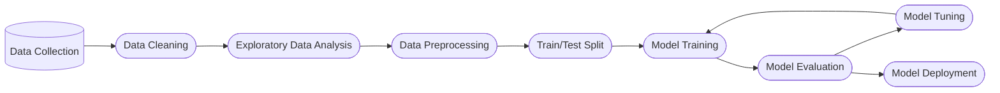

### Mermaid pour documenter vos projets

La documentation est une étape cruciale dans tout projet de développement, mais soyons honnêtes, ce n'est pas toujours la plus amusante. Pourtant, quand il s'agit de clarifier des concepts complexes ou de représenter des processus, rien ne vaut un bon diagramme. Beaucoup de gens se tournent vers Word ou PowerPoint, voire des logiciels spécialisés comme Lucidchart, pour créer ces illustrations. Mais pour nous, développeurs, qui aimons le code et l'automatisation, il existe un outil qui pourrait bien changer la donne : **Mermaid**.

Mermaid permet de créer des diagrammes et des flowcharts directement à partir de texte, ce qui vous permet de rester dans votre éditeur de code préféré. Si vous avez toujours voulu documenter vos projets avec des diagrammes sans quitter votre environnement de développement, ce guide est fait pour vous. Découvrez comment Mermaid peut transformer votre approche de la documentation.

#### Préparer votre Environnement

Avant de plonger dans la création de diagrammes avec Mermaid, vous devez configurer votre environnement de travail.

##### Extensions Recommandées pour VSCode

Pour une expérience optimale avec Mermaid, nous vous recommandons d'installer les extensions suivantes dans Visual Studio Code :

- **Markdown Preview Mermaid Support** : Permet d'afficher un aperçu en temps réel de vos diagrammes Mermaid directement dans VSCode avec la commande `Ctrl + K V`.
- **Markdown PDF** : Permet d'exporter vos diagrammes Mermaid en PDF avec la commande `Ctrl + Shift + P`.

Une fois ces extensions en place, vous êtes prêt à créer vos premiers diagrammes avec Mermaid !

#### Étape 1 : Définir les Nœuds et les Relations

Créer un diagramme avec Mermaid commence par la définition des nœuds (ou étapes) et des relations entre eux. Voici comment procéder :

##### Nœuds

Les nœuds représentent différentes étapes ou entités dans votre processus. Chaque nœud est identifié par un identifiant unique et peut avoir une étiquette optionnelle. Voici un exemple simple :

Dans cet exemple, `data`, `clean`, `explore`, et `preprocess` sont des identifiants de nœuds. Les flèches (`-->`) indiquent les relations entre eux. Ce diagramme montre un flux de gauche à droite grâce à la directive `graph LR`.

##### Relations

Les relations définissent la séquence ou la connexion entre les nœuds. Voici quelques types de relations que vous pouvez utiliser :

- `-->` : Relation directionnelle de gauche à droite.
- `---` : Relation horizontale sans flèche.
- `==>` : Relation bidirectionnelle.
- `==>|label|` : Relation directionnelle avec un label.

Un exemple avec des relations plus complexes et des labels :

#### Étape 2 : Personnaliser les Formes et les Couleurs

Mermaid offre une variété de formes pour vos nœuds. Voici un aperçu des formes les plus couramment utilisées :

| Forme                | Code            | Description                                       |
|----------------------|-----------------|---------------------------------------------------|
| Rectangle            | `[(...)]`       | Nœud rectangulaire standard                       |
| Rectangle arrondi    | `[[...]]`       | Nœud avec des bords arrondis                      |
| Cylindre             | `[(...)]`       | Nœud en forme de cylindre                         |
| Cercle               | `((...))`       | Nœud en forme de cercle                           |

Utilisez ces formes pour personnaliser vos diagrammes en fonction de vos besoins. Par exemple, pour créer un flux de travail de data science :

#### Étape 3 : Ajuster la Direction et le Style

Mermaid vous permet de contrôler la direction et le style de vos diagrammes grâce à quelques mots-clés simples.

##### Direction du Flux

Vous pouvez ajuster la direction du flux avec les options suivantes :

- `LR` : De gauche à droite (Left to Right).
- `TB` : De haut en bas (Top to Bottom).
- `RL` : De droite à gauche (Right to Left).
- `BT` : De bas en haut (Bottom to Top).

##### Style des Nœuds

Pour personnaliser l'apparence des nœuds, vous pouvez utiliser :

- `fill` : Couleur de fond du nœud.
- `stroke` : Couleur de la bordure du nœud.
- `color` : Couleur du texte à l'intérieur du nœud.

Voici un exemple combinant direction et style :

Ce diagramme utilise un flux de haut en bas (TB) et applique des styles personnalisés aux nœuds pour les mettre en valeur visuellement.

#### Ressources Utiles

Pour aller plus loin avec Mermaid, voici quelques liens utiles :

- [Documentation officielle de Mermaid](https://mermaid-js.github.io/mermaid/)
- [Guide de syntaxe Mermaid pour les flowcharts](https://mermaid.js.org/syntax/flowchart.html)
- [Éditeur en ligne Mermaid](https://mermaid.live/edit#)

#### Conclusion

Avec Mermaid, documenter vos projets devient non seulement plus simple, mais aussi plus amusant. Fini les allers-retours entre plusieurs outils : vous pouvez créer, personnaliser et intégrer des diagrammes directement depuis votre code. Que vous soyez en train de planifier un projet, de documenter un processus ou de clarifier une architecture, Mermaid est un atout précieux pour tout développeur. Essayez-le, et vous ne reviendrez plus en arrière !