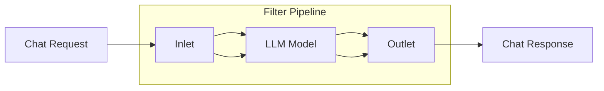
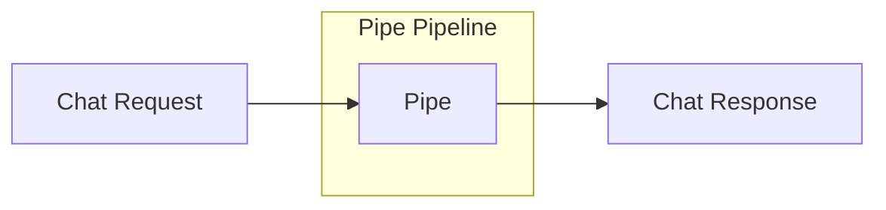

# Faire tourner son chatbot avec une interface équivalente à ChatGPT grâce à OpenWebUI

L'ère des assistants conversationnels est en pleine expansion, et grâce à des outils comme **OpenWebUI**, il est désormais possible de créer son propre UI conversationnel avec des fonctionnalités similaires à celles de ChatGPT sans beaucoup d'effort. On suppose que vous avez déjà un chatbot qui fonctionne correctement et que vous souhaitez une meilleure interface utilisateur. Cet article vous guidera dans la mise en place de cette UI.
<!-- more -->


### 1. Qu’est-ce qu’OpenWebUI ?
**OpenWebUI** est conçu pour être une solution flexible d’interface utilisateur (UI) open-source qui facilite l’interaction avec les LLM comme GPT-3.5 ou GPT-4. Il repose sur deux composants principaux :
- **Le composant OpenWebUI proprement dit** : C’est l’interface utilisateur qui permet de gérer les interactions entre l'utilisateur et le modèle.
- **Le composant Pipelines** : Cette composante s’occupe de la logique LLM. Elle permet d'intercepter, traiter et modifier les prompts utilisateurs avant de les envoyer au modèle final.

Bon, comme vous le savez , une image vaut mieux milles vaux. Voici la magie que nous propose openwebui


### 2. Concepts de Pipelines

Pour comprendre l'outil pipelines, il faut s’intéresser aux valves, filtres (filters) et pipes.

#### 2.1. Concepts de Valves
Les valves jouent un rôle de régulation dans le pipeline, autorisant ou bloquant le passage de certaines données.  
Pour qu'un pipeline soit fonctionnel, on doit avoir une classe valves. Le plus souvent, c’est l'endroit où sont passés les credentials clés et paramètres des modèles.


#### 2.2. Concept de Filter 
Un **Filter Pipeline** est principalement utilisé pour intercepter le message avant qu'il ne soit envoyé au LLM, ou après avoir reçu la réponse du LLM mais avant de l'envoyer à l'utilisateur. L'idée derrière le **Filter Pipeline** est d’ajouter des étapes **avant** ou **après** l'appel au modèle. Il sert donc principalement à :
- **Récupérer des informations externes (RAG)** pour enrichir le contexte du message avant l'envoi au LLM.
- **Exécuter des outils** qui ajoutent des données supplémentaires nécessaires au LLM.
- **Appliquer des filtres de sécurité** ou d'autres types de transformation avant que la réponse ne soit affichée à l'utilisateur.



*Exemple* :

Si l'utilisateur demande *"Quelle est la météo à Paris ?"*, le Filter Pipeline peut intercepter la requête avant de l’envoyer au LLM, appeler une API météo pour obtenir la température, et ensuite ajouter cette information dans le message contextuel envoyé au modèle.

Voici un diagramme pour illustrer le flux d'un **Filter Pipeline** :

### 2.3 Concept de Pipe 
Un **Pipe Pipeline** prend **entièrement en charge** le traitement des messages. Il remplace ou enrichit la manière dont le message est géré par le LLM. Au lieu de simplement ajouter des informations autour du message, comme dans un **Filter Pipeline**, le **Pipe Pipeline** contrôle **tout** le processus. Cela inclut :
- **Appeler différents modèles LLM** (comme GPT-4, GPT-3.5, Mistral, etc.) pour répondre directement au message.
- **Construire des workflows** complexes qui peuvent intégrer de nouvelles fonctionnalités, comme exécuter du code, consulter des bases de données, ou récupérer des informations.
- **RAG (Retrieve and Generate)** : Créer un système complet où les informations sont non seulement récupérées mais aussi générées par un modèle choisi.

*Exemple* :

Dans un **Pipe Pipeline**, si l'utilisateur demande *"Raconte-moi une histoire"*, ce pipeline pourrait décider quel modèle LLM utiliser (GPT-4, Claude, etc.) et créer une réponse en fonction du workflow configuré. 

Voici un diagramme pour illustrer le flux d'un **Pipe Pipeline** :



On parle de **pipelines manifold** lorsque l’on a un pipe qui sait gérer plusieurs modèles. En gros, c’est la même logique d'implémentation, mais le LLM utilisé pour le chat va différer. Un peu plus bas, j'ai implémenté un pipe qui sert de ChatGPT, où je peux choisir quel modèle utiliser entre GPT-3.5, GPT-4, ou GPT-mini.

#### 2.4. Différences
La différence principale entre un **Filter Pipeline** et un **Pipe (ou Manifold) Pipeline** repose sur le **moment** et la **manière** dont les données sont traitées avant ou après l'appel à un modèle de langage (LLM).

### 3. Implémentation de pipelines

#### 3.1. Pipeline simple :
Voici un exemple d'implémentation d'un pipeline basique, qui utilise l'API OpenAI pour répondre aux messages utilisateur.

```python
from typing import List, Union, Generator, Iterator
from pydantic import BaseModel
import os
import requests

class Pipeline:
    class Valves(BaseModel):
        OPENAI_API_KEY: str = os.getenv("OPENAI_API_KEY", "my-keys")

    def __init__(self):
        self.name = "OpenAI Pipeline GPT3.5"
        self.valves = self.Valves()

    def pipe(self, user_message: str, model_id: str, messages: List[dict], body: dict) -> Union[str, Generator, Iterator]:
        headers = {"Authorization": f"Bearer {self.valves.OPENAI_API_KEY}", "Content-Type": "application/json"}
        payload = {**body, "model": model_id}
        self._clean_payload(payload)

        try:
            response = requests.post(url="https://api.openai.com/v1/chat/completions", json=payload, headers=headers)
            response.raise_for_status()
            return response.json()
        except requests.RequestException as e:
            return f"Error: {e}"

    @staticmethod
    def _clean_payload(payload: dict):
        keys_to_remove = {"user", "chat_id", "title"}
        for key in keys_to_remove:
            payload.pop(key, None)
```

#### 3.2 Pipeline manifold (multi-modèle) :
Un pipeline manifold permet de gérer plusieurs modèles d'IA en parallèle. Voici un exemple qui inclut plusieurs modèles d'OpenAI.

```python
from typing import List, Union, Generator, Iterator
from pydantic import BaseModel
import os
import requests

class Pipeline:
    class Valves(BaseModel):
        OPENAI_API_BASE_URL: str = "https://api.openai.com/v1"
        OPENAI_API_KEY: str = os.getenv("OPENAI_API_KEY", "your-openai-api-key")

    def __init__(self, name: str = "manifold: "):
        self.type = "manifold"
        self.name = name
        self.valves = self.Valves()
        self.pipelines = self.get_openai_models()

    def get_openai_models(self):
        predefined_model_ids = ['gpt-4', 'gpt-3.5-turbo', 'gpt-4o-2024-08-06', 'gpt-4o-mini']
        return [{'id': model_id, 'name': model_id} for model_id in predefined_model_ids]

    def pipe(self, user_message: str, model_id: str, messages: List[dict], body: dict) -> Union[str, Generator, Iterator]:
        headers = {"Authorization": f"Bearer {self.valves.OPENAI_API_KEY}", "Content-Type": "application/json"}
        payload = {**body, "model": model_id}
        self._clean_payload(payload)

        try:
            response = requests.post(url=f"{self.valves.OPENAI_API_BASE_URL}/chat/completions", json=payload, headers=headers)
            response.raise_for_status()
            return response.json()
        except requests.RequestException as e:
            return f"Error: {e}"

    @staticmethod
    def _clean_payload(payload: dict):
        keys_to_remove = {"user", "chat_id", "title"}
        for key in keys_to_remove:
            payload.pop(key, None)
```

#### 3.3 Pour aller plus loin :
Il n'y a rien de mieux que la documentation officielle. Vous y trouverez une pléthore d'exemples d'implémentation de pipelines que vous pourriez personnaliser. Vous trouverez plus d'une cinquantaine d'exemples ici :  
[exemples de pipelines](https://github.com/open-webui/pipelines/tree/main/examples/)

### 4. Construire votre stack avec Docker Compose


#### 4.1. Motivation

L'une des manières les plus efficaces de mettre en place cette architecture est d’utiliser **Docker Compose**. Voici un exemple de configuration pour orchestrer les services nécessaires au fonctionnement de votre chatbot.

Selon la documentation officielle pour installer **open-webui/open-webui**, une commande telle que :

```bash
docker run -d -p 3000:8080 -v ollama:/root/.ollama -v open-webui:/app/backend/data --name open-webui --restart always ghcr.io/open-webui/open-webui:ollama
```

est recommandée. D'autres méthodes d'installation sont aussi détaillées sur le site officiel [ici](https://github.com/open-webui/open-webui).

En utilisant cette commande, l'interface est déjà prête à l'emploi. Cependant, pour la communication avec l'UI, [https://github.com/open-webui/pipelines](https://github.com/open-webui/pipelines) propose une configuration simplifiée via Docker :

Exécutez le conteneur **Pipelines** avec la commande suivante :

```bash
docker run -d -p 9099:9099 --add-host=host.docker.internal:host-gateway -v pipelines:/app/pipelines --name pipelines --restart always ghcr.io/open-webui/pipelines:main
```

Ensuite, connectez **Open WebUI** :

- Allez dans **Settings > Connections > OpenAI API** dans Open WebUI.
- Configurez l'URL de l'API à `http://localhost:9099` et la clé API à `0p3n-w3bu!`. Vos pipelines devraient maintenant être actifs.

Cependant, la connexion n’est pas toujours aussi simple 😅. La documentation n’est pas encore optimale. Je vous conseille de bien explorer **Pipelines** sur le site et de comprendre comment l’interaction entre les deux services devrait se faire pour améliorer la communication.

Parfois, des pipelines sont déjà disponibles et vous pouvez vous inspirer des exemples ici : [Pipelines Exemples](https://github.com/open-webui/pipelines/tree/main/examples). Cependant, l’intégration est une autre affaire. Après plusieurs essais, j’ai réussi à connecter les deux services en ajustant des variables clés comme **REQUIREMENTS_PATH**, **PYTHONPATH**, et d'autres, grâce à des volumes de copie pour les pipelines.

#### 4.2. Exemple de `docker-compose.yml` :
```yaml
ervices:
  open-webui:
    image: ghcr.io/open-webui/open-webui:main
    container_name: open-webui
    volumes:
      - open-webui:/app/backend/data
    ports:
      - ${OPEN_WEBUI_PORT-3000}:8080
    environment:
      - WEBUI_SECRET_KEY=
      - OPENAI_API_BASE_URL=http://pipelines:9099
      - OPENAI_API_KEY=0p3n-w3bu!
      - ENABLE_OLLAMA_API=false
    extra_hosts:
      - host.docker.internal:host-gateway
    restart: unless-stopped

  pipelines:
    image: ghcr.io/open-webui/pipelines:main
    container_name: pipelines
    volumes:
      - ./chat_pipelines/pipelines:/app/pipelines
      - ./chat_pipelines/openwebui_utils:/app/openwebui_utils
      - ./src/onepiece_bot:/app/onepiece_bot
      - ./requirements.txt:/app/requirements_custom.txt
    extra_hosts:
      - host.docker.internal:host-gateway
    environment:
      - OPENAI_API_KEY=${OPENAI_API_KEY}
      - PIPELINES_DIR=${PIPELINES_DIR}
      - RESET_PIPELINES_DIR=${RESET_PIPELINES_DIR}
      - PIPELINES_REQUIREMENTS_PATH=${PIPELINES_REQUIREMENTS_PATH}
      - PYTHONPATH=/app
    restart: unless-stopped
    ports:
      - 9099:9099

volumes:
  open-webui:
```


Comme vous travaillez avec Docker, vous pouvez facilement inspecter ce qui se passe et vérifier si tout fonctionne correctement ou non. Le service UI (**OpenWebUI**) fonctionne généralement très bien ; cependant, il faut porter une attention particulière à **Pipelines**. 

Pour déboguer, vous pouvez exécuter une commande comme `docker ps` ou `docker logs pipelines`. Si vous utilisez Docker Desktop, vous devriez voir quelque chose de similaire à ceci, montrant que vos deux conteneurs sont en cours d'exécution :


Les logs sont disponibles en cliquant sur les noms de chaque service :


Ici, on voit que tout fonctionne bien ! 😊

Pour un exemple complet d'implémentation de bout en bout et comment l'exécuter, je vous invite à consulter mon dépôt GitHub où vous trouverez des exemples et des pipelines prêts à l'emploi : [Mon dépôt GitHub](https://github.com/sawadogosalif/openwebui/tree/main). Vous y trouverez également des informations sur les variables d'environnement et d'autres configurations utiles.


### Conclusion
En combinant OpenWebUI et une architecture pipeline, il est possible de créer un UI de conversion flexible commme celui de chatgpt, tout en ayant un contrôle total sur l'interface utilisateur et la logique de traitement des requêtes. Que vous soyez un passionné de LLM ou simplement curieux de tester, OpenWebUI avec Pipelines offre une base solide pour innover. Comme le projet est actuellment nouveau, n'hesitez pas à suivre de près leurs evolutions.
