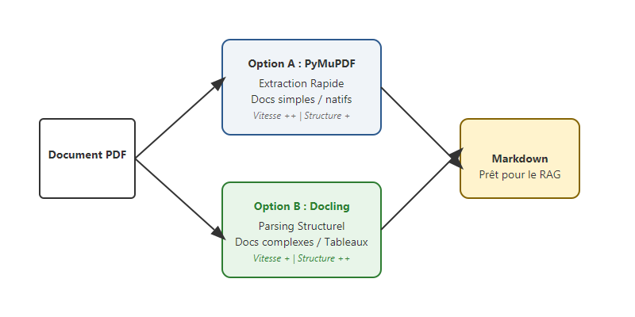

# Du PDF au Markdown : choisir le bon pipeline d'ingestion pour son RAG

On dit souvent que la qualité d'un système RAG dépend de son modèle d'embedding ou de son LLM. Mais mon expérience m'a montré qu'en réalité, la bataille se gagne bien plus tôt : au moment du parsing des documents. Un agent IA ne peut pas naviguer intelligemment dans un document s'il reçoit un bloc de texte brut sans structure.

Aujourd'hui, je partage avec vous mon approche pour transformer des PDF complexes en **Markdown structuré**, et surtout comment choisir entre les deux outils phares du moment.

<!-- more -->

## Le Markdown : le format roi pour le RAG

Le texte brut issu d'un PDF est souvent pollué. En convertissant vers le Markdown, on conserve la hiérarchie (titres), les tableaux et l'unité sémantique des paragraphes. C'est la base indispensable pour un chunking intelligent par header.

## Deux philosophies : PyMuPDF vs Docling

Il n'y a pas un outil unique pour tous les projets. Le choix dépend de la nature de vos documents et de vos contraintes de performance.

### Option A : PyMuPDF (fitz) - La rapidité brute
J'utilise **PyMuPDF** lorsque les documents sont "propres" (PDF natifs, texte simple) et que la vitesse est une priorité absolue. C'est l'outil idéal pour traiter des milliers de pages en quelques secondes tout en gardant un contrôle fin sur les zones de texte à extraire.

### Option B : Docling - L'intelligence structurelle
Pour les documents complexes (mises en page sur plusieurs colonnes, tableaux imbriqués, documents scannés), je me tourne vers **Docling**. Développé par IBM, cet outil excelle dans la reconstruction de la structure logique. Il traite le document comme un ensemble d'objets (titres, listes, tables) plutôt que comme de simples coordonnées de caractères.

## Comment choisir ?

| Critère | PyMuPDF | Docling |
| :--- | :--- | :--- |
| **Vitesse** | Ultra-rapide | Modérée (besoin de CPU/GPU) |
| **Précision Tableaux** | Basique | Excellente |
| **Structure complexe** | Manuelle | Native |
| **Cas d'usage** | Indexation massive, docs simples | Rapports techniques, fiches métier |

## Conclusion

L'ingestion n'est pas une simple formalité technique ; c'est un choix d'architecture. Que vous privilégiez la vitesse de PyMuPDF ou la précision structurelle de Docling, l'objectif reste le même : fournir à votre agent une "vision" Markdown claire du document.

Dans le [prochain article](https://sawallesalfo.github.io/blog/2025/12/30/le-rag-ne-se-limite-pas-aux-embeddings--limportance-de-la-recherche-hybride/), nous verrons comment exploiter cette structure pour faire de la recherche hybride performante.
