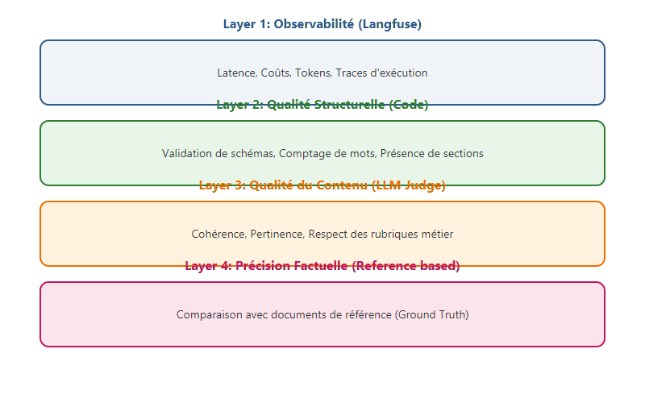

# Évaluer un système RAG (Partie 1) : le framework technique

La bataille du RAG se gagne sur deux fronts : la capacité à trouver l'information (**Retrieval**) et la capacité à l'utiliser sans inventer (**Génération**). Pour évaluer ces deux piliers, j'utilise un framework basé sur des métriques probabilistes et qualitatives.

Voici le détail des métriques que j'implémente pour auditer mes pipelines, étape par étape.

<!-- more -->

## 1. Métriques de Retrieval : avons-nous les bons documents ?

Le but ici est de mesurer si le moteur de recherche (Vector ou Hybride) a réussi à extraire les segments nécessaires à la réponse.

### Contextual Recall (Rappel)
Le Rappel mesure l'exhaustivité. Il répond à la question : "Sur l'ensemble des informations nécessaires, quel pourcentage avons-nous trouvé ?".

Le calcul se déroule en trois étapes :

1. On extrait les affirmations clés de la réponse de référence (Ground Truth).
2. On vérifie si chacune de ces affirmations est présente dans les documents récupérés par notre moteur.
3. On calcule le ratio :

$Recall = \frac{|\text{Segments récupérés} \cap \text{Segments attendus}|}{|\text{Segments attendus}|}$

> **Note technique** : Un score bas indique généralement qu'il faut améliorer votre stratégie de chunking ou augmenter la valeur du `top_k` lors de la recherche.

### Contextual Precision (Précision)
La Précision vérifie si les segments les plus pertinents sont classés en haut de la liste. C'est crucial car plus l'information utile est "noyée" loin dans le contexte, plus le LLM risque de s'y perdre (effet *Lost in the Middle*).

On utilise souvent la moyenne des précisions à chaque rang $k$ où un document est jugé pertinent :

$Precision = \frac{\sum_{k=1}^{n} P@k \times \text{rel}(k)}{\text{Nombre de segments pertinents}}$

---

## 2. Métriques de Génération : le LLM est-il fiable ?

Une fois le contexte fourni, nous évaluons la qualité de la synthèse produite par le modèle.

### Faithfulness (Fidélité / Groundedness)
C'est la métrique vitale pour lutter contre les hallucinations. Elle garantit que l'IA ne s'appuie que sur les documents fournis et non sur ses propres connaissances internes (qui peuvent être datées ou erronées).

Le processus de mesure :

1. L'IA génère une réponse.
2. On décompose cette réponse en affirmations atomiques.
3. Pour chaque affirmation, on demande à un "Juge" si elle est étayée par le contexte fourni.

$Faithfulness = \frac{\text{Nombre d'affirmations étayées par le contexte}}{\text{Nombre total d'affirmations dans la réponse}}$

### Answer Relevancy (Pertinence de la réponse)
Elle mesure à quel point la réponse s'adresse directement à la question de l'utilisateur. Une réponse peut être fidèle au contexte mais totalement hors-sujet.

La mesure s'effectue en comparant les vecteurs :

1. On génère plusieurs questions potentielles à partir de la réponse produite par l'IA.
2. On calcule la similarité cosinus entre ces questions générées et la question initiale de l'utilisateur.

---

## Pourquoi diviser ainsi ?

Cette séparation permet d'identifier immédiatement le maillon faible de votre chaîne de valeur :

*   **Scénario A** : Recall bas / Faithfulness haute.

     *Diagnostic* : Votre base de données est mal indexée ou la recherche est inefficace. Votre LLM est "honnête" mais manque d'informations.

*   **Scénario B** : Recall haut / Faithfulness basse.

    *Diagnostic* : Votre moteur de recherche trouve les bonnes infos, mais votre LLM invente des faits. Il faut ajuster le prompt système ou changer de modèle.

Dans la [Partie 2](https://sawallesalfo.github.io/blog/2026/02/15/evaluer-un-syst%C3%A8me-rag-partie-2--le-pilotage-en-production/), nous verrons comment agréger ces métriques techniques pour piloter la qualité globale de votre service.
