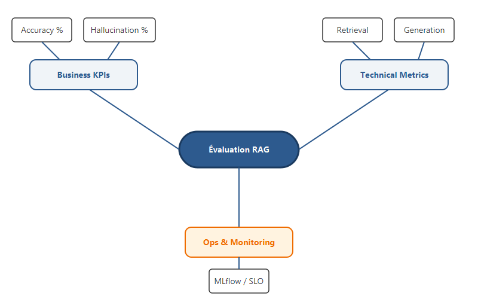

# Évaluer un système RAG en production : mon framework d'analyse et de pilotage

Construire un RAG est simple, mais garantir sa fiabilité en production est une autre paire de manches. Après avoir mis en place plusieurs systèmes d'IA agentiques, j'ai réalisé que l'on ne peut pas piloter ce que l'on ne mesure pas. Aujourd'hui, je vous présente mon framework d'évaluation complet, conçu pour aligner les exigences techniques des ingénieurs avec les besoins métier des décideurs.

Mon approche repose sur une stratégie à double niveau : des **Métriques Techniques** pour débugger le pipeline et des **Business KPIs** pour valider la valeur réelle.

<!-- more -->

## Une Stratégie à Double Couche

L'évaluation d'un RAG ne doit pas être une boîte noire. J'ai structuré mon analyse autour de trois axes majeurs : le Métier, la Technique, et l'Opérationnel.



### 1. Les Business KPIs (Pour les Stakeholders)
Ces indicateurs répondent à la question : "Le système est-il prêt pour les utilisateurs ?".

- **Accuracy Rate** : Le taux de réponses correctes.
- **Hallucination Rate** : La fréquence à laquelle le modèle invente des faits.
- **Knowledge Gap** : Le pourcentage de questions auxquelles le système n'a pas pu répondre faute de données.

### 2. Les Métriques Techniques (Pour les Ingénieurs)
Inspiré par le framework RAGAS, je mesure la qualité de chaque composant.

#### Qualité du Retrieval (Recherche)
Le **Contextual Recall** mesure si la réponse attendue se trouve bien dans les documents récupérés :
$$Recall = \frac{|\text{Faits attendus} \cap \text{Faits présents dans le contexte}|}{|\text{Faits attendus}|}$$

#### Qualité de la Génération (LLM)
La **Faithfulness** (Fidélité) vérifie si la réponse de l'IA est strictement dérivée des documents fournis :
$$Faithfulness = \frac{\text{Nombre d'affirmations étayées par le contexte}}{\text{Nombre total d'affirmations dans la réponse}}$$

## Orchestration du Pipeline d'Évaluation

Pour automatiser ce processus, j'ai développé un `EvalRunner` qui orchestre la génération et le calcul des scores. Voici un extrait de ma logique d'implémentation :

```python
class EvalRunner:
    def evaluate_case(self, case: EvalCase, query_fn: RAGQueryFn) -> EvalResult:
        # 1. Requête du pipeline RAG
        rag_result = query_fn(case.question)
        
        # 2. Calcul des métriques techniques
        faith_score = self.faithfulness.score(
            case.question, 
            rag_result.answer, 
            rag_result.contexts
        )
        
        recall_score = self.contextual_recall.score(
            case.expected_answer, 
            rag_result.contexts
        )
        
        # 3. Évaluation qualitative via un LLM Judge
        judge_result = self.judge.evaluate(
            question=case.question,
            actual_answer=rag_result.answer,
            expected_answer=case.expected_answer
        )
        
        return EvalResult(
            accuracy=(judge_result.score + similarity_score) / 2,
            is_hallucination=faith_score < 0.5,
            ...
        )
```

## Le Système "Feu Tricolore"

Pour rendre les rapports digestes, je convertis les scores numériques en statuts visuels :
- 🟢 **PASS (Score > 0.8)** : Précis et sourcé.
- 🟡 **REVIEW (Score 0.5 - 0.8)** : Acceptable mais perfectible.
- 🔴 **FAIL (Score < 0.5)** : Erreur factuelle ou hors-sujet.

## Pilotage par les données avec MLflow

Toutes mes expériences sont tracées dans **MLflow**. Cela me permet de comparer l'impact d'un changement d'embedding ou d'un nouveau prompt sur mes KPIs globaux. Je génère systématiquement des graphiques radar pour visualiser l'équilibre entre précision, rappel et fidélité.

## Conclusion

L'évaluation est le système nerveux de tout projet d'IA générative. Sans elle, vous avancez à l'aveugle. En combinant des formules mathématiques rigoureuses et des KPIs métier clairs, vous transformez un prototype fragile en un produit de production robuste et auditable.

C'est ainsi que se termine cette série d'articles sur la mise en œuvre de systèmes agentiques. J'espère que ces partages d'expérience vous aideront à bâtir des solutions IA qui apportent une réelle valeur ajoutée.
