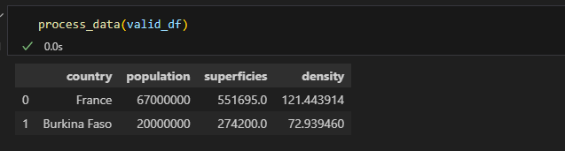

## Parlons de tests pour data scientists - MLOPS

Dans cet article, je vais partager avec vous une pratique qui a transformé ma carrière de data scientist end-to-end : tester son code. C'est une étape cruciale dans l'adoption des bonnes pratiques MLOps, mais qui est souvent négligée par beaucoup de data scientists. Je vais explorer les raisons pour lesquelles les tests sont souvent peu utilisés dans ce domaine et comment vous pouvez intégrer des tests efficaces dans le workflow de vos projets de data science. Vous trouverez également un tutoriel pratique pour vous aider à démarrer, en utilisant des outils comme pytest, beartype, pandera, unittest, ou pydantic.

### 1. Les types de tests

Les tests en développement proviennent du génie logiciel. On imagine souvent une pyramide avec différents niveaux de tests, chacun ayant son rôle pour garantir que le logiciel fonctionne correctement. Cependant, la manière dont les tests sont abordés dépend beaucoup des tâches spécifiques que vous réalisez en tant que data scientist. Voici un aperçu des principaux types de tests, illustrés dans le contexte d'un projet de data science.

#### **Tests unitaires**

Les tests unitaires sont à la base de la pyramide des tests. Ils sont utilisés pour vérifier chaque fonction ou composant de manière isolée. En data science, cela peut inclure :

- Vérifier le format et le type des données (par exemple, s'assurer qu'une colonne est toujours un entier).
- Tester les paramètres d'un modèle pour valider leur conformité.
- Contrôler les variables d'entrée pour détecter les anomalies ou les valeurs hors des plages attendues.
- Tester les performances d’un modèle sur des jeux de données spécifiques.

Ces tests sont particulièrement utiles lorsque vous développez des fonctions de transformation de données ou des algorithmes personnalisés. Ils permettent de vérifier la stabilité du code à chaque changement et d'éviter des erreurs fréquentes, comme un format de données incorrect.

#### **Tests d’intégration**

Les tests d'intégration s'assurent que différents composants fonctionnent correctement ensemble, ce qui est essentiel dans les projets où plusieurs parties du système doivent collaborer. Par exemple, dans un pipeline de données complet (de la collecte au prétraitement jusqu’au modèle et à la production des résultats), ces tests vérifient que toutes les étapes s'enchaînent sans erreur. Souvent, ils sont intégrés dans un cadre de CI/CD (Intégration et Déploiement Continus) pour automatiser et garantir la cohérence des tests.

#### **Tests systèmes**

Les tests systèmes, ou tests "boîte noire", évaluent le logiciel dans son ensemble dans des scénarios d'utilisation réels. Ils sont particulièrement utiles pour les projets qui aboutissent à des applications prêtes à être utilisées par des utilisateurs finaux. 

- **Exemple** : Vérifier que votre modèle déployé sur une application web fait des prédictions et renvoie les résultats correctement.

Ces tests sont souvent effectués par des équipes indépendantes pour garantir une évaluation impartiale de l'ensemble du système.

#### **Tests d’acceptation**

Au sommet de la pyramide se trouvent les tests d’acceptation, qui vérifient que le produit final répond aux attentes du client ou de l’utilisateur. Ces tests sont généralement réalisés par le Product Owner, le client, ou le sponsor du projet, plutôt que par les développeurs. 

- **Exemple** : Pour une application de recommandation, s'assurer que les suggestions fournies aux utilisateurs sont pertinentes et alignées avec les critères définis par le client.

Ces tests sont essentiels dans les projets avec des parties prenantes définies (client, Product Owner, sponsor, expert métier) qui doivent valider que le produit répond bien aux besoins spécifiés.


### 2. Pourquoi les tests sont essentiels en data science

Faire des tests ou non dépend vraiment de tes tâches quotidiennes. Si tu es en exploration de données ou en phase de recherche, tu pourrais moins sentir le besoin d'automatiser des tests rigoureux. Mais dès que tu commences à mettre des choses en production, les tests deviennent indispensables. Voilà pourquoi :

- **Gagner du temps à long terme** : Attraper les erreurs tôt évite de devoir corriger des bugs coûteux après coup.
- **Assurer la fiabilité** : Les tests automatisés garantissent que les modèles continuent de fonctionner correctement, même après des mises à jour du code.
- **Documentation vivante** : Des tests bien rédigés peuvent te servir de documentation. Ils montrent exactement comment chaque partie du système est censée fonctionner.

La documentation est souvent négligée, mais c'est crucial car les data scientists ou les développeurs bougent beaucoup entre les entreprises. Si le code est bien documenté et testé, la personne qui le reprend pourra plus facilement s'approprier le projet.

Bref, l'idée, c'est de s'adapter à ton contexte. Si tu codes régulièrement des fonctions critiques, mets en place des tests unitaires et d'intégration. Si tu développes un produit pour des utilisateurs finaux, pense aux tests systèmes et d'acceptation. Si tu es un data scientist qui fait des études ad hoc ou travaille étroitement avec des métiers, alors les tests d'acceptation suffiront probablement. Mais si tu es un ML engineer ou un AI engineer, les tests deviennent une necessité.

### 3. Pourquoi les data scientists négligent-ils les tests ?

En data science, les tests sont souvent négligés pour plusieurs raisons :

- **Manque d'expérience en ingénierie logicielle** : Beaucoup de data scientists viennent d’un background académique (stats, maths, physique, data) sans formation solide en développement logiciel.
- **Pression pour produire des résultats rapides** : Les entreprises poussent souvent pour des prototypes rapides, ce qui laisse peu de temps pour les tests rigoureux.
- **Mauvaise compréhension de la valeur des tests** : Les data scientists ne voient pas toujours comment les tests peuvent faciliter leur travail en production.
- **Data scientist ≠ développeur** : Même si c'est un débat, je fais partie de ceux qui pensent qu'un data scientist n'a pas nécessairement besoin d'être un bon développeur. Néanmoins, quand tu veux faire du ML engineering ou du end-to-end data science, coder en respectant les bonnes pratiques devient une nécessité.
N'oublie pas que l'une des premières définitions d'un data scientist a été : "I think of data scientists as knowing more about statistics than computer scientists and more about computer science than statisticians." — Michael O'Connell.

### 4. L'expérience et les bonnes pratiques

En production, les erreurs coûtent cher. Les tests te permettent d'éviter des bugs répétitifs et d'économiser du temps. En lisant des tests bien écrits, tu comprends le fonctionnement du système sans documentation supplémentaire.


Les développeurs se bonifient avec les projets qu'ils font et grâce à leurs collaborations avec d'autres développeurs. Si je fais des tests aujourd'hui, c'est grâce à ces seniors ou développeurs qui ne juraient que par les tests et m'ont obligé à le faire avant de valider mes `merge merquest`. 

**Bonnes pratiques :**

- Commencez par les tests unitaires simples.
- N’essayez pas de tout couvrir à 100 % dès le début. Concentrez-vous sur les parties critiques.
- Ne testez pas les bibliothèques tierces ; concentrez-vous sur votre code.
- Automatisez les tests dans votre pipeline CI/CD ou avec des hooks Git pour détecter les erreurs avant de déployer.


### 5. Les tests en data Science et les outils utiles

Pour les data scientists, il existe plusieurs outils pour écrire des tests :

- **Pandera** : Pour valider les DataFrames Pandas (eh oui, les data scientists adorent Pandas !).
- **Pytest** ou **Unittest** : Pour écrire des tests unitaires et d'intégration.
- **Beartype** ou **Pydantic** : Pour la validation de types dans vos fonctions.

#### **1. Exemple de tests implicites avec pandera**

Lorsque l'on travaille avec des DataFrames, il est bien connu que la gestion des types dans pandas peut être problématique, en particulier avec le type `object`. Pandera est une bibliothèque qui facilite la validation des DataFrames en permettant de définir des contraintes sur les colonnes et les schémas attendus. Pour utiliser Pandera pour valider la structure d'un DataFrame, voici un exemple simple. Vous pouvez consulter la documentation officielle pour plus de détails : [Documentation de Pandera](https://pandera.readthedocs.io/en/stable/). L'argument `strict` permet de valider les colonnes spécifiées dans le DataFrame.

```python
import pandas as pd
import pandera as pa
from pandera import Column, DataFrameSchema, Check

# Définition de schema
schema = DataFrameSchema({
    "country": Column(str, Check(lambda x: len(x) > 0)),  # Nom de pays non vide
    "population": Column(int, Check(lambda x: x >= 0)),   # Population doit être un entier non négatif
    "superficies": Column(float, Check(lambda x: x > 0)) , 

},strict='filter')

# Exemple de DataFrame qui respecte le schéma
valid_df = pd.DataFrame({
    "country": ["France", "Burkina Faso"],
    "population": [67000000, 20000000],
    "superficies": [551695.0, 274200.0],
    "Category" :["A", "C"]
})

# Exemple de DataFrame qui ne respecte  pas le schéma
invalid_df = pd.DataFrame({
    "country": ["France", "Burkina Faso"],
    "population": ["67 millions", 20000000],  # Erreur : population devrait être un entier
    "superficies": [551695.0, 274200.0],
     "Category" :["A", "C"]

})

@pa.check_input(schema)
def process_data(df):
    return df.assign(density=df["population"]/df["superficies"])
```

En appliquant ce code, vous obtenez :



On peut facilement voir que la fonction a `raise` une erreur de schema dès l'appel. 
Combiner Pandera avec Pytest permet de valider les données. En data science, il est fréquent de faire passer des DataFrames en entrée de fonction, donc il est préférable de valider les types en entrée et d'éviter tout problème.

#### **2. Exemple de validation des types avec beartype**

Beartype peut être utilisé pour vérifier les types de données à l'exécution.  Beartype est un validateur de types Python qui vérifie que les valeurs passées à une fonction correspondent bien aux annotations de type définies. C'est une excellente manière de renforcer la robustesse de ton code sans avoir à écrire de tests manuels pour chaque paramètre de fonction.

La documentation est ici : [Beartype](https://beartype.readthedocs.io/en/latest/). Vous pourriez utiliser Pydantic à la place :

```python
from beartype import beartype

@beartype
def add_numbers(a: int, b: int) -> int:
    return a + b
```


Comme on le voit, lorsque le type est violé, la fonction lève une erreur.

### 6. Implémentation de tests plus complètes

#### **1. Organisation du projet**
Pour un projet de data science orienté MLOps, une organisation claire et structurée est essentielle pour faciliter le développement, les tests, et la maintenance du code. Un bon schéma de projet permet non seulement de rendre le code plus lisible, mais aussi de simplifier l'intégration des tests à chaque étape du pipeline, depuis le prétraitement des données jusqu'au déploiement des modèles.

Imaginons le projet ci-dessous où PYTHONPATH pointe vers `mypackages` et  voici une structure typique qui peut servir de base solide :

```
project/
├── src/
│   ├── main.py
│   └── mypackages/
│       ├── algo.py 
│       └── __init__.py
│
└── test/
    ├── __init__.py  # Optionnel mais utile pour les tests
    ├── test_algo.py
└── test-data/
    ├── profil_1.json
    ├── profil_2.json
    ├── profil_3.json
    ├── expected_profil_1.json
    ├── expected_profil_2.json
    └── expected_profil_3.json
```

#### **2. Simple test unitaire**

Le fichier `test_algo1.py` contient les lignes de test unitaire suivantes :

```python
from mypackages.algo import Algorithm_1

def test_algorithm_1():
    input_data = [1, 2, 3]
    algorithm_1 = Algorithm_1()
    result = algorithm_1.predict(input_data)
    expected = [1, 4, 9]
    assert result == expected
```

Avec la commande `pytest`, vous pouvez exécuter ce test unitaire. L'organisation du projet peut varier, chacun s'organise comme il le souhaite.

#### **3. Plusieurs tests unitaires en Un avec `pytest.mark.parametrize`**

`pyest.mark.parametrize` : C'est une fonctionnalité de Pytest qui permet de tester une même fonction avec différents ensembles de données. Cela t'aide à vérifier que ton code fonctionne correctement avec une large variété d'entrées, et c'est particulièrement utile en data science où les variations de données sont fréquentes.
Dans ce paragraphe, je mets en place un test en utilisant le decorateur pyest.mark.parametrize.

Voici le détail de `test_algo2.py` :
```python
import pytest
import os
import json
import pandas as pd
from mypackages.algo import Algorithm_2  
from loguru import logger

def get_data_path(filename: str) -> str:
    return os.path.abspath(os.path.join(os.path.dirname(__file__), "..", "test-data", filename))

def load_data(filename: str) -> pd.DataFrame:
    with open(get_data_path(filename), "rb") as f:
        json_file = json.load(f)
    return pd.json_normalize(json_file)

@pytest.mark.parametrize(
    ("input_file", "expected_file"),
    [
        ("profil_2.json", "expected_profil_2.json"),
        ("profil_1.json", "expected_profil_1.json"),
        ("profil_3.json", "expected_profil_3.json"),
    ],
)
def test_algorithm_2(input_file, expected_file):
    logger.info(f"testing {input_file}")
    
    df_input = load_data(input_file)
    df_expected = load_data(expected_file) 

    algorithm_2 = Algorithm_2()  
    result = algorithm_2.predict(df_input)  
    
    pd.testing.assert_frame_equal(result, df_expected)
```

Comme par magie, en exécutant la commande `pytest`, tout passe comme vous pouvez le voir dans l'image ci-après :


### Conclusion

Les tests sont une compétence essentielle pour les data scientists, surtout ceux qui visent à mettre leurs modèles en production ou livrent leur projects à d'autres dev. Commencez petit, concentrez-vous sur les parties critiques, et faites des tests une habituddans vos projets. Les outils comme Pandera, Pytest, Beartype, et Pydantic sont là pour vous aider à améliorer la qualité et la fiabilité de votre code. C'est un investissement qui paie à long terme, vous évitant de nombreux soucis et vous permettant de livrer des modèles plus robustes et maintenables.

Prêt à ajouter des tests à vos projets de data science ? Commençons dès maintenant !