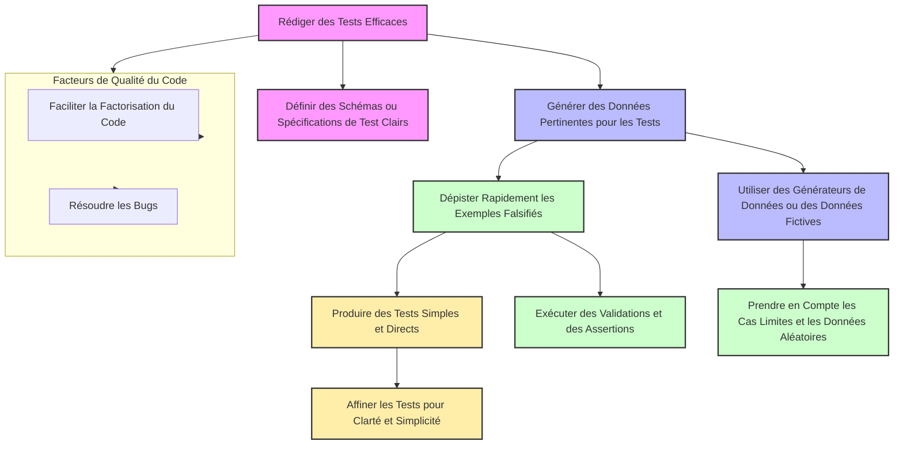

## Parlons de tests pour data scientists - MLOPS

Dans ce billet de blog, je discute avec vous de quelque chose qui a changé ma vie en tant que data scientist end-to-end : tester son code. C’est un must dans la quête des bonnes pratiques MLOps. Je vais explique pourquoi selon moi les data scientists en font souvent peu, et comment intégrer des tests efficaces dans le workflow d'un projet de data science.

### 1. Les types de Tests

En vérité, les tests proviennent du génie logiciel. En data science, on en parle peu parce que la plupart des data scientists viennent de formations quantitatives, comme les statistiques ou les mathématiques ou encore la physique, plutôt que de développement logiciel.
<!-- more -->

Quand on parle de tests en développement, on imagine souvent une pyramide avec différents niveaux de tests, chacun ayant son rôle pour garantir que le logiciel fait ce qu’on attend de lui. Mais la vérité, c'est que la façon dont tu approches les tests dépend beaucoup de ce que tu fais au quotidien en tant que data scientist. Voici un aperçu des principaux types de tests, en les illustrant avec une solution logicielle de data science.

#### **Tests Unitaires**

Les tests unitaires sont à la base de la pyramide des tests. Ce sont des tests courts et précis faits par les développeurs pour vérifier chaque fonction ou composant de manière isolée. En data science, cela pourrait signifier :

- Vérifier le format et le type des données (comme s'assurer qu'une colonne est toujours un entier).
- Tester les paramètres d'un modèle (pour s'assurer qu’ils sont valides).
- Contrôler les variables d'entrée pour détecter les anomalies ou les valeurs hors des plages attendues.
- Tester les performances d’un modèle sur des jeux de données connus.

Ces tests sont idéaux pour les tâches où tu écris beaucoup de code — par exemple, quand tu développes des fonctions de transformation de données ou des algorithmes personnalisés. En automatisant ces tests, tu peux facilement vérifier que ton code reste correct au fil des changements et des nouvelles versions. Cela te permet d'éviter des erreurs dont la source est le mauvais format de données en entrée, par exemple.

#### **Tests d’Intégration**

Les tests d'intégration prennent tout leur sens quand tu travailles sur des projets où plusieurs composants doivent collaborer. Le but est de vérifier que ces différents éléments fonctionnent bien ensemble. Si tu bosses sur un pipeline de données complet — de la collecte au prétraitement, jusqu’au modèle et à la production des résultats — c’est ici que les tests d’intégration deviennent essentiels. 

Ils permettent de s'assurer que toutes les étapes d'un pipeline de données s'enchaînent correctement sans erreurs. Souvent, la CI/CD (Intégration et Déploiement Continus) sert de cadre pour ces tests d'intégration, garantissant que les tests n'échouent pas.

#### **Tests Systèmes**

Les tests systèmes, aussi appelés tests "boîte noire", évaluent le logiciel dans son ensemble dans des scénarios d'utilisation réels. Ces tests sont particulièrement utiles si tu travailles sur des projets qui aboutissent à des applications prêtes à être utilisées par des clients ou des utilisateurs finaux.

- **Exemple** : Valider que ton modèle déployé sur une application web fait des prédictions et renvoie les résultats correctement.

Ce type de test est souvent géré par des équipes séparées ou des testeurs indépendants pour garantir une évaluation impartiale de l'ensemble du système.

#### **Tests d’Acceptation**

En haut de la pyramide, on trouve les tests d’acceptation. Ici, on s’assure que le produit final correspond bien aux attentes du client ou de l’utilisateur. Ces tests ne sont pas nécessairement réalisés par les développeurs eux-mêmes. Cela peut être le Product Owner (PO), le client, ou même le sponsor du projet qui les exécute. En gros, on vérifie que le produit répond bien aux besoins métiers ou utilisateurs définis en amont.

- **Exemple** : Pour une application de recommandation, s’assurer que les suggestions fournies aux utilisateurs sont pertinentes et en accord avec les critères définis par le client.

Ces tests sont essentiels si tu travailles sur des projets où il y a un client ou Product Owner, un chef de projet, un sponsor ou un expert métier responsable du besoin.

### 2. Pourquoi les Tests sont Essentiels en Data Science

Faire des tests ou non dépend vraiment de tes tâches quotidiennes. Si tu es en exploration de données ou en phase de recherche, tu pourrais moins sentir le besoin d'automatiser des tests rigoureux. Mais dès que tu commences à mettre des choses en production, les tests deviennent indispensables. Voilà pourquoi :

- **Gagner du temps à long terme** : Attraper les erreurs tôt évite de devoir corriger des bugs coûteux après coup.
- **Assurer la fiabilité** : Les tests automatisés garantissent que les modèles continuent de fonctionner correctement, même après des mises à jour du code.
- **Documentation vivante** : Des tests bien rédigés peuvent te servir de documentation. Ils montrent exactement comment chaque partie du système est censée fonctionner.

La documentation est souvent négligée, mais c'est crucial car les data scientists ou les développeurs bougent beaucoup entre les entreprises. Si le code est bien documenté et testé, la personne qui le reprend pourra plus facilement s'approprier le projet.

Bref, l'idée, c'est de s'adapter à ton contexte. Si tu codes régulièrement des fonctions critiques, mets en place des tests unitaires et d'intégration. Si tu développes un produit pour des utilisateurs finaux, pense aux tests systèmes et d'acceptation. Si tu es un data scientist qui fait des études ad hoc ou travaille étroitement avec des métiers, alors les tests d'acceptation suffiront probablement. Mais si tu es un ML engineer ou un AI engineer, les tests deviennent obligatoires.

### 3. Pourquoi les Data Scientists Négligent-ils les Tests ?

En data science, les tests sont souvent négligés pour plusieurs raisons :

- **Manque d'expérience en ingénierie logicielle** : Beaucoup de data scientists viennent d’un background académique (stats, maths, physique, data) sans formation solide en développement logiciel.
- **Pression pour produire des résultats rapides** : Les entreprises poussent souvent pour des prototypes rapides, ce qui laisse peu de temps pour les tests rigoureux.
- **Mauvaise compréhension de la valeur des tests** : Les data scientists ne voient pas toujours comment les tests peuvent faciliter leur travail en production.
- **Data scientist ≠ développeur** : Même si c'est un débat, je fais partie de ceux qui pensent qu'un data scientist n'a pas nécessairement besoin d'être un bon développeur. Néanmoins, quand tu veux faire les choses bien et livrer des solutions de qualité, coder en respectant les bonnes pratiques devient une nécessité.

### 4. L'Expérience et les Bonnes Pratiques

En production, les erreurs coûtent cher. Les tests vous permettent d'éviter des bugs répétitifs et d'économiser du temps. En lisant des tests bien écrits, vous comprenez le fonctionnement du système sans documentation supplémentaire.

Les développeurs se bonifient avec les projets qu'ils font et grâce à leurs collaborations avec d'autres développeurs. Si je fais des tests aujourd'hui, c'est grâce à ces seniors ou développeurs qui ne juraient que par les tests et m'ont obligé à le faire avant de valider mes `merge merquest`. Nous avons besoin de personnes compétentes et expérimentées pour nous mentorer et nous enseigner les bonnes pratiques. Mais il n'y en a pas assez. Donc devenez vite senior compétents si vous etes debutant :)

**Bonnes pratiques :**

- Commencez par les tests unitaires simples.
- N’essayez pas de tout couvrir à 100 % dès le début. Concentrez-vous sur les parties critiques.
- Ne testez pas les bibliothèques tierces ; concentrez-vous sur votre code.
- Automatisez les tests dans votre pipeline CI/CD ou avec des hooks Git pour détecter les erreurs avant de déployer.



### 5. Les Tests en Data Science et les Outils Utiles

Pour les data scientists, il existe plusieurs outils pour écrire des tests :

- **Pandera** : Pour valider les DataFrames Pandas (eh oui, les data scientists adorent Pandas !).
- **Pytest** ou **Unittest** : Pour écrire des tests unitaires et d'intégration.
- **Beartype** ou **Pydantic** : Pour la validation de types dans vos fonctions.

#### **1. Exemple de Tests Implicites avec Pandera**

On travaille le plus souvant avec des dataframe. Nul n'ignore que la gestion des types dans pandas est assez bordelique sur avec le type `object`. Pandera vient à la rescousse pour typer les dataframes et apporter plus de contraintes aux colonnes et schemas attendus.


Voici comment utiliser Pandera pour valider la structure d'un DataFrame ci-dessous.Il y a pas mieux que la documentation officille d'un package. https://beartype.readthedocs.io/en/latest/. L'argument strict permet de valider sur un set de columns qu'on a definie.

```python
import pandas as pd
import pandera as pa
from pandera import Column, DataFrameSchema, Check

# Définition de schema
schema = DataFrameSchema({
    "country": Column(str, Check(lambda x: len(x) > 0)),  # Nom de pays non vide
    "population": Column(int, Check(lambda x: x >= 0)),   # Population doit être un entier non négatif
    "superficies": Column(float, Check(lambda x: x > 0)) , 

},strict='filter')

# Exemple de DataFrame qui respecte le schéma
valid_df = pd.DataFrame({
    "country": ["France", "Burkina Faso"],
    "population": [67000000, 20000000],
    "superficies": [551695.0, 274200.0],
    "Category" :["A", "C"]
})

# Exemple de DataFrame qui ne respecte  pas le schéma
invalid_df = pd.DataFrame({
    "country": ["France", "Burkina Faso"],
    "population": ["67 millions", 20000000],  # Erreur : population devrait être un entier
    "superficies": [551695.0, 274200.0],
     "Category" :["A", "C"]

})

@pa.check_input(schema)
def process_data(df):
    return df.assign(density=df["population"]/df["superficies"])
```

En appliquant ce code, vous obtenez :


On peut facilement voir que la fonction a `raise` une erreur de schema dès l'appel. 
Combiner Pandera avec Pytest permet de valider les données. En data science, il est fréquent de faire passer des DataFrames en entrée de fonction, donc il est préférable de valider les types en entrée et d'éviter tout problème.

#### **2. Exemple de Validation des Types avec Beartype**

Beartype peut être utilisé pour vérifier les types de données à l'exécution. La documentation est ici : [Beartype](https://beartype.readthedocs.io/en/latest/). Vous pourriez utiliser Pydantic à la place :

```python
from beartype import beartype

@beartype
def add_numbers(a: int, b: int) -> int:
    return a + b
```


Comme on le voit, lorsque le type est violé, la fonction lève une erreur.

### 6. Implémentation de Tests Plus Complètes

#### **1. Organisation du Projet**

Imaginons le projet ci-dessous où PYTHONPATH pointe vers `mypackages` :

```
project/
├── src/
│   ├── main.py
│   └── mypackages/
│       ├── algo.py 
│       └── __init__.py
│
└── test/
    ├── __init__.py  # Optionnel mais utile pour les tests
    ├── test_algo.py
└── test-data/
    ├── profil_1.json
    ├── profil_2.json
    ├── profil_3.json
    ├── expected_profil_1.json
    ├── expected_profil_2.json
    └── expected_profil_3.json
```

#### **2. Simple Test Unitaire**

Le fichier `test_algo1.py` contient les lignes de test unitaire suivantes :

```python
from mypackages.algo import Algorithm_1

def test_algorithm_1():
    input_data = [1, 2, 3]
    algorithm_1 = Algorithm_1()
    result = algorithm_1.predict(input_data)
    expected = [1, 4, 9]
    assert result == expected
```

Avec la commande `pytest`, vous pouvez exécuter ce test unitaire. L'organisation du projet peut varier, chacun s'organise comme il le souhaite.

#### **3. Plusieurs Tests Unitaires en Un avec `pytest.mark.parametrize`**

Voici le détail de `test_algo2.py` :

En utilisant Pytest, vous pouvez paramétrer vos tests pour les exécuter avec plusieurs jeux de données :

```python
import pytest
import os
import json
import pandas as pd
from mypackages.algo import Algorithm_2  
from loguru import logger

def get_data_path(filename: str) -> str:
    return os.path.abspath(os.path.join(os.path.dirname(__file__), "..", "test-data", filename))

def load_data(filename: str) -> pd.DataFrame:
    with open(get_data_path(filename), "rb") as f:
        json_file = json.load(f)
    return pd.json_normalize(json_file)

@pytest.mark.parametrize(
    ("input_file", "expected_file"),
    [
        ("profil_2.json", "expected_profil_2.json"),
        ("profil_1.json", "expected_profil_1.json"),
        ("profil_3.json", "expected_profil_3.json"),
    ],
)
def test_algorithm_2(input_file, expected_file):
    logger.info(f"testing {input_file}")
    
    df_input = load_data(input_file)
    df_expected = load_data(expected_file) 

    algorithm_2 = Algorithm_2()  
    result = algorithm_2.predict(df_input)  
    
    pd.testing.assert_frame_equal(result, df_expected)
```

Comme par magie, en exécutant la commande `pytest`, tout passe :


### Conclusion

Les tests sont une compétence essentielle pour les data scientists, surtout ceux qui visent à mettre leurs modèles en production ou livrent leur projects à d'autres dev. Commencez petit, concentrez-vous sur les parties critiques, et faites des tests une habituddans vos projets. Les outils comme Pandera, Pytest, Beartype, et Pydantic sont là pour vous aider à améliorer la qualité et la fiabilité de votre code. C'est un investissement qui paie à long terme, vous évitant de nombreux soucis et vous permettant de livrer des modèles plus robustes et maintenables.

Prêt à ajouter des tests à vos projets de data science ? Commençons dès maintenant !